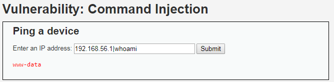
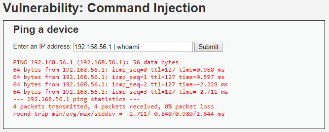
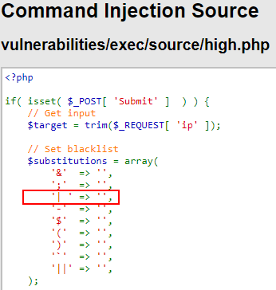
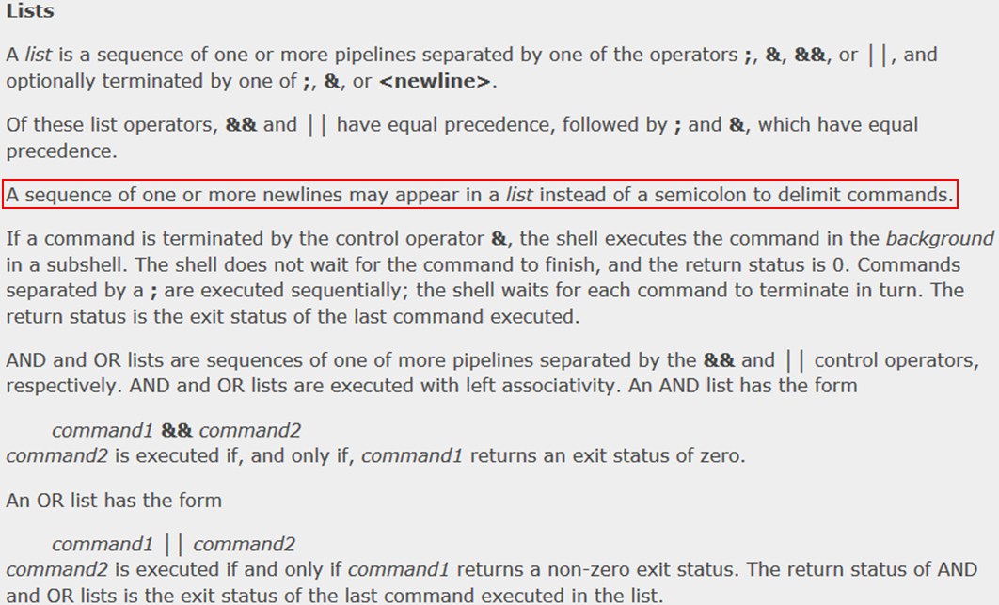
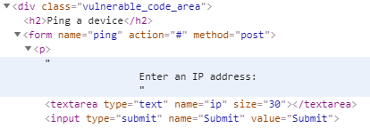
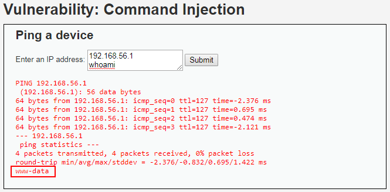
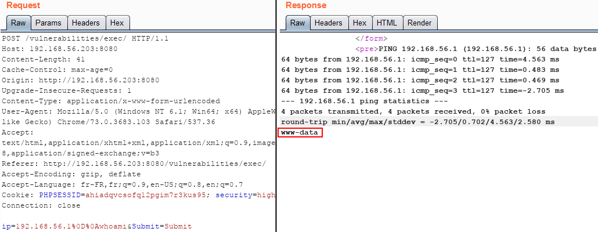

# Niveau "High"

Le ping semble fonctionner toujours de la même manière pour ce niveau "High" :

.png>)

En testant toutes les possibilités, aucun enchaînement de commandes ne semble fonctionner. Mais ici, la petite astuce est d'utiliser un pipe sans ajouter d'espace entre ce pipe et la seconde commande :

La même attaque mais contenant des espaces ne fonctionne pas :

Ce fonctionnement provient d'une petite erreur laissée par le développeur lors de la mise en place de sa liste noire. L'occurrence filtrée ici n'est pas `"|"` mais `"| "` (bien noter l'espace) :

Une autre solution peut être l'utilisation d'un saut de ligne entre les deux commandes. En effet, lors de l'utilisation d'une séquence de type [**list**](https://linux.die.net/man/1/bash) il est possible d'utiliser un saut de ligne à la place du caractère `";"` :

Pour exploiter cela, il suffit de transformer notre champ `<input>` en champ `<textarea>` (via la console par exemple) :

Puis d'injecter la seconde commande après un saut de ligne :

Il est tout à fait possible d'utiliser Burp en mode Interception ou Repeater pour insérer ce saut de ligne :


Cela ne s'arrête pas là mais les possibilités sont vastes : récupération d'un shell plus complet, maintien de l'accès, tentative d'élévation de privilèges, pivotage, ...


