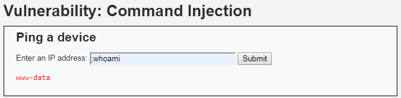

# Niveau "Low"

Ce challenge offre la possibilité de vérifier l'état d'un hôte effectuant un ping. On commence, par exemple, par pinger la passerelle du réseau à l'adresse `192.168.56.1` (il s'agit ici de la passerelle VirtualBox) :

.png>)

La fonctionnalité permet également de prendre un nom de domaine comme valeur :

.png>)

L'application étant en PHP, le code correspondant doit être sans-doute similaire à ceci :

```php
<?php
  system('ping ' . $_POST['ip']);
?>
```


Sous Linux, il existe plusieurs possibilités afin d’enchaîner des commandes : les pipelines ainsi que les listes.

**Pipeline**

Les caractères de pipelines sont les caractères `"|"` et `"|&"`. Ils permettent de rediriger la sortie (resp.  sortie d’erreurs) vers l’entrée de la seconde commande.

Pour rediriger la sortie standard de `command1` vers l’entrée de `command2` :

```bash
$ command1 | command2
```

Pour rediriger la sortie d’erreurs de `command1` vers l’entrée de `command2` :

```bash
$ command1 |& command2
```

****

**List**

Les listes sont des séquences de commandes séparées par les opérateurs suivants : `";"`, `"&"`, `"&&"` et `"||"`.

Pour exécuter la `command1` puis la `command2` :

```bash
$ command1 ; command2
```

Pour exécuter la `command1` dans un subshell de façon asynchrone :

```bash
$ command1 & command2
```

Pour exécuter `command1` puis `command2` si et seulement si `command1` se termine en succès (Opérateur AND) :

```bash
$ command1 && command2
```

Pour exécuter `command1` puis `command2` si et seulement si `command1` se termine en erreur (Opérateur OR) :

```bash
$ command1 || command2
```


Afin d'exécuter notre commande, le plus simple est d'utiliser le séparateur de commandes `";"` puis d'insérer notre commande ensuite :

.png>)

Ou encore plus simple, en omettant le ping :




Cela ne s'arrête pas là mais les possibilités sont vastes : récupération d'un shell plus complet, maintien de l'accès, tentative d'élévation de privilèges, pivotage, ...


##
