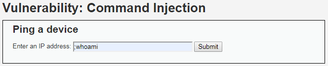
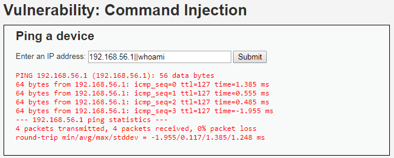

# Niveau "Medium"

A priori, pas de changement dans la fonctionnalité de ping pour ce niveau :

 (1).png>)

Je vais au plus simple en testant directement le séparateur de commandes `";"` :

Cela ne fonctionne pas. Il me faut donc tester toutes les autres possibilités. L'opérateur `"||"` semble fonctionner et me permet ainsi de contourner le filtre en place :


Cela ne s'arrête pas là mais les possibilités sont vastes : récupération d'un shell plus complet, maintien de l'accès, tentative d'élévation de privilèges, pivotage, ...


Attention, étant donné qu'il s'agit d'un opérateur OR, il faut impérativement que la première commande (le ping) se termine en erreur. Dans le cas contraire la seconde commande ne sera pas exécutée :

