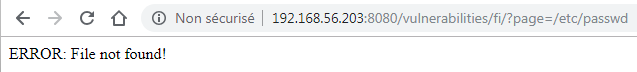
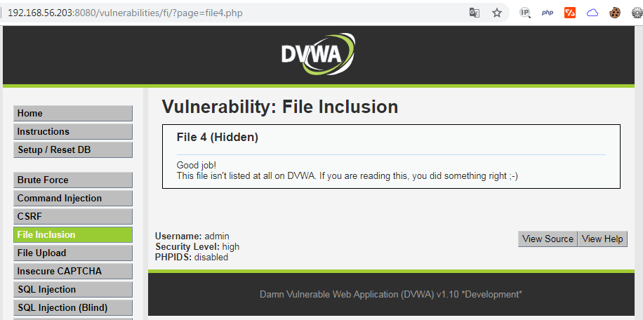
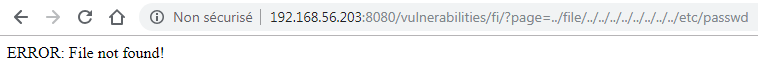
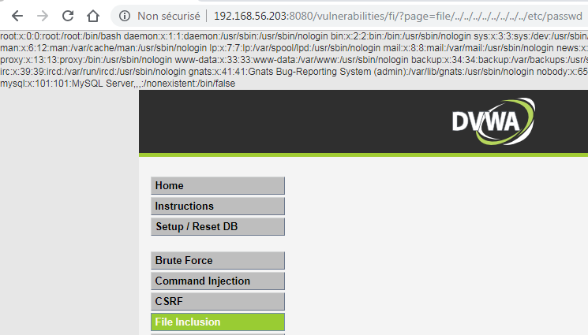
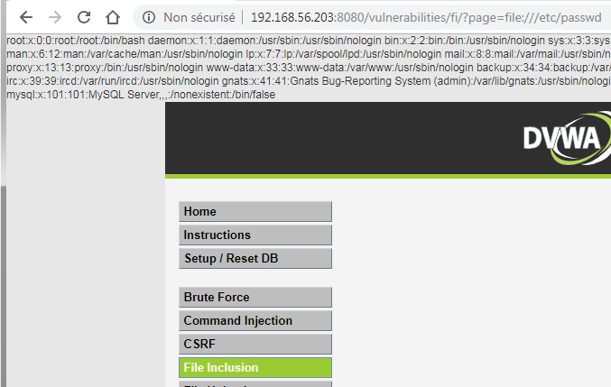

# Niveau "High"

Les réponses du serveur face aux attaques précédentes varient légèrement ici puisque nous avons le droit à l'erreur suivante pour chacun de nos essais :

La seule chose facilement réalisable est l'accès à la page cachée :

Il est sans doute possible qu'un filtre vérifie la présence du mot "file" dans le paramètre d'inclusion. L'idée du développeur était sans doute ici de ne pouvoir inclure seulement les fichiers `file*.php` . 

On tente un premier contournement mais sans succès :

Après quelques essais, on identifie qu'il est impératif que la valeur du paramètre commence par la chaîne "file" :

Ou alors, en utilisant le schéma `file://` qui permet d'accéder facilement au système de fichiers local :

 Je n'ai pas réussi à effectuer une RFI ici, mais cela ne veut pas dire que ce n'est pas possible 🙃 

