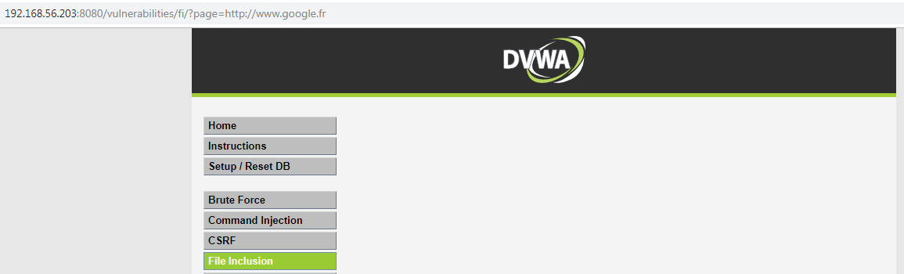
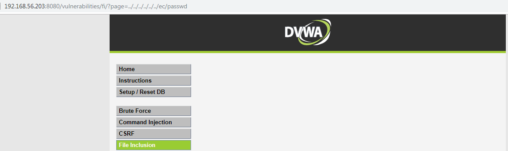
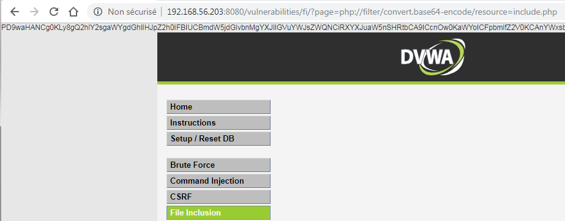
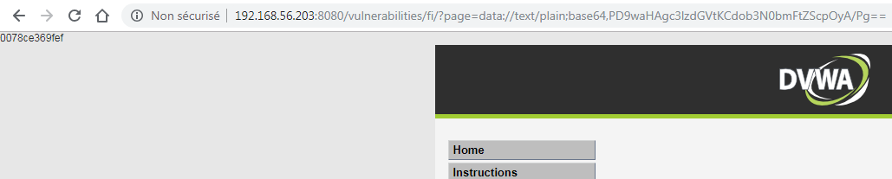

# Niveau "Medium"

Sur ce niveau, il ne semble plus possible d'effectuer une RFI ainsi que d'utiliser la technique du path traversal \(mais la LFI reste toujours possible\) :



Après quelques essais on devine l'utilisation d'un filtrage des patterns `http://` et `https://`. Ce genre de filtrage est très souvent contournable car il est facile pour le développeur d'oublier un scénario. Il suffit par exemple ici de doubler le schéma désiré :

```http
?page=hthttp://tp://www.google.fr
```



Etant donné que seule les protocoles `http://` ou `https://` sont filtrés, il est également possible de passer par un autre protocole \(comme `ftp://`\) afin de réaliser l'attaque


Le path traversal semble maintenant impossible à ce niveau :



Mais contournable avec la même technique de contournement de doublement \(car le filtrage est sans doute effectué sur les occurrences `../` \) :


L'utilisation de wrappers PHP reste tout de même possible :



Mais plus intéressant, l'exécution de code grâce au wrapper `data://` fonctionne également \(un autre wrapper bien dangereux comme il faut 😋\) :

```http
?page=data://text/plain;base64.PD9waHAgc3lzdGVtKCdob3N0bmFtZScpOyA/Pg==
```



La payload encodée en base64 étant la suivante :

```php
<?php 
  system('hostname');
?>
```

## 

