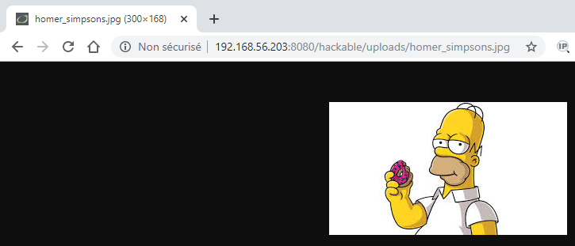
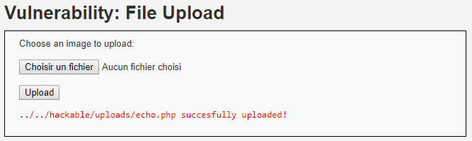

# Niveau "Low"

Premièrement, analysons comment fonctionne l’application et quels types de fichiers sont acceptés. Appuyons simplement sur le bouton « Upload » sans préalablement sélectionner une image :


Puis, chargeons une image valide. Par exemple Homer mangeant un délicieux donuts :


L'accès à l'image se fait par le chemin indiqué en réponse :



L'upload de fichiers étant plutôt destinée à des images, voyons s'il est possible d'uploader du code PHP :

```php
<?php
  echo 'Hacked';
?>
```

L'application semble accepter notre fichier sans broncher :



Et l'accès à notre fichier `.php` permet donc une exécution de code :



Cela ne s'arrête pas là mais les possibilités sont vastes : récupération d'un shell plus complet, maintien de l'accès, tentative d'élévation de privilèges, pivotage, ...


