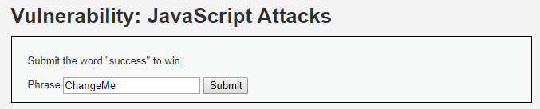
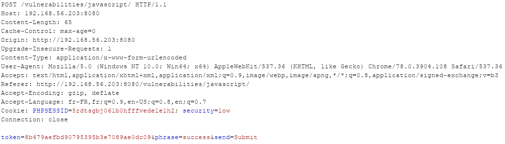
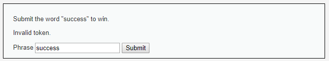
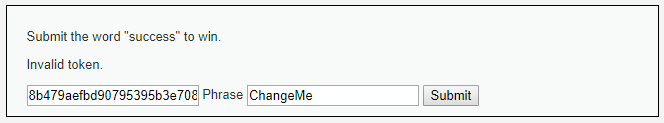
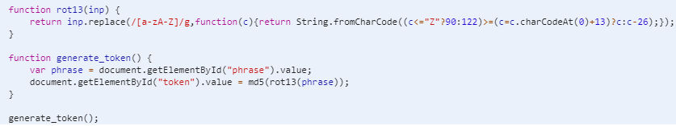
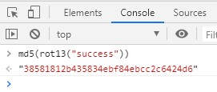
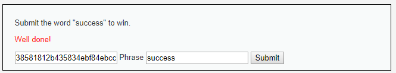

# Niveau "Low"

Ce challenge nous demande de renseigner le mot "success" pour gagner. Le champ de saisie comporte une valeur par défaut, "ChangeMe" :

On lance Burp et on tente notre chance en saisissant le mot demandé :

Nous voyons passer un jeton dans la requête, sans doute un champ caché. La réponse du serveur est un peu moins fun puisque nous avons le droit à une erreur "Invalid token" :

Pour la suite, j'active l'option de Burp permettant de rendre visible les champs cachés :

Il nous faut donc trouver le jeton valide qui correspond à la valeur "success". Pour cela, nous devons comprendre le script qui est présent dans le code de la page :

Le script n'est pas difficile à comprendre ici :

1. La méthode `generate_token()` est appelée
2. Cette méthode récupère la valeur présent dans le champ de saisie, effectue un `rot13()` puis calcul son empreinte md5
3. Cette empreinte est finalement placée dans le champ `token`

Afin de récupérer le jeton valide, il faut reproduire les mêmes étapes mais avec la phrase "success". Cela peut se faire directement dans la console du navigateur :

Si nous avons vu juste, il nous suffit de renseigner cette empreinte dans le champ `token` ainsi que la valeur "success" dans le champ `phrase` puis de valider :

Well done !

