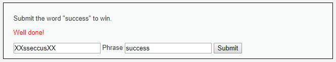
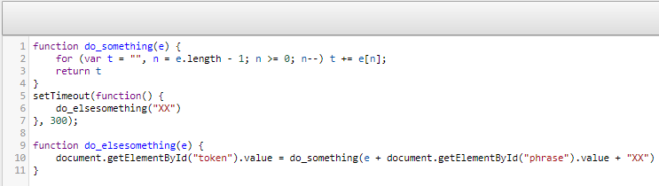

# Niveau "Medium"

Le niveau "Medium" contient également un jeton présent dans un champ caché :

Le jeton \(à gauche\) semble posséder un pattern qui est `"XX" + reverse("ChangeMe") + "XX"` . On tente directement de faire cela avec la phrase "success". Si cela ne fonctionne pas, on se plongera dans le code Javascript :

Bien joué ! Allons tout de même voir le code Javascript par curiosité :

Soit :

1. La fonction `do_elsesomething("XX")` est lancé au bout de 300 ms
2. Cette fonction effectue un appel à la méthode `do_something("XX" + "ChangeMe" + "XX")` 
3. La méthode `do_something("XX" + "ChangeMe" + "XX")` est une fonction de reverse dont le résultat est la chaîne `"XXeMegnahCXX"`
4. Finalement, le résultat est stocké dans le champ `token`

