# Niveau "Low"

Le niveau "Low" présente un simple formulaire permettant de renseigner un id d'utilisateur :

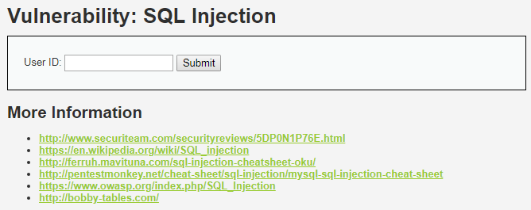

La première chose à faire est d'étudier le comportement de l'application en renseignant des données valides :

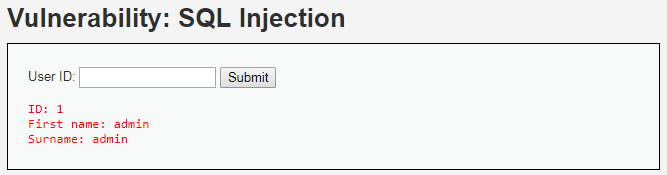

La réponse pour un id valide remonte plusieurs informations : le `First name` ainsi que le `Surname`, soit à minima 2 colonnes. Concernant l’`id` il peut soit être  récupéré depuis la réponse à la requête SQL \(donc une troisième colonne\) ou alors être la réflexion de la donnée renseignée en entrée.

Il faut bien sur également tester une requête non valide, c'est-à-dire un `id` inexistant :

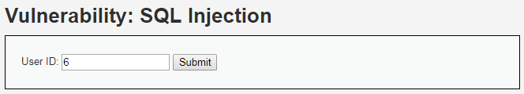

Dans ce cas, aucune donnée n'est remontée et aucun message d'erreur n'est affiché.

Tentons de détecter maintenant si le champ est susceptible d'être vulnérable à une injection SQL. Cela peut être fait de plusieurs manières, mais la plus simple reste sans doute l’insertion d’un caractère spécifique à SQL tel que le signe `"'"`:

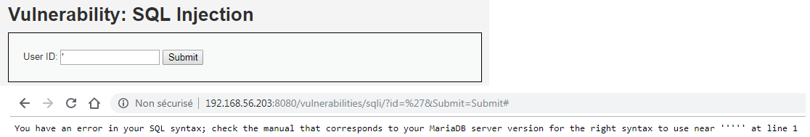

L'erreur SQL retournée ici révèle en effet la possibilité d'une injection SQL ainsi que le fait son type sans doute de type String.

On commence donc par récupérer le nombre de colonnes retourné par la requête :

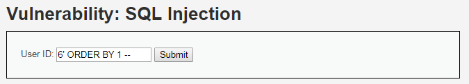

L'erreur survient lors de la requête sur une troisième colonne :

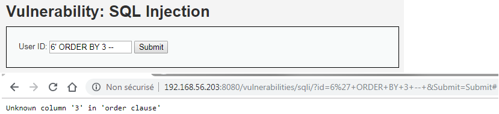

Cela indique qu'il y a seulement 2 colonnes. On repère maintenant l'emplacement de l'affichage des données remontées :

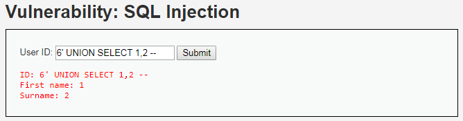

L'exploitation de la vulnérabilité peut maintenant réellement commencer. On récupère le nom de la base de données utilisée ainsi que le nom de l'utilisateur s'y connectant :

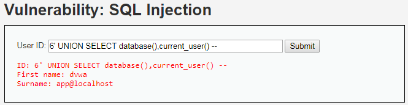

On récupère ensuite les noms des tables de la base `dvwa` \(le premier apostrophe est ajouté seulement pour la coloration syntaxique\) :

```sql
'6' UNION SELECT table_name,2 FROM INFORMATION_SCHEMA.TABLES WHERE TABLE_SCHEMA = 'dvwa' -- 
```

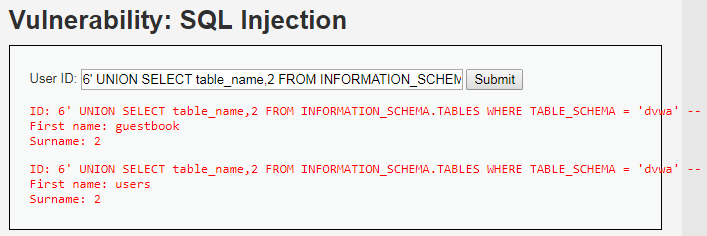

La table nommée `users` semble ici la plus intéressante. On utilise la même technique afin de récupérer le nom des colonnes de cette table :

```sql
'6' UNION SELECT column_name,2 FROM INFORMATION_SCHEMA.COLUMNS WHERE TABLE_SCHEMA = 'dvwa' -- 
```

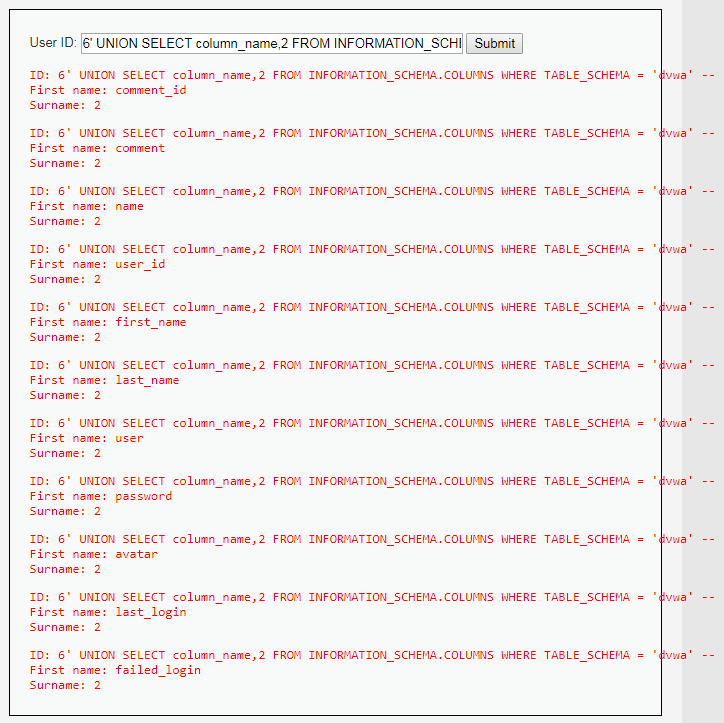

Puis finalement, on récupère les entrées pour les colonnes `user` et `password` de cette table `user` :

```sql
'6' UNION SELECT user,password FROM users -- 
```

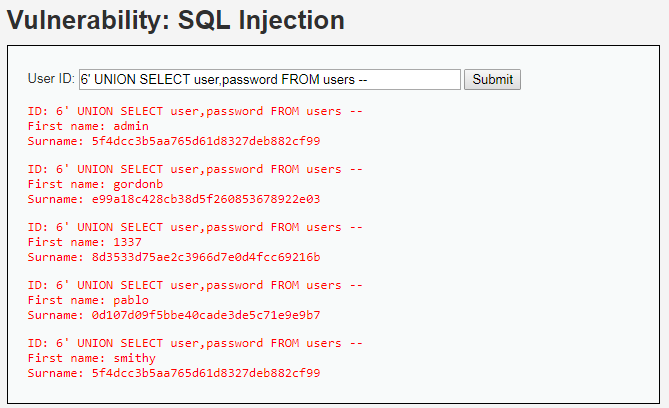

Une fois fait, la dernière étape reste de cracker les hash md5 \(32 caractères\) des mots de passe en utilisant par exemple [crackstation.net](https://crackstation.net/) :


