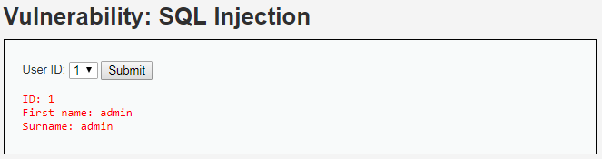
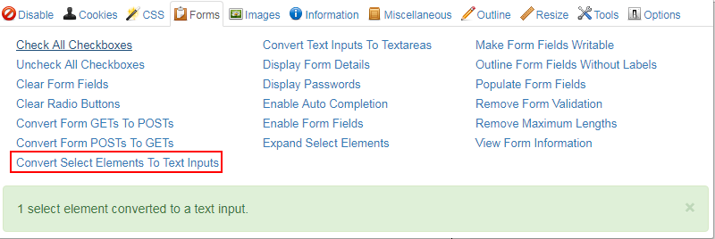
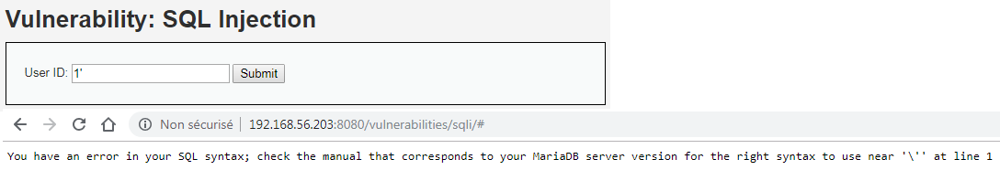
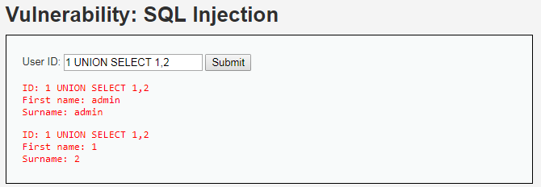
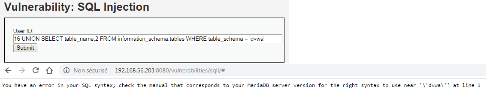
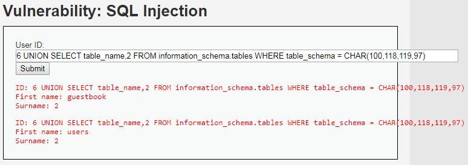
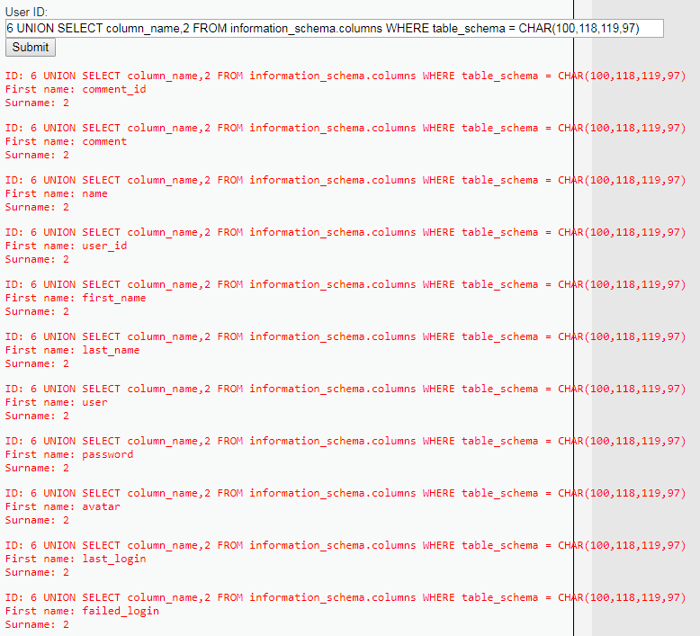
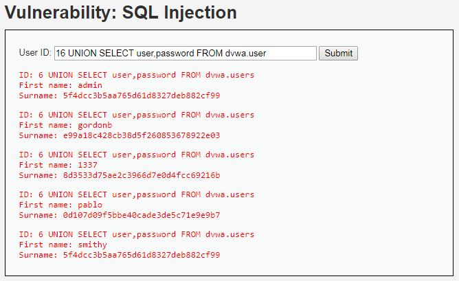

# Niveau "Medium"

Le formulaire est légèrement modifié ici puisque l'application nous présente non plus un champ de type `<input>` mais une liste de sélection `<select>` :



Pour un soucis de simplicité, j'utilise ici l'extension Web Developer (possible via Burp également) qui va convertir ce nouveau formulaire en champ de type `<input>` :



On tente d'injecter notre caractère spécial `"'"` afin de générer une erreur SQL :



L'erreur nous informe sur la présence d'une protection car le caractère `"'"` est échappé (via le caractère `"\"`). De plus, l'erreur nous indique qu'il s'agit sans doute d'une injection de type numérique et non plus de type String (nombre de `"'"` entourant notre donnée).

Sans reprendre toutes les étapes de reconnaissance (déjà effectuées pour le niveau "Low"), voici l'exploitation de l'injection dans les grandes lignes :

```sql
1 UNION SELET 1,2
```



L'échappement effectué par l'application est un peu embêtant car il nous empêche d'effectuer notre clause `WHERE` :&#x20;

```sql
6 UNION SELECT table_name,2 FROM INFORMATION_SCHEMA.tables WHERE TABLE_SCHEMA = 'dvwa' -- 
```



Afin de contourner cette limitation on peut, soit supprimer notre clause, ce qui aura pour conséquence de retourner une liste de toutes les tables des différentes bases, ou alors, d'utiliser la fonction `CHAR()` de MySQL :

```sql
6 UNION SELECT table_name,2 FROM INFORMATION_SCHEMA.tables WHERE TABLE_SCHEMA = CHAR(100,118,119,97)
```



Maintenant que nous pouvons contourner l'échappement en place, la suite est facile :

```sql
6 UNION SELECT column_name,2 FROM INFORMATION_SCHEMA.columns WHERE TABLE_SCHEMA = CHAR(100,118,119,97)
```



Puis finalement :

```sql
6 UNION SELECT user,password FROM dvwa.users
```



Une fois fait, la dernière étape reste de cracker les hash md5 (32 caractères) des mots de passe en utilisant par exemple [crackstation.net](https://crackstation.net/) :

.png>)
