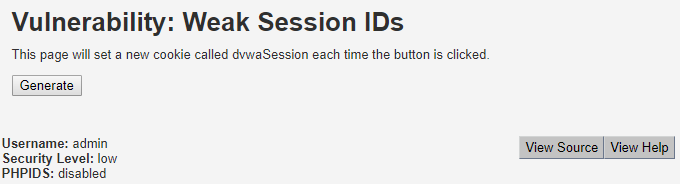

# Weak Session IDs

## Objectif du challenge

Malheureusement ici, à part déterminer comment est généré le jeton du challenge on ne pourra pas aller beaucoup plus loin. Il faudra garder à l'esprit que le jeton généré est censé représenter la session de l'utilisateur et donc, que déterminer un tel jeton peut mener à une usurpation d'identité :

