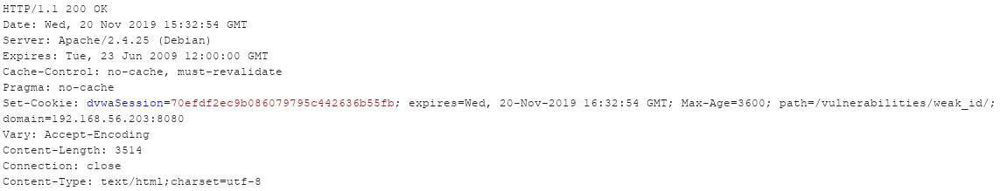
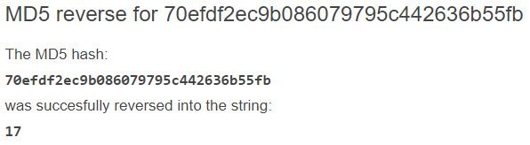
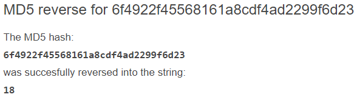
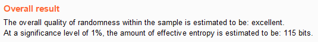

# Niveau "High"

Le niveau "High" met en place un jeton de session qui semble plus complexe de prime abord :

Le format du jeton est toutefois reconnaissable et il s'agit ici sans doute d'une empreinte md5 (32 caractères). Deux approches ici :

1. Soit je détermine ce qui a pu donner cette empreinte (mon adresse IP, le timestamp, mon nom d'utilisateur etc)
2. Soit je tente de la reverser et je vois  ce que cela donne

Je suggère la seconde approche et si elle échoue je passe  à la première :yum: :

L'empreinte est celle du nombre "17". Je génère un second jeton pour confirmer :

Il s'agit de l'empreinte du nombre "18" :

Il s'agit donc en fait de la même mécanique de génération que le niveau "Low" à laquelle est ensuite appliquée une méthode de hashage.

Pour détourner la session d'un utilisateur il suffit donc de tester le hash d'un nombre inférieur et de croiser les doigts.

Burp va t'il être capable de reconnaître que se cache une suite simple sous ces empreintes :

En fait non, Burp analyse l'aléa des jetons comme ayant une entropie de 115 bits. Je propose donc de conclure par : "Rien ne remplacera l'humain :wink: ".
