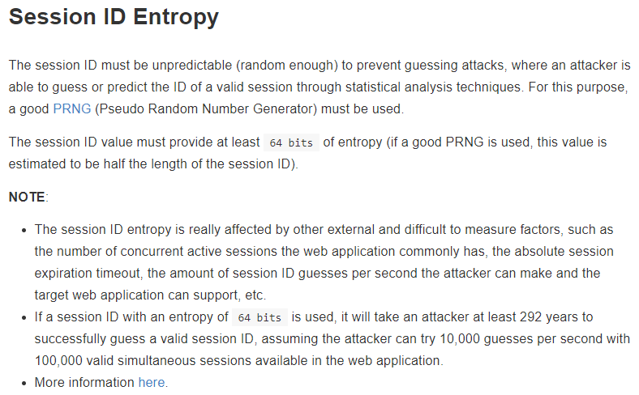
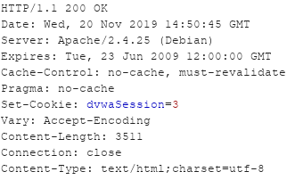
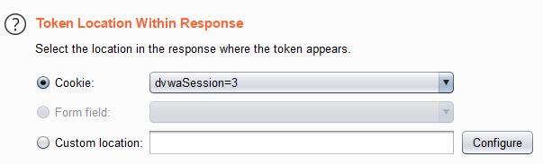
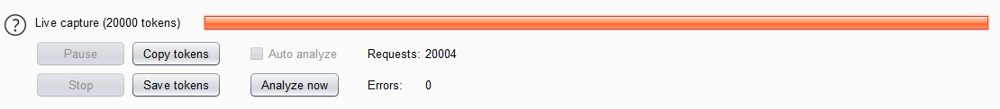
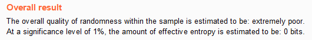

# Niveau "Low"

L'application permet de générer un nouveau cookie (pouvant représenter un cookie de session) possédant à chaque fois une nouvelle valeur. Comme l'indique l'[OWASP](https://cheatsheetseries.owasp.org/cheatsheets/Session\_Management\_Cheat\_Sheet.html), un identifiant de session doit posséder plusieurs propriétés dont celles d'être non prédictible et de fournir une entropie d'au moins 64 bits :

Je génère donc quelques cookies, nommés pour l'occasion "dvwaSession" :

dont les valeurs semblent se suivre en commençant par la valeur "1", puis "2", puis "3" et ainsi de suite.

Si ce jeton était un jeton de session, il suffirait alors de tester tous les jetons avant celui représentant ma session (en admettant que j'ai reçu la valeur "15" alors il suffira de tester tous les jetons de "1" à "14") pour sans doute pouvoir détourner la session d'un utilisateur (à condition que sa session soit toujours active).

Burp et son Sequencer permet de calculer l'entropie d'un jeton de session. Pour cela, il est nécessaire de sélectionner la requête de génération du jeton (dans l'historique de Burp) et de l'envoyer dans l'outil en question :

.png>)

Puis de sélectionner la valeur à auditer :

Et finalement de démarrer la "Live Capture" :

Une fois que Burp a récupéré assez d’échantillons, il est possible de lui demander d'analyser la robustesse de l'identifiant (bouton "Analyze now").&#x20;

Etant donné que le jeton ne possède aucun aléa, Burp indique une entropie de 0 bits soit le qualificatif d' "extremely poor" :

