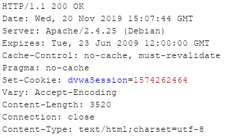

# Niveau "Medium"

Le niveau "Medium" renvoi comme valeur de jeton une suite de chiffres :

Cette suite est reconnaissable à son format, il s'agit d'un timestamp UNIX :

Afin d'usurper l'identité d'une personne il suffira donc de tester les sessions passées avec, une certaine chance que les sessions les plus récentes soient encore actives.

Voyons ce qu'en dit le Sequencer de Burp :

En effet, étant donné qu'il n'y ait toujours pas d'aléa dans ce jeton, Burp le qualifie également d' "extremely poor" avec une entropie de 0 bits.

