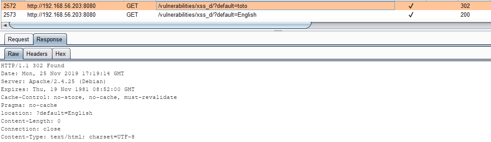
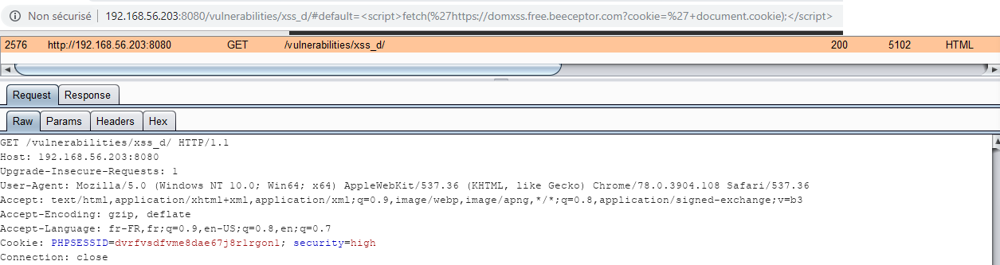
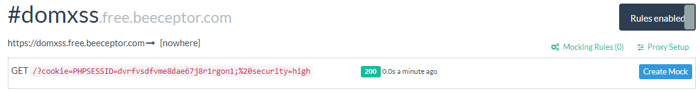

# Niveau "High"

Dans ce dernier niveau de difficulté, il n'est plus possible de renseigner une valeur aléatoire en guise de langue car le serveur nous répond dans ce cas par une **`302`** redirigeant vers une URL contenant une valeur correcte :

Le code Javascript permettant de renseigner la valeur sélectionnée n'ayant pas été modifiée, on exploite la vulnérabilité DOM XSS comme il se doit et l'on contourne les mécanismes de protection en place :

Et le cookie de notre victime est maintenant nôtre :

