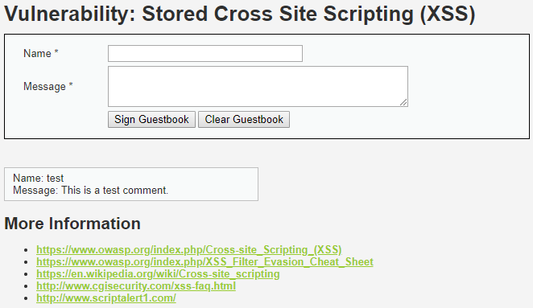
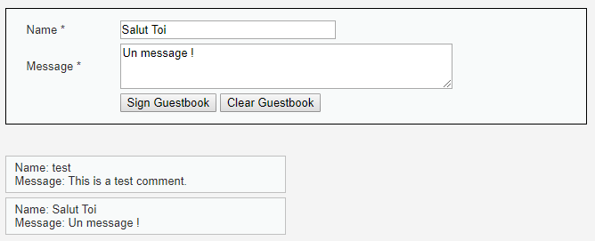
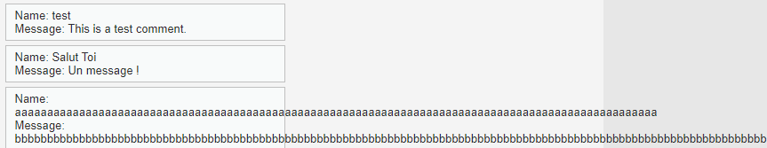
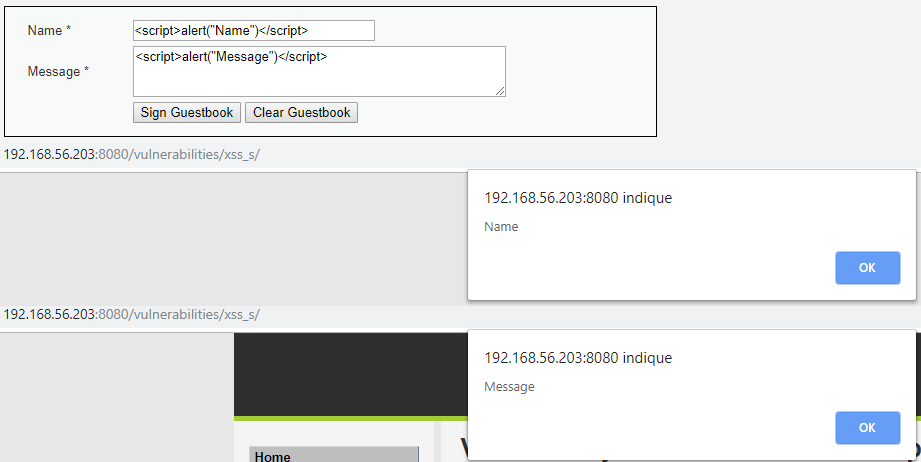
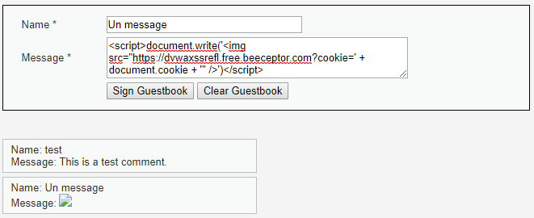
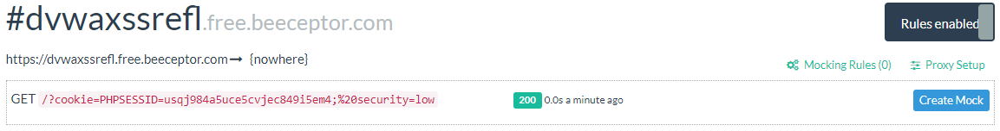

# Niveau "Low"

Le challenge se présence ici sous la forme d'un guestbook nous permettant de laisser un message visible par tous les utilisateurs :

Deux champs nous sont proposés ici. Un premier test va nous permettre de mieux cerner le fonctionnement de l'application :

Les deux champs sont présents au niveau de l'affichage du message. De plus, les longueurs des champs sont respectivement limitées à 15 et 50 caractères, mais un second test nous indique que cette limitation n'est pas renforcée côté back (la console de dév ou Burp peut nous aider à supprimer cette limitation) :

On effectue un essai d'injection de scripts :

Les deux champs sont vulnérables à une injection XSS. Une payload simple à base d'image va nous permettre de récupérer le jeton de notre victime :

Etant donné que la faille XSS est de type stockée, alors chaque utilisateur visitant la page va déclencher la payload (dont nous même :rofl:) :

