# Hackademic: RTB1

## Détails de la machine

**Nom :** Hackademic: RTB1  
**Date de sortie :** 6 Septembre 2011  
**Lien de téléchargement :** [https://download.vulnhub.com/hackademic/Hackademic.RTB1.zip](https://download.vulnhub.com/hackademic/Hackademic.RTB1.zip)  
**Niveau :** Facile  
**Objectif\(s\) :** obtenir un accès "root" et lire le flag situé dans le fichier `/root/Key.txt`  
**Description :**  
`This is the first realistic hackademic challenge (root this box) by mr.pr0n  
Download the target and get root.  
After all, try to read the contents of the file 'key.txt' in the root directory.  
Enjoy!`

## Reconnaissance

La machine étant en DHCP il nous faut tout d'abord récupérer son adresse IP :

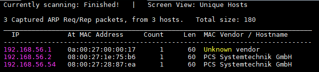

On garde les mêmes habitudes avec un scan de services grâce à `nmap` :

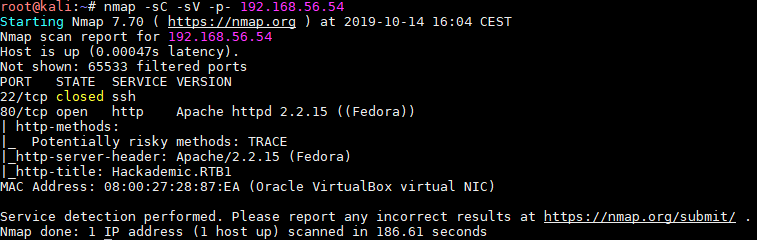

Le port 22 \(service SSH\) est clos, il nous reste donc seulement le serveur HTTP sur le port 80.

### Serveur Web

On utilise les habituels outils, `nikto` :

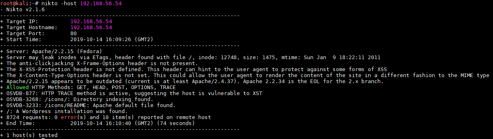

qui nous indique l'installation d'un CMS Wordpress. Suivi de `dirb` :

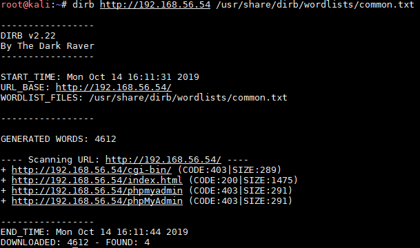

qui lui, remonte l'URL d'un `/phpMyAdmin` retournant un code 403 Forbidden. On continue la reconnaissance en accédant à la page d'accueil du site :

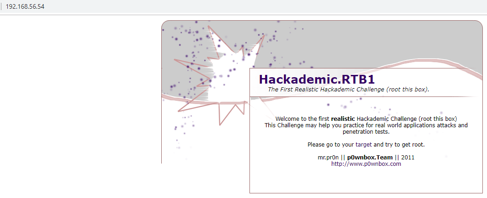

Le lien "target" nous dirige vers une seconde page `/Hackacdemic_RTB1` :

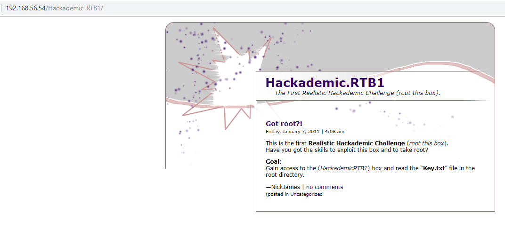

Je retente un `dirb` à parti de cette nouvelle URL afin de récupérer un maximum d'informations :

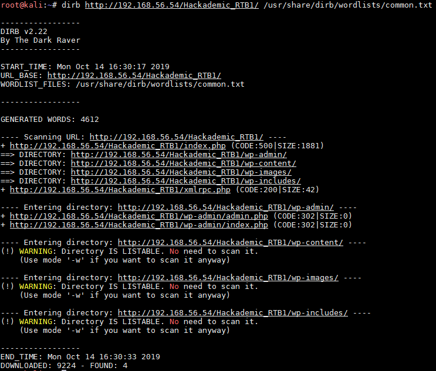

Il nous permet la découverte des URL liées au Wordpress déjà détecté par `nikto` . On identifie rapidement la mire d'authentification du CMS à l'URL `/Hackademic_RTB1/wp-login.php` :

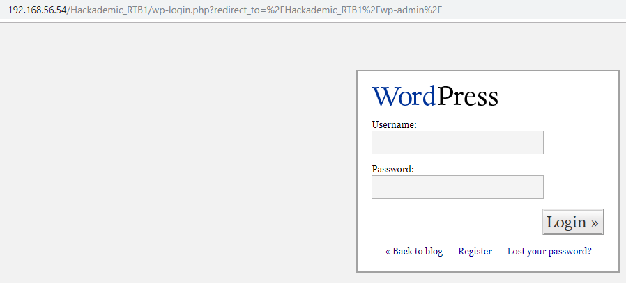

Après quelques tests basiques d'injections, on repère facilement l'injection SQL sur la paramètre `?cat=`de la page d'accueil `index.php` :

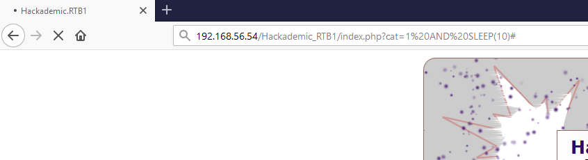

## Exploitation

L'exploitation de l'injection SQL peut être nous permettre de récupérer des identifiants permettant de s'authentifier sur le Wordpress :

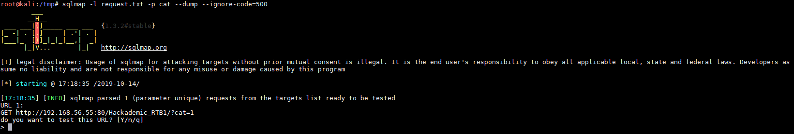


Je ne sais pas si cela venait d'une instabilité de ma VM mais les codes HTTP renvoyés par l'application étaient des codes 500. Le contenu HTML étant bien renvoyé, l'injection reste donc possible mais j'ai dû ajouter l'option `--ignore-code=500` à `sqlmap`


L'exploitation de l'injection permet de récupérer certains logins/mots de passe \(table wp\_users\) :

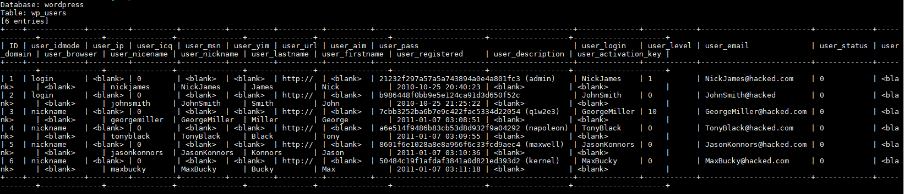

La suite de l'attaque se poursuivra sans doute avec le compte GeorgeMiller car il semble posséder le plus de permissions :

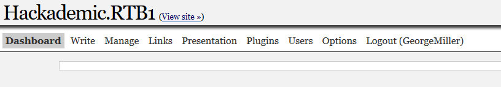

Le compte possède les droits d'édition sur certaines pages `.php` \(par exemple ici `wp-content/plugins/markdown.php`\) :

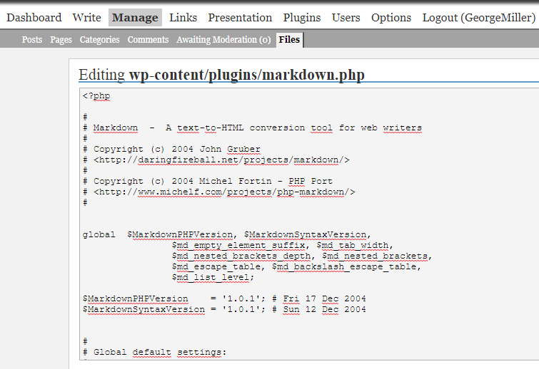

L'exploitation de cette fonctionnalité semble assez évidente, on va remplacer le contenu de la page par le code d'un reverse shell. Tout d'abord on génère le code avec `msfvenom` :

On modifie la page `markdown.php` :

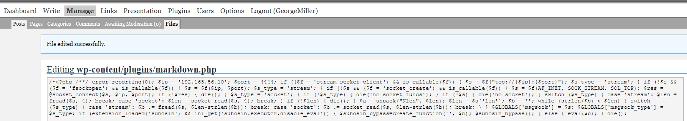

On sauvegarde les modifications puis met en place le handler sur la machine d'attaque :

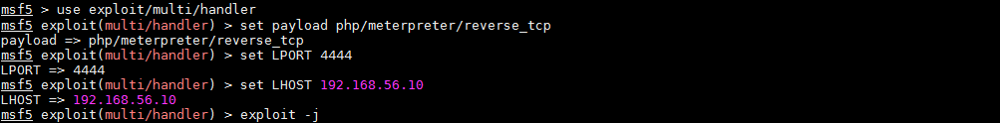

On active la payload en visitant la page malicieuse :

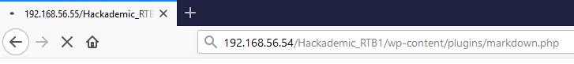

La connexion est établie, nous sommes dans la place :

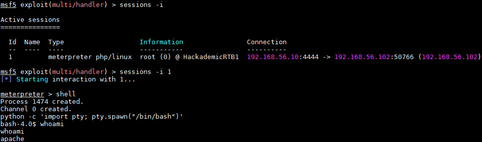

## Élévation de privilèges

Un petit tour de reconnaissance avec nos nouveaux droits :

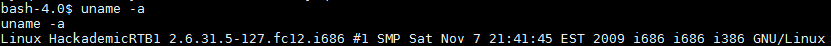

On liste les utilisateurs présents sur la machine :

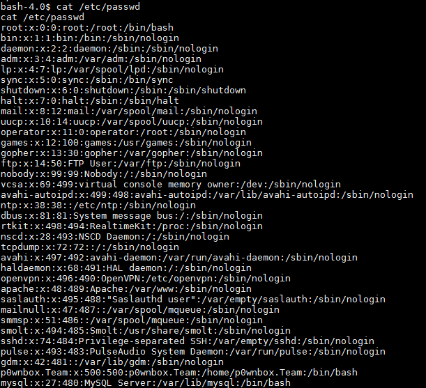

On récupère le mot de passe de connexion à la base mySQL :

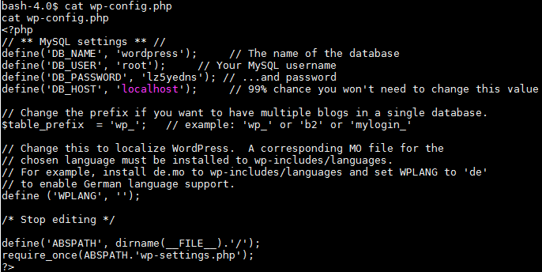

On termine par une recherche de mots de passe hardcodé autre que celui-ci ou encore la recherche de binaire suid mais rien. Je me tourne vers les exploits possibles pour la version 2.6.31 du noyau Linux. Pour cela je me sers de ce [GitHub](https://github.com/lucyoa/kernel-exploits) qui liste les différentes vulnérabilités et versions vulnérables :

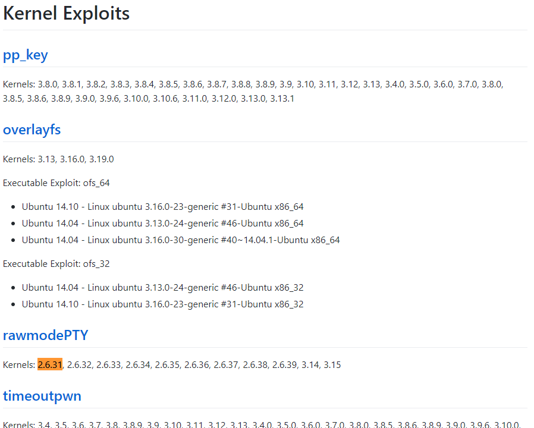

Ici j'ai posé mon cerveau et j'ai simplement testé un à un tous les exploits possibles pour la version 2.6.31 en version x86 \(je ne dis pas que c'est la meilleure solution 🙃 \). Au bout d'un moment il s'avère que l'exploit RDS passe :

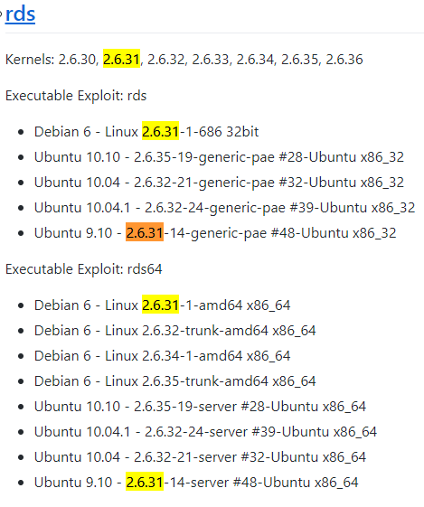

Afin de l'exécuter rien de plus simple, on met en place un serveur HTTP python côté attaque et on récupère l'exploit avec un `wget` :

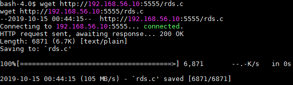

On le compile :

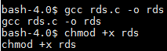

Puis on l'exécute :

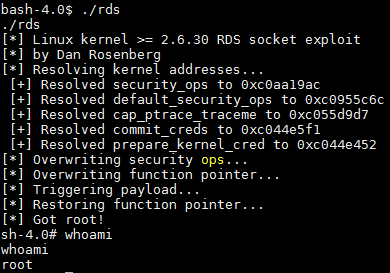

Afin de satisfaire la demande du créateur de la machine, on récupère le flag contenu dans le fichier `/root/key.txt` :

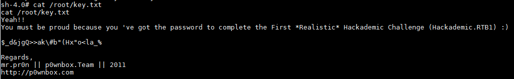

Travail terminé.

## Conclusion

La machine n'est pas difficile. L'injection SQL se trouve facilement et permet d'aller à la prochaine étape en possédant des comptes Wordpress valides. Récupérer un shell ne présente pas de soucis non plus et la technique d'exécution de code via une page php forgée pour l'occasion est maintenant une habitude.

Là où je suis un peu moins fier de moi c'est l'élévation de privilèges ou j'ai bêtement testé tous les exploits existants pour la version appropriée. L'excuse était que la fatigue commençait à m'envahir et je voulais terminer la machine au plus vite 😋 . Je pense qu'il est possible de faire une première analyse afin de savoir quel exploit peut convenir le mieux sans avoir à tous les exécuter mais je suis pas un grand connaisseur dans ce domaine.

