# Holynix: v1

## Détails de la machine

**Nom :** Holynix: v1\
**Date de sortie :** 27 Novembre 2010\
**Lien de téléchargement :** [https://download.vulnhub.com/holynix/holynix-v1.tar.bz2](https://download.vulnhub.com/holynix/holynix-v1.tar.bz2)\
**Niveau :** N/A\
**Objectif(s) :** obtenir un accès "root"\
**Description :** \
`Holynix is a Linux distribution that was deliberately built to have security holes for the purposes of penetration testing. If you're having trouble, or there are any problems, it can be discussed here.`

## Reconnaissance

On commence notre phase de reconnaissance par les habituels `netdiscover` et `nmap` permettant respectivement d'obtenir l'adresse IP de la cible ainsi que la liste des services qu'elle héberge :&#x20;

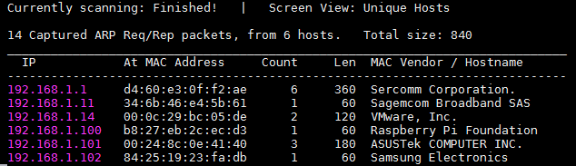

La cible a pour adresse 192.168.1.14, regardons maintenant le résultat de `nmap` :

.png>)

Ici un seul service semble être exposé sur la machine, à savoir un serveur HTTP sur le port 80.

### Serveur HTTP

La page d'accueil du site web nous indique directement que l'accès est restreint et qu'une authentification est nécessaire :

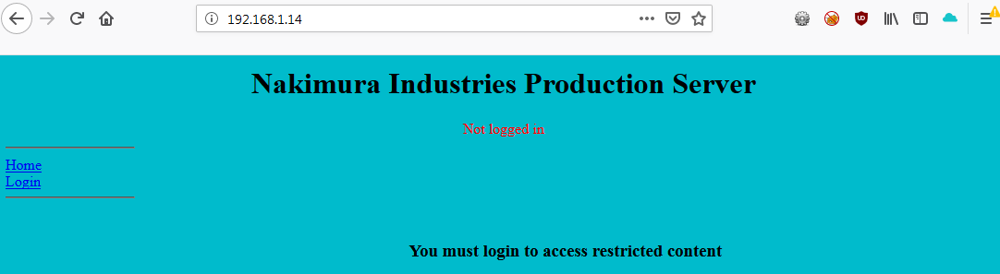

Pendant la phase manuelle de reconnaissance je lance en background un `dirb` ainsi qu'un `nikto`, les résultats sont données à la fin de cette phase.

Le premier paramètre, nommé "page", que l'on rencontre semble être vulnérable à une LFI/RFI :

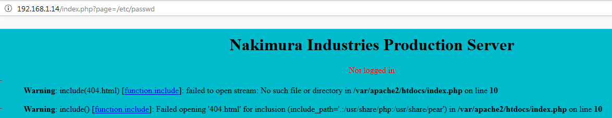

Il y a également la page d'authentification que voici :

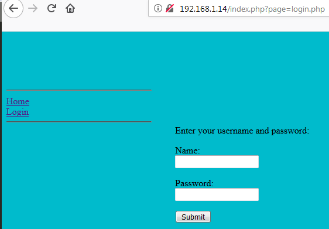

J'ai testé l'injection SQL sur le champ "Name" mais rien de ce côté là. Le tour est terminé, cela a le mérite d'être rapide (un peu trop même ?).

Voici les résultats de `nikto` tout d'abord :

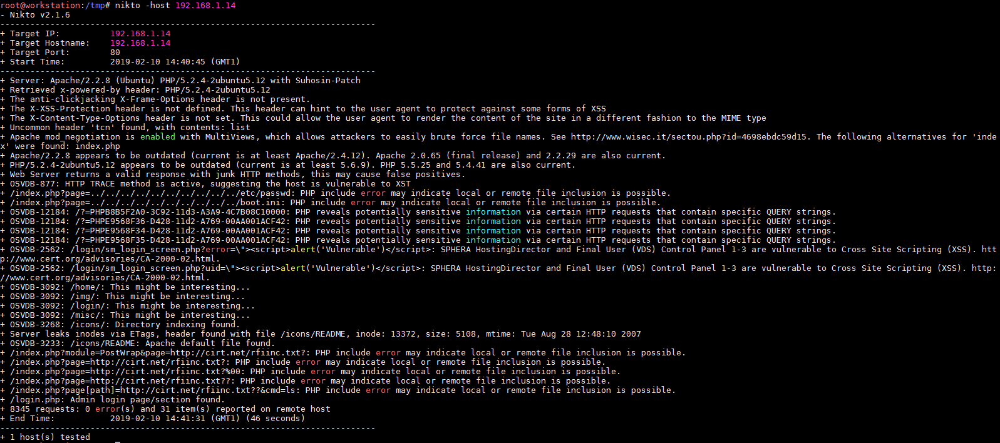

Quelques remontées intéressantes en termes de répertoires à visiter, mais nous sommes rapidement bloqué soit par un contrôle d'accès ou simplement une page blanche. Voyons du côté du `dirb` :

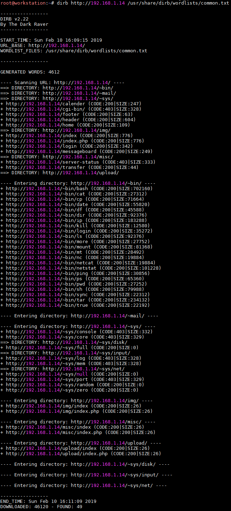

Pas mal de monde dis donc, mais après analyse rien ne semble bien exploitable : on peut télécharger les binaires, mais cela nous avance à rien. En ce qui concerne les autres il s'agit principalement de pages blanches. A noter tout de même le "/calender" ainsi que le "/messageboard" qui remonte une erreur SQL :

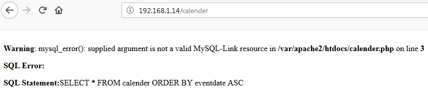

## Exploitation

### LFI/RFI

En termes d'exploitation il n'y a pas grand chose à se mettre sous la dent ici puisque la seule vulnérabilité potentielle est la LFI/RFI. Aucun moyen d'effectuer une LFI et encore moins une RFI, je soupçonne ici la validation du paramètre par une liste blanche. Au bout d'un certain temps j'ai tenté d'inclure les pages déjà existantes vues précédemment (les pages "/calender" et "/messageboard"), et voici ce que cela donne :

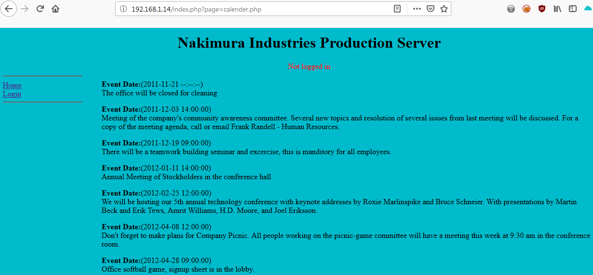

"/messageboard.php" (trop long pour mettre un screenshot) est un échange de messages entre plusieurs utilisateurs. Nous possédons maintenant une liste d'utilisateurs du système (en cas de nécessité de faire du bruteforce) et nous apprenons également qu'un système de port-knocking a été mis en place pour camoufler le port 22 (SSH) mais que le schéma a été envoyé par mail à un utilisateur nommé "jdraper".

Il est possible ici d'insérer des messages sans être authentifié mais pas d'injection SQL présente (mais du XSS). Voici la liste des utilisateurs évoqués dans le "/messageboard" :

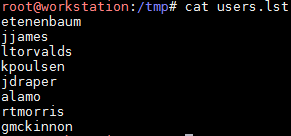

Une erreur que l'on voit parfois est l'utilisation de la méthode `include()` au lieu de `include_once()` en PHP comme ici. Il est donc possible de faire des sapins de noël en incluant la même page, ici "index.php" :

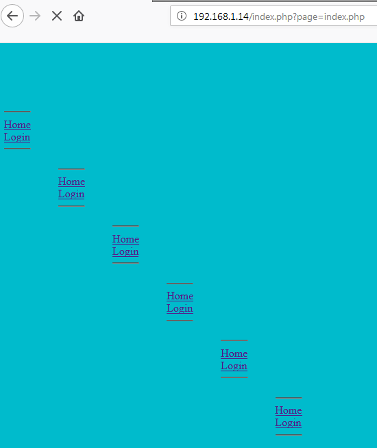

### SQL injection

Après des tests de weak password (et autres joyeusetés) pour ces comptes et ne trouvant rien de probant j'ai refait le tour des tous les paramètres disponibles afin de voir si je n'étais pas passé à côté de quelque chose, et en fait si : le champ "Password" est injectable. Cette injection SQL nous permet de récupérer les mots de passe des différents utilisateurs. Une table comporte également toutes les pages valides permettant d'être incluses par le paramètre "page", il s'agissait donc bien d'une validation par liste blanche :

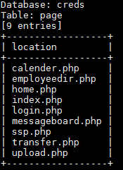

Voici la table la plus intéressante, celle qui contient les usernames/passwords :

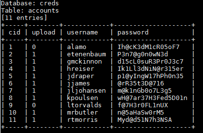

En effet, c'était mal barré pour des weaks credentials ou du bruteforce ...

Le premier compte que j'ai testé est celui de "jdraper", car si nous pouvons accéder à ses mails (webmail, une note sur son profil ou quelque chose de ce genre) peut être pouvons nous récupérer le schéma du port-knocking. Mais rien de tout cela, par contre il est possible d'uploader des fichiers sur le serveur :

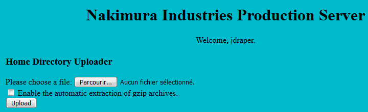

J'ai tenté en premier lieu d'uploader un fichier image, mais impossible de savoir où est stocké le fichier (dans l'optique d'uploader un fichier PHP par exemple puis de l'exécuter). J'ai tenté le "/upload" que l"on aperçoit sur le `dirb` , mais rien. J'ai également essayé d'autres types de fichier ainsi que des archives "gzip" mentionnées sur la page, mais que dalle, nada. Je suis resté bloqué ici un certain temps ...


Puis j'ai craqué, j'ai été lire un writeup d'une autre personne pour me débloquer sur cette partie. Attention, s'il vous arrive de faire la même chose, je vous conseille par contre de ne regarder que l'étape qui vous pose problème et non toute la solution.


La solution était donc d'aller chercher les fichiers uploadés sur le "home" de l'utilisateur, à savoir ici "/\~jdraper" :

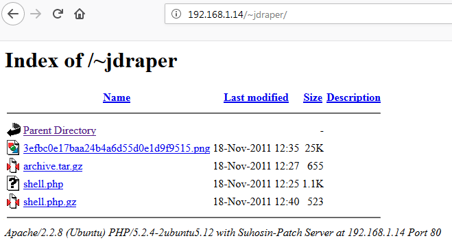

J'ai donc tenté directement un fichier webshell PHP (le fichier ici nommé "shell.php"), mais une erreur de permission empêche son exécution :

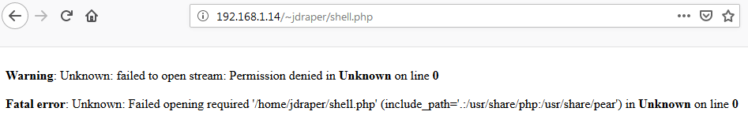

Etant donné que les fichier "gzip" sont automatiquement extraits, l'idée sera de zipper son webshell et de voir ce que cela donne. Ici le fichier "shell2.php" a été automatiquement extrait d'un fichier "shell2.tar.gz" :


On récupère un shell via Meterpreter :

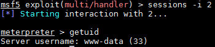

Nous avons donc un accès limité, il ne reste plus qu'à trouver un moyen d'élever nos privilèges.

## Élévation de privilèges

Un des premiers réflexes qu'il faudrait avoir est de regarder les droits `sudo` que nous offrent notre compte :

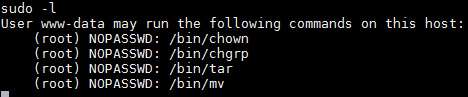

Il y a sans doute moyen de faire quelque chose avec tout cela :

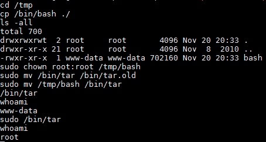

J'explique ma démarche. Tout d'abord on copie le binaire "bash" puis avec un `sudo` nous y mettons les droits "root:root" (l'objectif est de l'exécuter pour devenir "root"). On déplace le binaire "tar" (car nous avons le droit de l'exécuter) puis nous le remplaçons par notre "bash". On exécuter donc avec un `sudo` notre faux bash (soit '/bin/tar') et nous sommes "root".

## Conclusion

Premièrement j'ai perdu du temps à cause de l'injection SQL. En effet, je trouve qu'il est rare maintenant de trouver des injections sur les champs de mot de passe (même dans les applications volontairement vulnérables comme DVWA, Webgoat et autres il me semble). Cela vient du fait que les mots de passe sont hachés avant utilisation. A peu près comme ceci :

```php
<?php
  $user_password = md5($_GET['password']);
?>
```

Donc même si au niveau SQL une injection est possible, la valeur que l'attaquant renseigne est tout d'abord hachée ce qui rend l'attaque par le champs mot de passe impossible.

Puis j'ai bien galéré (et même échoué je dirais) à identifier l’emplacement des fichiers uploadés. Je ne suis pas fier de moi mais j'ai dû regarder la solution pour cette étape (je trouve cela très frustrant de ne pas trouver soi-même :unamused: ).&#x20;

En ce qui concerne le dézippage automatique, l'option à cocher nous met sur la piste assez rapidement. De plus il me semble qu'un challenge de Root-Me ressemble à cela également.

En ce qui concerne la LPE, je n'ai pas regardé tout de suite les droits `sudo`. J'ai le réflexe de le faire avec les comptes utilisateurs du système mais pas forcément avec les comptes de services, comme quoi il faut tout de même y penser.
