# Holynix: v2

## Détails de la machine

**Nom :** Holynix: v2\
**Date de sortie :** 8 Décembre 2010\
**Lien de téléchargement :** [https://download.vulnhub.com/holynix/holynix-v2.tar.bz2](https://download.vulnhub.com/holynix/holynix-v2.tar.bz2)\
**Niveau :** N/A\
**Objectif(s) :** obtenir un accès "root"\
**Description :** \
`Holynix is an Linux distribution that was deliberately built to have security holes for the purposes of penetration testing. The object of the challenge v1 is just to root the box. Register on the forums to receive an email update when a new challenge is released.`\
``\
`Network Configuration Holynix v2 is set with static ip and requires some network configuration in order to run.`\
`Network: 192.168.1.0/24` \
`Pool Starting Addr: 192.168.1.2` \
`Gateway Addr: 192.168.1.1` \
`Subnet Mask: 255.255.255.0`

## Reconnaissance

Comme d'habitude on commence par identifier notre cible grâce à `netdiscover` :

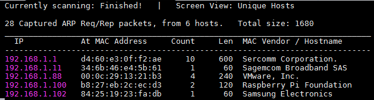

Et le scan `nmap` de la machine "192.168.1.88" :

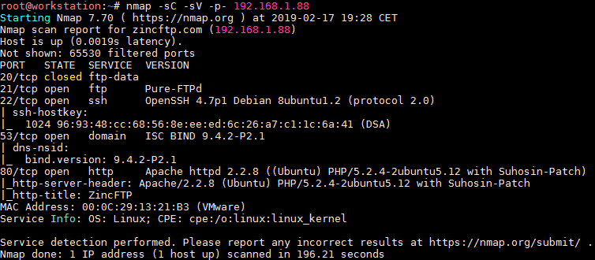

Nous avons donc un service FTP Pure-FTPd mais `nmap` ne nous remonte pas sa version. Un service SSH de type OpenSSH 4.7p1, un service DNS avec un serveur ISC BIND en version 9.4.2-P2.1 ainsi qu'un serveur web sur le port 80 (Apache 2.2.8 et PHP 5.2.4).

### Service FTP

J'ai tenté ici d'en savoir plus sur le service Pure-FTPd et notamment sur son possible fingerprinting afin de pouvoir rechercher les vulnérabilités associées à sa version. Tout d'abord grâce au module Metasploit :

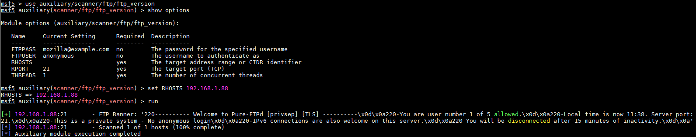

Il est possible de récupérer la même chose sans utiliser Metasploit mais `telnet` :

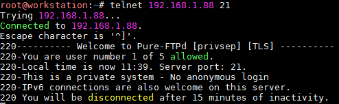

Il est indiqué que l'authentification anonyme n'est pas possible. C'est en effet sans doute le cas, sinon `nmap` l'aurait remonté pendant son scan (grâce à l'option activant certains scripts `-sC`).

### Service SSH

Il s'agit d'une version 4.7 donc vulnérable à la CVE-2018-15473, mais celle-ci datant de 2018 je ne pense pas que l'auteur de la machine en avait conscience  :wink: . On la garde sous le coude on ne sait jamais.

### Service DNS

Le service DNS est géré par un ISC BIND en version 9.4.2-P2.1, mais je n'ai trouvé aucune vulnérabilité qui peut nous aider ici.

### Serveur HTTP

La page d'accueil nous indique qu'il faut être un utilisateur de "ZincFTP" afin de pouvoir accéder aux services offerts part la plateforme. Deux champs permettent de demander l'accès après confirmation par un administrateur :

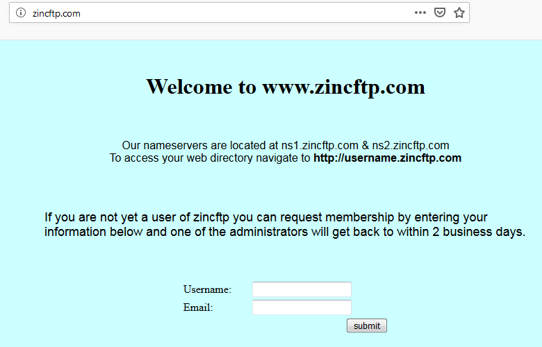

Pas d'injection SQL identifiée sur ces deux champs, on continue l'analyse en utilisant `dirb` et `nikto` :

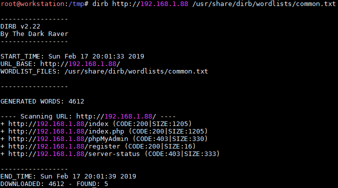

Un phpMyAdmin est disponible mais la réponse est un 403 (Forbidden), de même pour le "/server-status". Le "/register" est la page qui reçoit la requête de la page d'accueil :

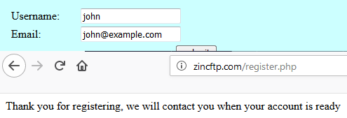

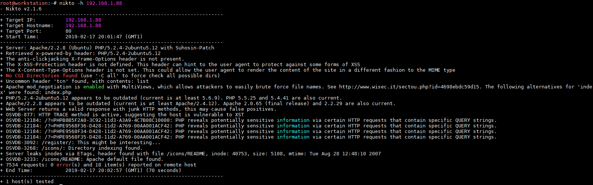

Rien de spécial en sortie du `nikto`.

Pour réussir à avancer, il faut revenir sur la page d'accueil. Elle nous indique que les serveurs de noms sont disponibles sur "ns1.zincftp.com" ainsi que sur "ns2.zincftp.com". De plus, il est possible d'accéder à un répertoire web propre à l'utilisateur en accédant à l'URL "http://username.zincftp.com", le problème c'est que nous ne connaissons aucun nom d'utilisateur.

Si nous pouvons récupérer les sous-domaines existants on obtiendra donc la liste des utilisateurs de la  plateforme et peut être même accéder aux différents répertoires web. Il faut donc sans doute se concentrer sur le serveur DNS présent sur la machine. A partir de là, vient l'idée de tenter un transfert de zone.

## Exploitation

### Transfert de zone DNS

Avant de tenter un transfert de zone, nous allons commencer par en savoir un peu plus sur le nom de domaine "zincftp.com" en interrogeant le DNS de la machine grâce à la commande `dig` :

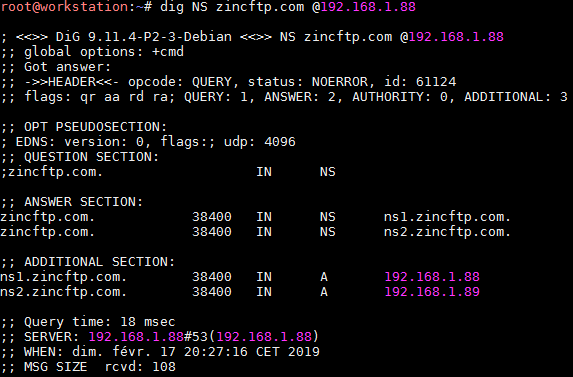

Un second serveur DNS est disponible à l'adresse 192.168.1.89 mais étant donné que la machine ne contient qu'une seule interface réseau cette adresse ne donne rien. Avant de passer au transfert de zone quelques rappels à son sujet :


Il ne s'agit pas d'une attaque mais d'un mécanisme de duplication des bases de données des serveurs DNS. Dans cette base se trouvent la liste des domaines gérées par le serveur en question. Dans notre cas il doit contenir par exemple les sous-domaines propres aux utilisateurs de la plateforme sous la forme "username.zincftp.com".&#x20;

La réplication de cette base sert dans le cas par exemple où deux (ou plus) serveurs DNS sont en place. Le premier est le serveur primaire, il répond aux requêtes des utilisateurs permettant ainsi de traduire une adresse IP en nom de domaine (c'est quand même plus facile à retenir pour nous). Mais que se passe t'il si ce serveur tombe en panne ? Le serveur secondaire prend le relais. Mais pour qu'il puisse prendre le relais il faut qu'il possède la même base de données que le serveur primaire, d'où la nécessité de se maintenir à jour en demandant régulièrement au serveur primaire une copie de sa base de données.


L'attaque consiste donc à utiliser ce mécanisme afin de récupérer sa base de données et ainsi connaître les domaines qu'il gère :

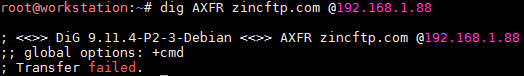

Ici "AXFR" signifie simplement : "donne moi toute les entrées que contient ta base". Mais dans notre cas, le transfert de zone ne fonctionne pas : le transfert a échoué. Après un certain temps de réflexion, il m'est venu l'idée d'utiliser l'IP du second serveur DNS, soit 192.168.1.89, et de réitérer la demande. En effet, il se peut qu'une sécurité soit mise en place afin que seul le second serveur DNS puisse effectuer cette requête, mais vu qu'il ne semble pas en ligne ici pas de problème pour se faire passer pour lui :

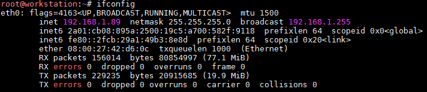

Notre machine d'attaque possède maintenant l'adresse 192.168.1.89 qui correspond au serveur DNS secondaire. On tente à nouveau le transfert de zone :

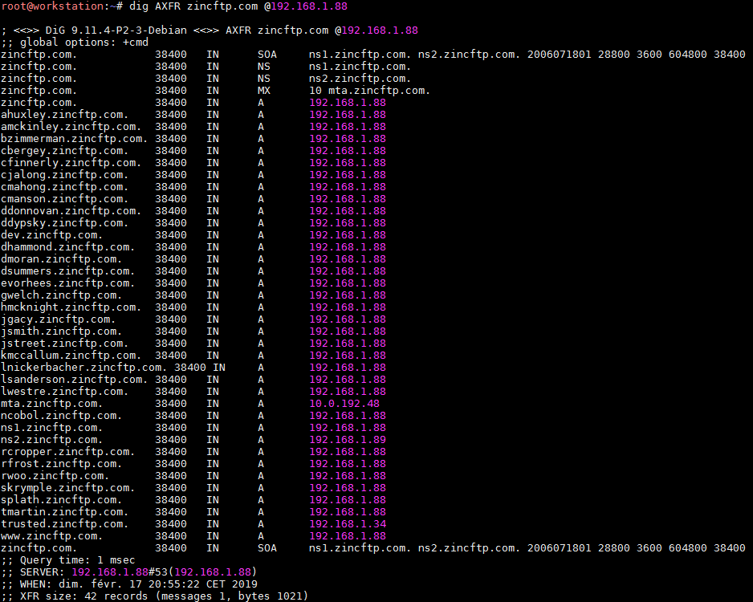

Cela fonctionne et la réponse est plus intéressante maintenant, nous possédons donc les sous-domaines valides et donc également une liste de noms d'utilisateur.

### Découverte des sous-domaines

Afin de pouvoir visiter les différents sous-domaines il est nécessaire de configurer l'adresse DNS de notre  machine pour qu'il pointe vers 192.168.1.88 pour la résolution des noms de domaine. Pour ma part, mon Kali est en fait une VM VirtualBox qui ne possède pas d'environnement graphique (je m'y connecte en SSH) depuis l'hôte qui est un Windows. Faire du browsing web à coup de `cURL` ou de Lynx ne m’intéressait pas vraiment donc j'ai configuré ma machine hôte directement. Pour que cela fonctionne j'ai du désactiver IPV6 (je ne sais pas si c'était réellement nécessaire, mais vu que cela ne fonctionnait pas dans le cas contraire ...) :

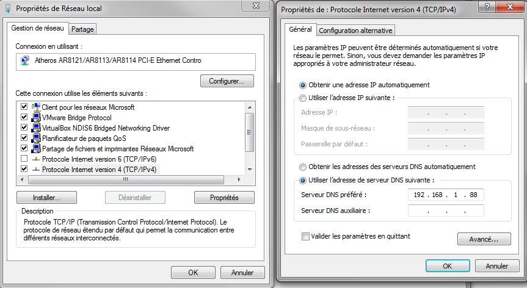

Malheureusement, après avoir visité tous les sous-domaines possibles, aucune information réellement intéressante (à part quelques photos ou vidéos légèrement drôle).&#x20;

### PhpMyAdmin (CVE-2005-3299)

Nous savons qu'il y a un phpMyAdmin de disponible, mais l'accès nous est interdit (403 Forbidden). Après quelques minutes de recherche, j'ai tenté de changer d'adresse IP pour une autre, présente en réponse du transfert de zone (bon en fait je mens un peu, il y a deux bonnes heures de recherche entre temps :yum:).

La seule adresse qui est sous le même sous-réseau est l'adresse 192.168.1.34 qui correspond au sous-domaine "trusted.zincftp.com". Et là, si on tente d'accéder au phpMyAdmin avec notre nouvelle adresse IP (en se faisant donc passer pour "trusted.zincftp.com") :

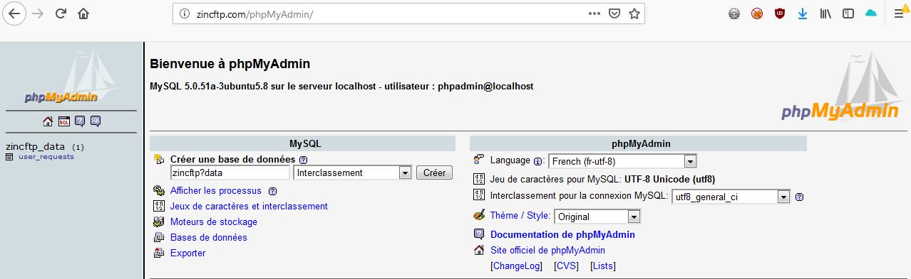

Pour info la configuration de ma machine hôte devient donc :

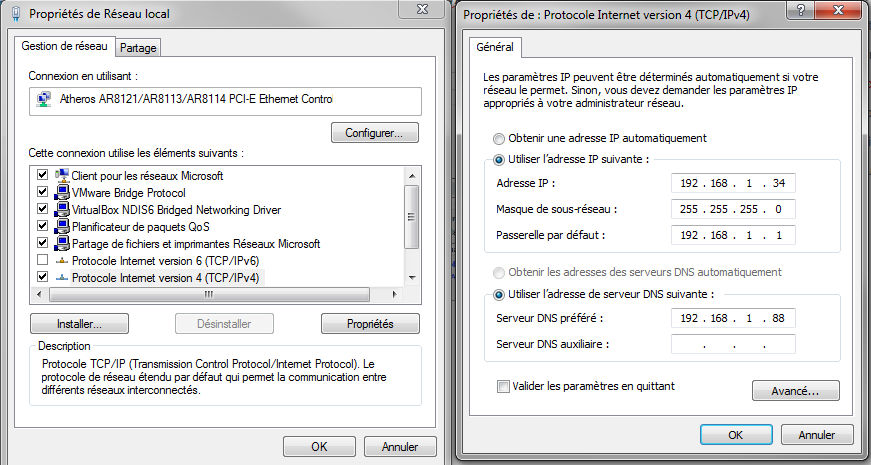

On récupère ce que contient la base de données (c'est-à-dire pas grand chose ici) :

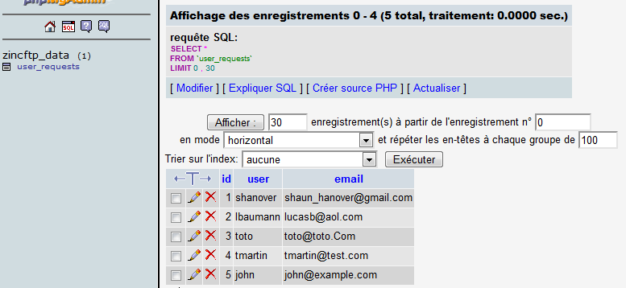


Les trois dernières entrées sont des tests que j'avais effectués en phase de reconnaissance


Pas de mot de passe pour nous aider à avancer :neutral\_face: . On peut tenter de connaître la version de phpMyAdmin grâce à son ficher "README" :

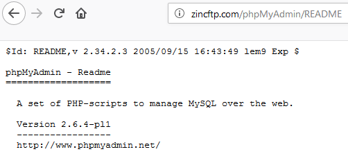

Il s'agit donc de la version 2.6.4-pl1 qui contient une vulnérabilité de type LFI (CVE-2005-3299) :

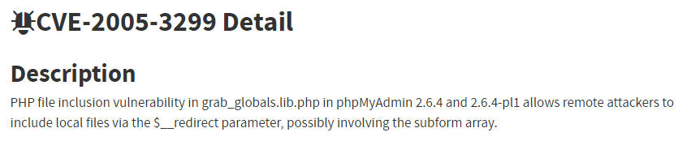

Un `searchsploit` nous indique qu'un exploit en Perl existe mais un Burp suffit amplement ici. Voici la requête à exécuter pour récupérer le fichier "/etc/passwd" :

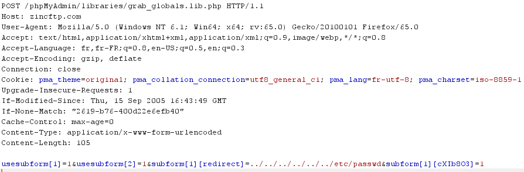

La réponse avec le fichier désiré :

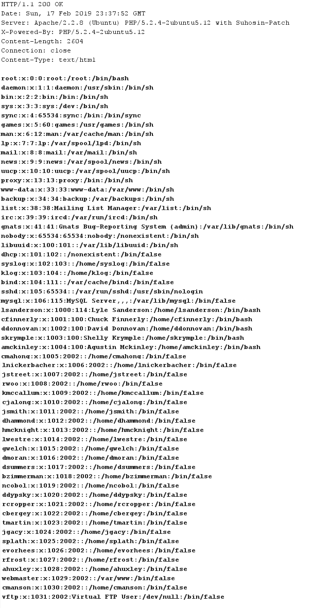

Il y a un sacré paquet de comptes. Mais nous pouvons distinguer les comptes qui ont un accès à un shell ("/bin/bash"), des autres comptes de service ou de ceux indiqués avec "/bin/false" (comparable à un "/bin/nologin").&#x20;

Après un peu de recherche, on apprend que Pure-FTPd stocke les mots de passe des utilisateurs dans un fichier spécifique "/etc/pureftpd.passwd" :

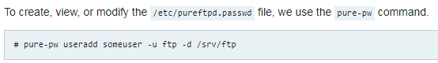

Grâce à la vulnérabilité de phpMyAdmin, nous récupérons ce fichier :

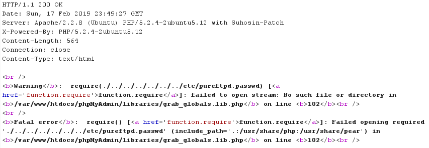

Hmm, ce fichier ne semble pas exister sur la machine dommage. En creusant un peu plus il apparaît que le chemin peut également être quelque chose comme "/etc/pure-ftpd/pureftpd.passwd" ou "/etc/pure-ftpd/conf/pureftpd.passwd" :

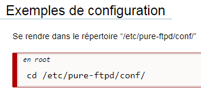

On tente à  nouveau :

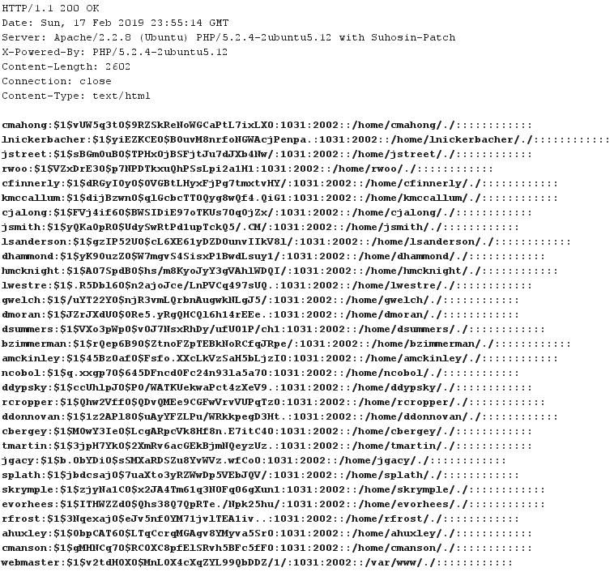

Bingo, il s'agit donc non pas des credentials d'un accès SSH mais plutôt des comptes FTP, c'est toujours ça. Rien ne nous empêche de faire du credentials stuffing afin de voir si les mêmes mots de passe ne sont pas réutilisés.&#x20;

### Reverse Shell

Dans un premier temps, nous crackons les mots de passe avec `john` :

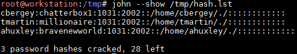

Pour info le dictionnaire utilisé était le fichier "rockyou" de Kali. Seul le dossier FTP de "tmartin" possède un fichier de type .rar (les autres sont vides), mais il est protégé par un mot de passe :

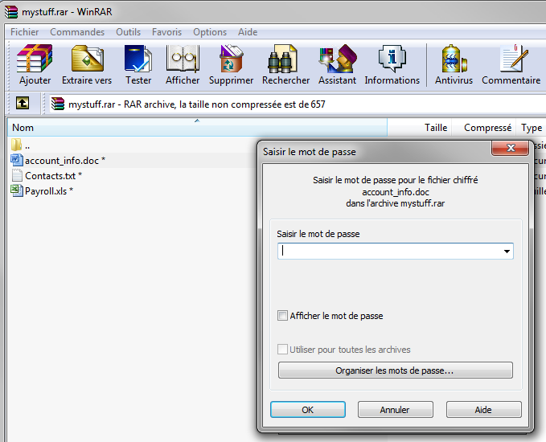

J'ai tenté de casser le mot de passe avec `john` (précédé d'un `rar2john`) mais c'était beaucoup trop long (j'ai bien sur essayé son mot de passe FTP mais sans succès) :

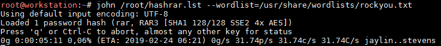

Je me suis un peu renseigné sur comment fonctionne la protection de WinRAR et en effet il semble que c'est assez consommateur en temps/puissance à cause des nombreuses itérations sur SHA-1 :

La solution était en fait plus simple, nul besoin de l'archive WinRar. Il faut uploader un web shell puis l'appeler directement en accédant au sous-domaine qui correspond à l'utilisateur :

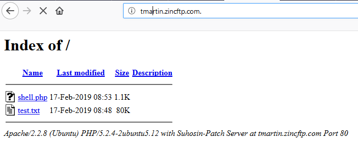

La paylaod a été générée avec `msfvenom`. Côté Metasploit on récupère donc une session `meterpreter` en tant que "www-data" :

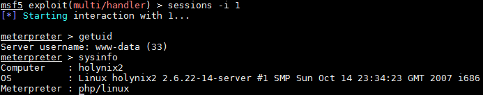

Après une recherche de droits sudo, etc, on récupère un fichier qui mentionne une réinitialisation de mot de passe pour l'utilisateur "amckinley" :

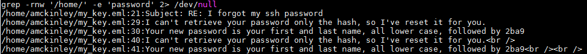

Voici le contenu entier de l'échange par mail :

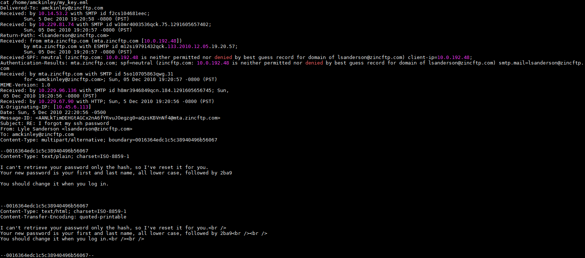

Le mot de passe de l'utilisateur "amckinley" a été réinitialisé à la valeur "agustinmckinley2ba9" (son prénom est présent dans le fichier "/etc/passwd" récupéré plus tôt).

Nous avons donc un accès SSH plus stable et peut être un compte plus permissif :

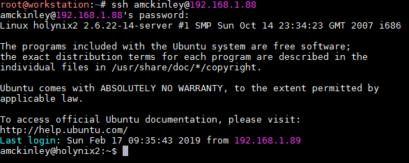

## Élévation de privilèges

Je n'ai pas trouvé ici d'autre solution que l'exploitation d'une vulnérabilité du kernel. La version du noyau est une 2.6.22 :

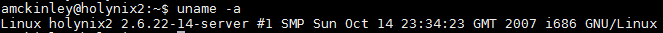

Ce noyau est vulnérable à l'exploitation "vmsplice" ([https://downloads.securityfocus.com/vulnerabilities/exploits/27704.c](https://downloads.securityfocus.com/vulnerabilities/exploits/27704.c)). Une fois compilé et exécuté, nous obtenons un accès "root" :

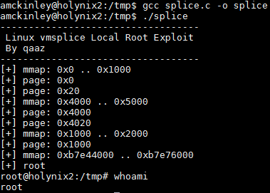

## Conclusion

J'ai vraiment apprécié cette machine ! Le transfert de zone sort de ce que j'ai précédemment fait sur les Vulnhub et la suite est du même acabit (des fichiers pour nous mettre sur une fausse piste, pas mal de recherche à effectuer etc).

J'ai par contre passé plusieurs soirs dessus et je ne l'ai pas trouvé si simple que cela (pour mon niveau bien sûr). Le challenge était là et selon moi, il vaut le détour.

