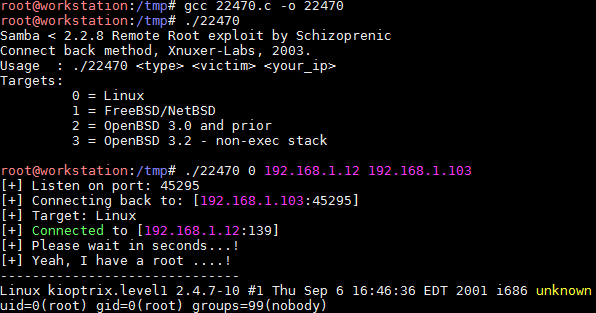

# Kioptrix: Level 1 (#1)

## Détails de la machine

**Nom :** Kioptrix: Level 1 (#1)\
**Date de sortie :** 17 Février 2010\
**Lien de téléchargement :** [http://www.kioptrix.com/dlvm/Kioptrix\_Level\_1.rar](http://www.kioptrix.com/dlvm/Kioptrix\_Level\_1.rar)\
**Niveau :** Facile\
**Objectif(s) :** obtenir un accès "root"\
**Description :**\
****`This Kioptrix VM Image are easy challenges. The object of the game is to acquire root access via any means possible (except actually hacking the VM server or player). The purpose of these games are to learn the basic tools and techniques in vulnerability assessment and exploitation. There are more ways then one to successfully complete the challenges.`

## Reconnaissance

Je ne change pas les bonnes habitudes, un `netdiscover` suivi d'un `nmap` pour connaitre un peu mieux notre cible :

La cible aura l'adresse IP 192.168.1.12 :

Du SSH, du web (80 et 443), du smb ainsi que du rpc, du classique pour cette machine.

### Service SSH

La version 2.9 est très vieille même pour une machine sortie en 2010, et en effet la version 2.9 est vulnérable à la CVE-2002-0083 :

### Serveur HTTP (port 80)

Rien à se mettre sous la dent, le serveur web est déséspérement vite. Une seule page (la page d'accueil) semble disponible et quelques images etc. Un `dirb` ne remonte rien d'intéressant non plus. Etant donné qu'il n'y a pas de vulnérabilité web possible, peut-être faut il se pencher un peu plus sur les version d'Apache ou de ses modules afin de trouver une porte d'entrée. Voici donc le résultat du `nikto` :

Il y a tout de même une page en PHP nommée "test.php" à la racine du site :

#### Apache

La version d'Apache est une version 1.3.20, le mod\_ssl est en 2.8.4 et OpenSSL en 0.9.6b, de très vieilles versions donc. Beaucoup de vulnérabilités existent sur ces différents composants, mais j'en retiens principalement une qui affecte le module mod\_ssl :

### Samba

Le port 139 est un partage Samba dont je ne connais pas la version (en tout cas pas avec le scanne de `nmap`). Peut être qu'un Metasploit en dira d'avantage :

Les versions de Samba 2.2.x avant 2.2.8a semblent vulnérables à un buffer overflow permettant une exécution de code distant (CVE-2003-0201) :

### Serveur HTTP (port 443)

Rien ne semble différent par rapport à la version exposée sur le port 80.

## Exploitation

### OpenSSN (CVE-2002-0083)

La CVE-2002-0083 du service SSH est intéressante mais je n'ai trouvé aucun exploit sur cette dernière et ceci est bien dommage.

### Mod\_SSL (CVE-2002-0082)

L'exploitation de la vulnérabilité présente sur le mod\_ssl doit pouvoir me permettre de récupérer un shell. L'exploit disponible sur Kali n'est pas compilable sans modification, certaines choses doivent être adaptées. Un article explique toutes les étapes nécessaires : [https://medium.com/@javarmutt/how-to-compile-openfuckv2-c-69e457b4a1d1](https://medium.com/@javarmutt/how-to-compile-openfuckv2-c-69e457b4a1d1). Pour que l'exploit fonctionne j'ai également dû utiliser le paramètre "-c" avec une valeur de 50 ici :

Concernant l'option "0x6b" il s'agit du couple version du système/version d'Apache. Je sais déjà, grâce à `nikto`, que c'est un RedHat et pour Apache une version 1.3.20, il n'y a en fait que deux possibilités pour l'option : "0x6a" et "0x6b".

### Samba (CVE-2003-0201)

Bien que je suis déjà "root", rien ne m'empêche de tester la seconde vulnérabilité (un module Metasploit existe également) :


Il sera sans doute nécessaire de supprimer les quelques premiers lignes de l'exploit 22470.c pour réussir à le compiler.


## Élévation de privilèges

Aucune élévation de privilèges ici n'est nécessaire puisque les deux exploits me donne directement les accès "root".

## Conclusion

Machine intéressante car elle change des vulnérabilités web fréquemment rencontrées. Ici il s'agit de l'exploitation de composants tiers (OpenSSH, Apache et Samba), bien que l'exploit pour OpenSSH n'a pas été possible.
