# Kioptrix: Level 1.2 \(\#3\)

## Détails de la machine

**Nom :** Kioptrix: Level 1.2 \(\#3\)  
**Date de sortie :** 11 Février 2011  
**Lien de téléchargement :** [http://www.kioptrix.com/dlvm/KVM3.rar](http://www.kioptrix.com/dlvm/KVM3.rar)  
**Niveau :** Facile  
**Objectif\(s\) :** obtenir un accès "root"  
**Description :**`It's been a while since the last Kioptrix VM challenge. Life keeps getting the way of these things you know.`  
****`After the seeing the number of downloads for the last two, and the numerous videos showing ways to beat these challenges. I felt that 1.2 (or just level 3) needed to come out. Thank you to all that downloaded and played the first two. And thank you to the ones that took the time to produce video solutions of them. Greatly appreciated.  
  
As with the other two, this challenge is geared towards the beginner. It is however different. Added a few more steps and a new skill set is required. Still being the realm of the beginner I must add. The same as the others, there’s more then one way to “pwn” this one. There’s easy and not so easy. Remember… the sense of “easy” or “difficult” is always relative to ones own skill level. I never said these things were exceptionally hard or difficult, but we all need to start somewhere. And let me tell you, making these vulnerable VMs is not as easy as it looks…`  
****

## Reconnaissance

La machine étant en DHCP il nous faut tout d'abord récupérer son adresse IP :

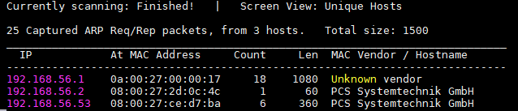

Comme indiqué dans la consigne du challenge, la machine a besoin d'une résolution DNS avec le nom `kioptrix3.com`. Direction donc le fichier `/etc/hosts` :

```text
192.168.56.53	kioptrix3.com
```

Le `nmap` habituel, afin de déterminer les services exposés par la machine :

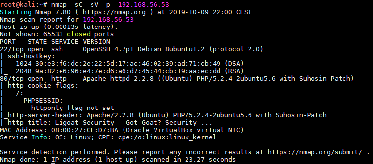

Peu de services puisque seul un service SSH et un serveur HTTP sont exposés.

### Service SSH

Pas de vulnérabilité notable pour cette version de SSH, ça ne sera sans doute pas notre porte d'entrée :

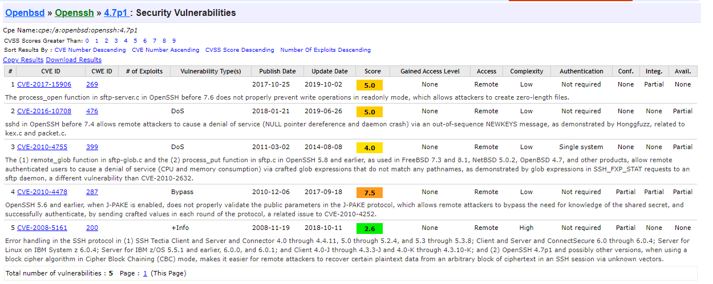

### Serveur HTTP

Le `nmap` nous apprend que le serveur HTTP est un Apache 2.2.8 utilisant PHP en version 5.2.4. Ajoutons à cela les résultats d'un `nikto` :

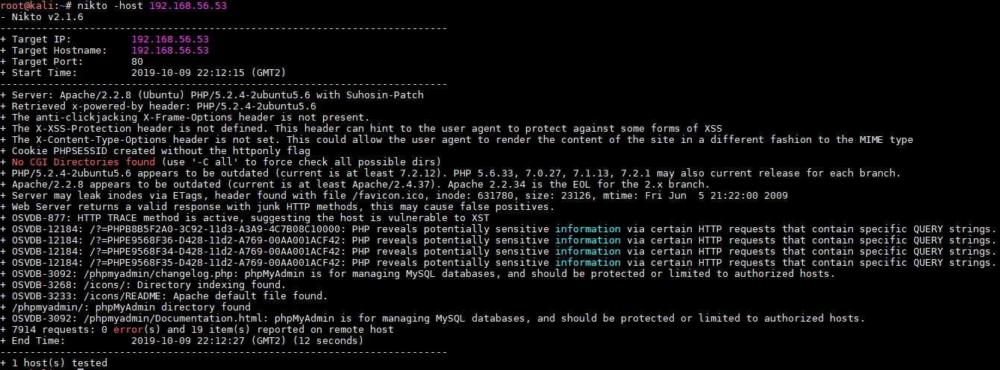

Le scan nous apprend la présence d'un phpMyAdmin. La consultation du fichier `changelog.php` nous indique son numéro de version :

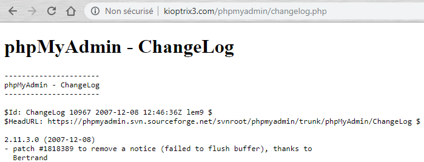

Je ne mets pas la sortie du `dirb` car cela ne donne pas grand chose.

Passons maintenant à l'analyse des pages web hébergées par le service. Tout d'abord la page d'accueil :

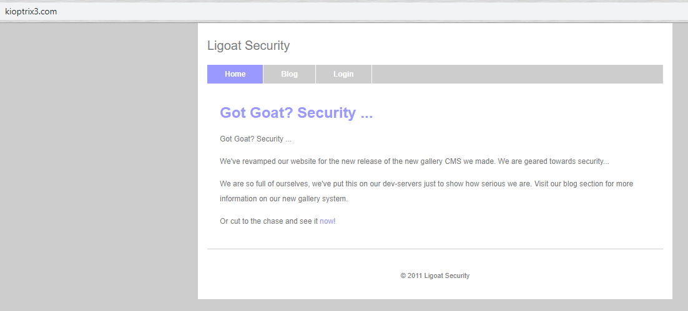

La mire de login est intéressante car elle nous informe du CMS utilisé :

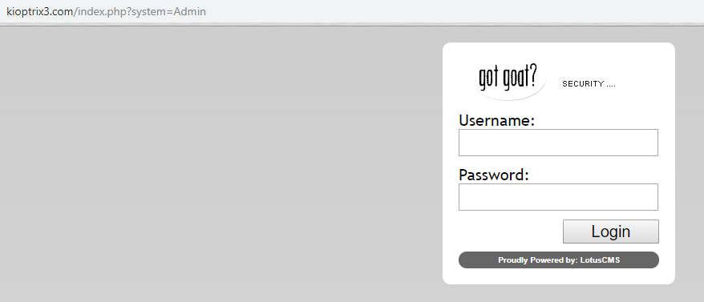

LotusCMS était un CMS open-source écrit en 2007/2008. Le code source est encore disponible sur [GitHub](https://github.com/kevinbluett/LotusCMS-Content-Management-System) \(hébergé à l'origine sur [sourceforge](http://sourceforge.net/projects/arboroiancms/%20)\).

Mon premier but était d'identifier la version utilisée, j'ai donc récupéré le code source afin de repérer les différents fichiers pouvant contenir cette information. Le titre du fichier `install.html` présent dans le répertoire `/style/comps/admin/` nous rend ce service :

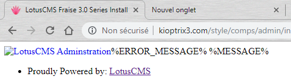

LotusCMS en version 3.0 possède une vulnérabilité de type LFI pouvant amener à une RCE \([CVE-2011-0518](https://www.cvedetails.com/cve/CVE-2011-0518/)\). Pour faire court, le système de post de commentaires sur le blog permet en fait l'écriture de fichiers sur le disque, puis la faille LFI permet de les charger.

## Exploitation

### CVE-2011-0518

Un module `metasploit` existe concernant cette vulnérabilité :

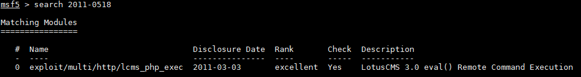

L'exploitation sera donc plutôt aisée :

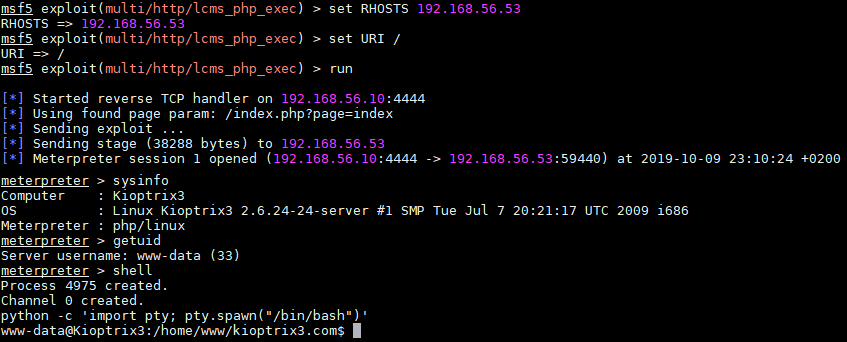

## Élévation de privilèges

La phase de reconnaissance permet de récupérer la liste des utilisateurs de la machine :

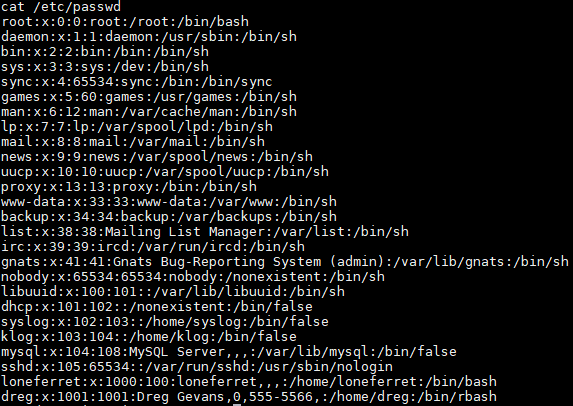

Deux comptes sont des utilisateurs de la machine : **dreg** et **loneferret**. Après avoir fouillé dans le `/home` de **loneferret** :

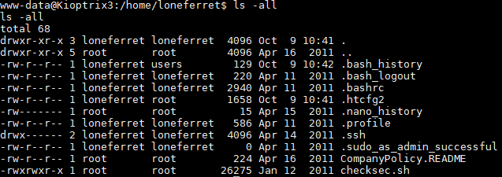

Le fichier `CompanyPolicy.README` \(ainsi que le `.bash_history`\) indique l'utilisation d'un programme nommé `ht`. Après quelques recherches, il s'agit d'un éditeur de texte. Chose intéressante, le binaire possède le **suid** à 1 :

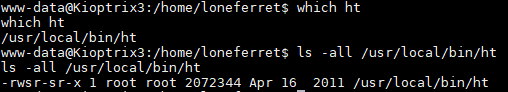

Je tente donc de lancer le binaire :

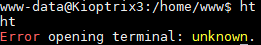

Je suis pas un grand connaisseur des erreurs XTERM et compagnie. Je tente un peu à l'aveugle quelques commandes trouvées ici et là, par exemple :

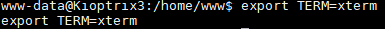

Cela améliore sensiblement les choses, à savoir que je peux maintenant lancer le binaire mais ce n'est toujours pas utilisable \(la saisie de caractères écrit tout simplement sur l'interface\) :

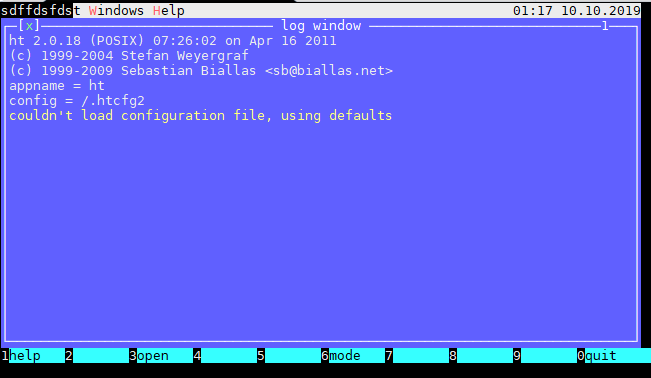

Après un certain temps à tourner en rond, j'ai décidé de rétropédaler et d'approfondir la reconnaissance du système.

Mon premier objectif est d'avoir accès à la partie administration de LotusCMS. Etant donné qu'il s'agit d'un CMS qui utilise seulement des fichiers plats, le mot de passe doit se situer dans un de ses fichiers de configuration.

Après quelques recherches il se trouve que le mot de passe est présent dans un fichier distinct pour chaque utilisateur. Dans notre cas il s'agit de l'administrateur :

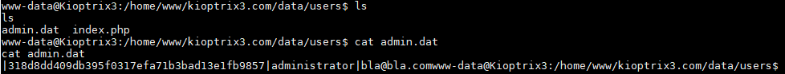

Après une lecture du code source, il se trouve que le mot de passe, avant d'être haché en SHA1, est tout d'abord concaténé avec un sel statique. Ce sel est présent dans le fichier /data/config/salt.dat :

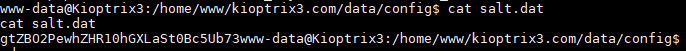

John va nous aider à cracker ce mot de passe, mais il faut bien prendre en compte le sel utilisé. J'ajoute donc le hash dans un fichier sous le format `username:hash$sel` :

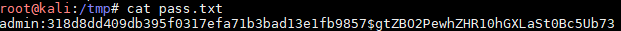

Il ne faut pas oublier d'indiquer le format \(ici `dynamic_24`\) dans notre ligne de commande :

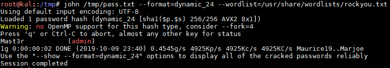

Tout cela nous donne accès à la partie administration de LotusCMS :

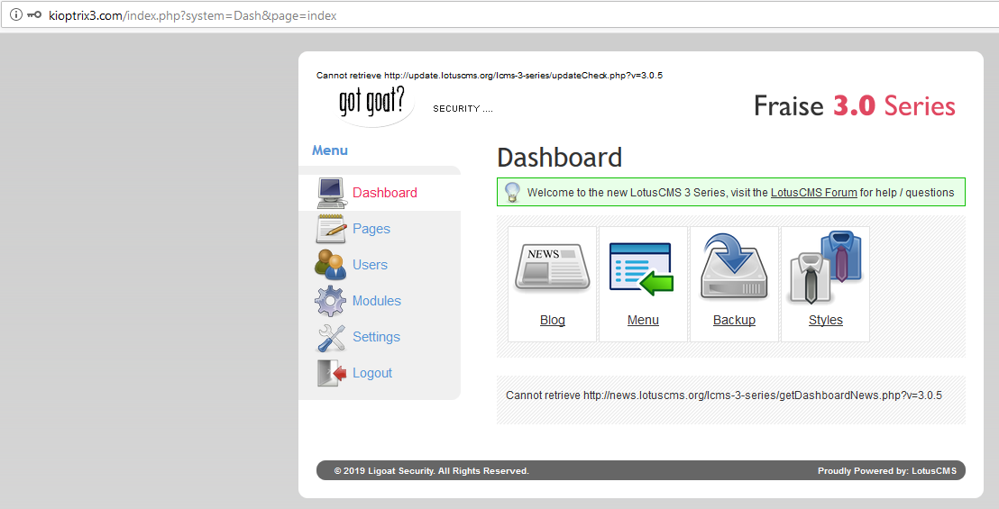

Malheureusement, impossible d'aller plus loin dans la compromission de la machine par ce vecteur, je me penche alors sur l'accès shell.

La recherche de mot de passe en plaintext porte ses fruits au niveau du répertoire `/gallery` :

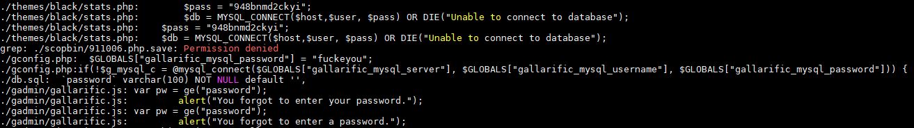

Cela nous permet d'avoir accès à la base MySQL avec le compte root/fuckeyou. Pour une analyse plus facile du contenu de la base de données, je passe par le phpMyAdmin.

Nous avons donc un premier mot de passe dans la table `gallarific_users` :

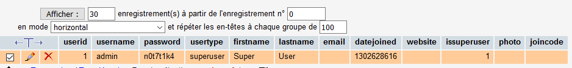

Et deux autres mots de passe \(cette fois hashés\) pour les utilisateurs **dreg** et **loneferret** dans la table `dev_accounts` :

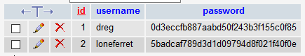

On tente de récupérer les mots de passe en clair :

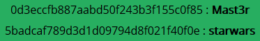

Cela nous permet de se connecter en SSH avec le compte de **loneferret** :

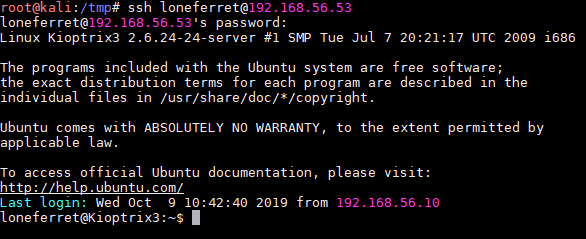

Etant donné que `ht` possède le bit suid à 1, il est possible d'éditer des fichiers avec les droits root. On modifie alors le fichier `/etc/sudoers` :

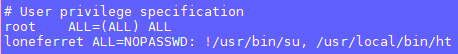

afin d'ajouter le droit su à notre utilisateur **loneferret** :


Un petit `sudo` su plut tard, nous voilà root :

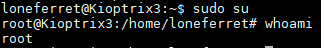

## Conclusion

Très facile jusqu’à la récupération d'un shell, la machine se corse en ce qui concerne l'élévation de privilèges. J'ai passé un sacré bout de temps à tenter de faire fonctionner `ht` avec le compte **www-data** avant d'explorer d'autres solutions.

J'ai apprécié de pouvoir/devoir étudier le code source du CMS afin de connaitre les emplacements des données intéressantes et également son fonctionnement \(notamment sur la façon de stocker ses mots de passe\).

La leçon à retenir est de ne pas oublier d'explorer les autres pistes quand on est bloqué à une étape afin de collecter un maximum de données. Je m’aperçois que je dois fortement m'améliorer en ce qui concerne la phase de reconnaissance post compromission.

