# LAMPSecurity: CTF4

## Détails de la machine

**Nom :** LAMPSecurity: CTF4\
**Date de sortie :** 10 Mars 2009\
**Lien de téléchargement :** [http://sourceforge.net/projects/lampsecurity/files/CaptureTheFlag/CTF4/ctf4.zip/download](http://sourceforge.net/projects/lampsecurity/files/CaptureTheFlag/CTF4/ctf4.zip/download)\
**Niveau :** Facile\
**Objectif(s) :** obtenir un accès "root"\
**Description :** \
****`Updated to set default runlevel to 3 (no X windows) and fixed DHCP.`\
``\
`This is the fourth capture the flag exercise. It includes the target virtual virutal machine image as well as a PDF of instructions. The username and password for the targer are deliberately not provided! The idea of the exercise is to compromise the target WITHOUT knowing the username and password. Note that there are other capture the flag exercises. If you like this one, download and try out the others. If you have any questions e-mail me at justin AT madirish DOT net.`\
``\
`The LAMPSecurity project is an effort to produce training and benchmarking tools that can be used to educate information security professionals and test products. Please note there are other capture the flag exercises (not just the latest one). Check the SourceForge site to find other exercises available (http://sourceforge.net/projects/lampsecurity/files/CaptureTheFlag/).`\
``\
`These exercises can be used for training purposes by following this documentation. Alternatively you may wish to test new tools, using the CTF virtual machines as targets. This is especially helpful in evaluating the effectiveness of vulnerability discovery or penetration testing tools.`

## Reconnaissance

On récupère l'adresse IP de la machine cible via `netdiscover` :

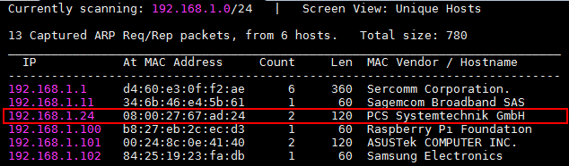

Comme d'habitude, on scanne les services disponibles grâce à `nmap` :

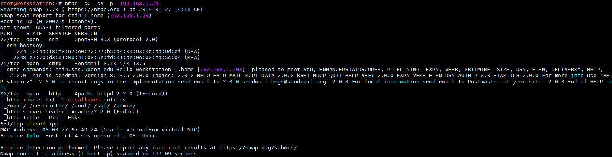

Nous avons donc un service OpenSSH en version 4.3 sur le port 22, un service SMTP sur le port 25 avec un Sendmail en version 8.13.5 et pour terminer un Apache 2.2.0 sur le port 80. `nmap` nous révèle aussi la présence d'un fichier "robots.txt" ainsi que son contenu, soit les URLs suivantes :

* /mail
* /restricted
* /conf
* /sql
* /admin

### Service SSH

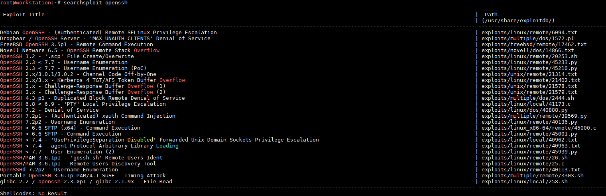

Il nous sera possible d’énumérer les comptes valides grâce à l'exploit "45939.py" (CVE-2018-15473) si besoin, mais cela nécessite de fournir une liste d'utilisateurs en entrée.

### Service SMTP

`searchsploit` va nous permettre de savoir si un exploit existe pour Sendmail en version 8.13.5 :

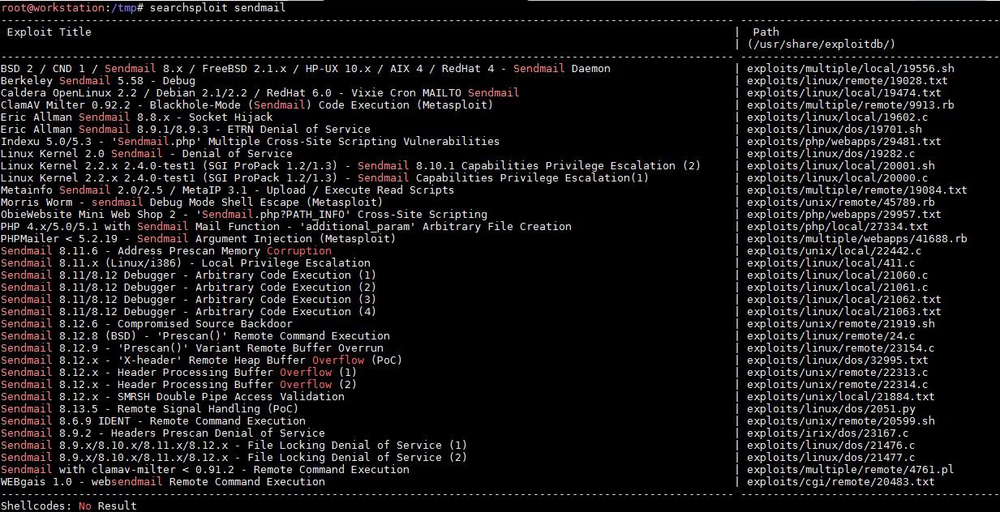

Il semble qu'un exploit nommé "Remote Signal Handling (POC)", soit en fait la CVE-2006-0058, existe pour cette version en question et permet une exécution de code arbitraire :

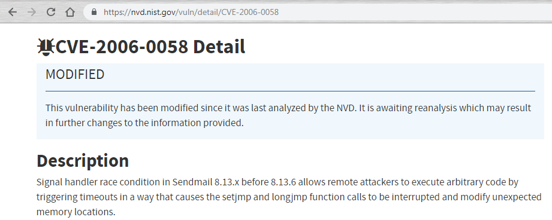

L'outil `smtp-user-enum` peut nous permettre d’énumérer les utilisateurs existants mais il nécessite au préalable une liste d'utilisateurs en entrée. En effet, le service SMTP va répondre si oui non l'utilisateur spécifié existe.&#x20;

### Serveur HTTP

Le serveur HTTP sert une première d'accueil ainsi qu'un blog et des travaux de recherche :

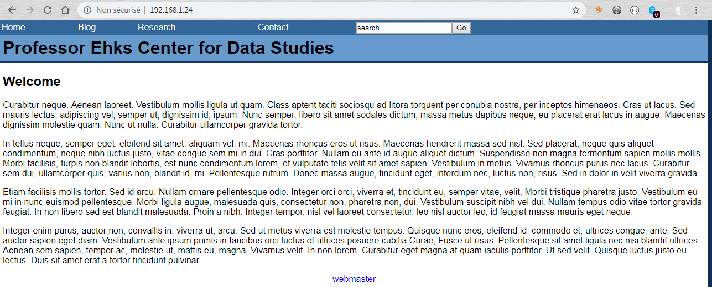

On navigue sur le site, puis en modifiant le paramètre "page" on identifie une LFI :

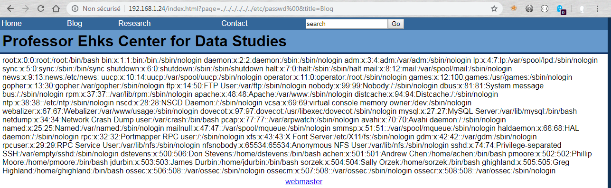

La modification du paramètre "page" n'engendre pas une erreur PHP mais seulement une page vide. Pour confirmer la vulnérabilité il a donc ici fallu faire quelques tests et tenter par exemple de récupérer un fichier (ici le fichier "/etc/passwd"). De plus, il faut ici utiliser une seconde vulnérabilité qui est un Null byte injection, soit l'injection du caractère "NULL" représenté par "%00" permettant d'indiquer une fin de chaîne. En effet, le développeur a ici concaténé le nom du fichier (par exemple "blog") à la chaîne de caractères ".php". Si nous tentons d'inclure tout simplement "/etc/passwd", la fonction `include()` recevra en fait :

```php
include($file . ".php"); // $file sera égale ici à /etc/passwd
```

Il y a sans doute également la concaténation d'un (ou plusieurs) répertoire avant l'inclusion du fichier, c'est pour cette raison qu'il faut effectuer une attaque de type path transversal pour récupérer le fichier désiré. En conclusion, le développeur doit avoir développé quelque chose comme ceci : &#x20;

```php
include("/chemin/vers/" . $file . ".php");
```

La lecture d'un article du blog nous permet de voir un paramètre intéressant nommé ici "id"_._ Ce type de paramètre est propice aux injections SQL, ce qui est ici bien le cas. Pour confirmer la vulnérabilité une attaque de type boolean-based en deux étapes suffit :

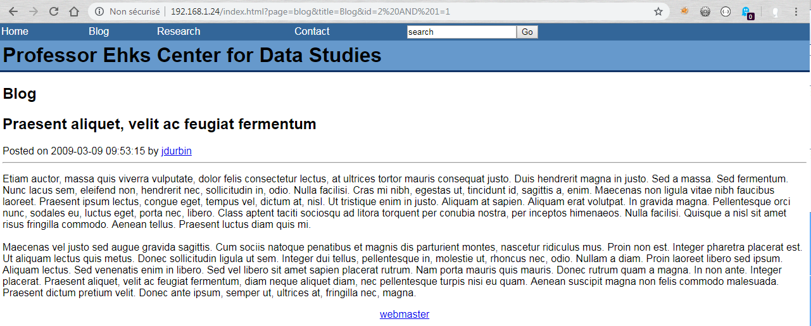

Pour confirmer la vulnérabilité il suffit de faire en sorte que la partie après le "AND" soit fausse (en logique  `vrai ET faux` donne `faux`) :

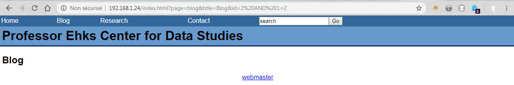

Nous avons donc une injection SQL sous le coude pour la phase d'exploitation. Continuons l'exploration avec le contenu fichier "robots.txt" :

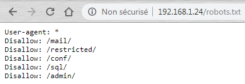

Le répertoire "/mail" amène à un webmail SquirrelMail en version 1.4.17 :

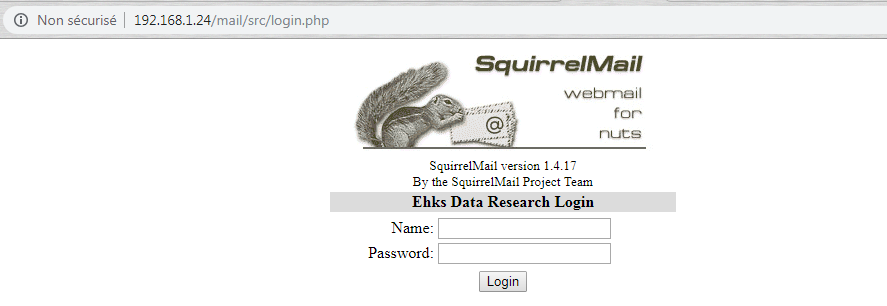

Un `searchsploit` indique une possibilité de RCE (Remote Code Execution, CVE-2017-7692) grâce à l'exploit "41910.sh". En regardant de plus près cette exploit, on s'aperçoit qu'il faut un login / mot de passe valide pour l'exploiter, mais sait-on jamais :

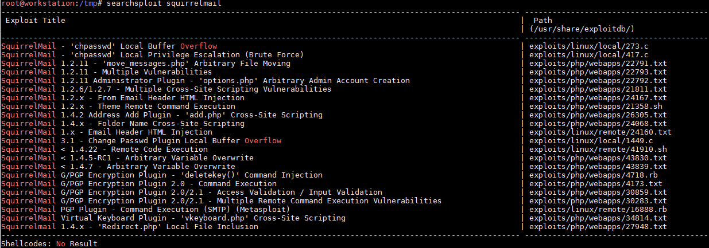

Le "/restricted" est sécurisé par une authentification de type HTTP Basic. J'ai bien tenté un tampering du verbe HTTP mais sans succès, :

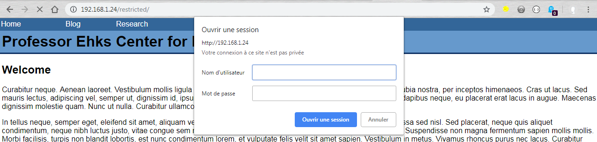

Le répertoire "/conf" renvoie une erreur HTTP 500, on ira pas plus loin par là pour l'instant :

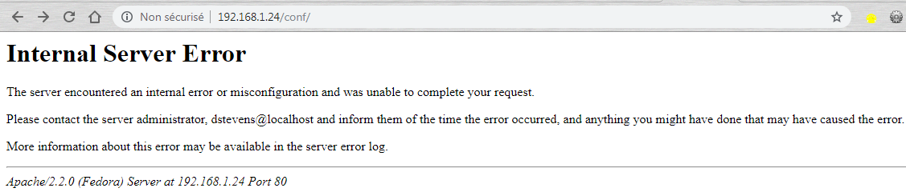

Le répertoire "/sql" quant à lui nous permet de récupérer un fichier ".sql" sans doute utilisé pour mettre en place la base de données du blog. La base de données porte le nom de "ehks" et possède 3 tables : "user", "blog" et "comment". Quelle idée de laisser traîner ce genre de choses :unamused: :

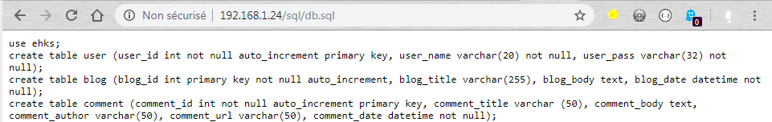

Le dernier répertoire présent est le "/admin", qui met souvent le sourire aux lèvres en pensant à quoi cela peut donne accès si on trouve le sésame :

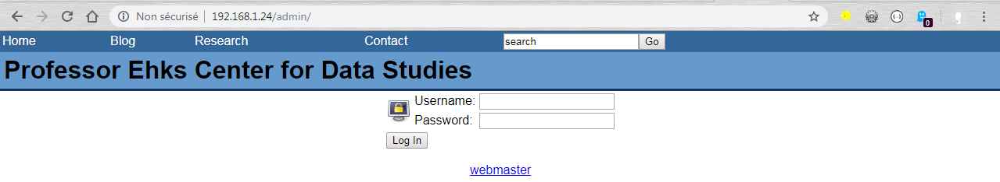

Quelques tests rapides sur la mire d'authentification conduit à une possible injection SQL (attention au javascript qui supprime certains caractères lors de l'envoi) :

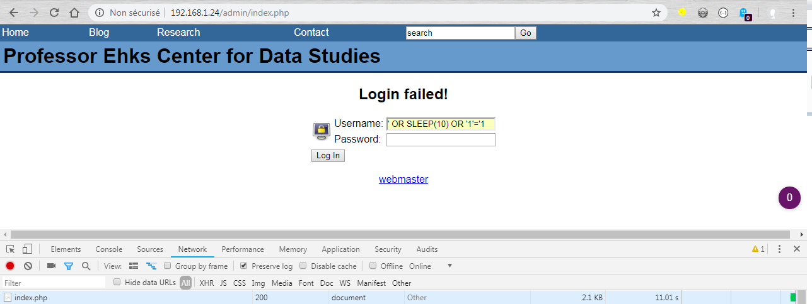

Je pourrais bien sur ici directement remplacer mon `SLEEP(10)` par un `1=1` et qui permettra sans doute de contourner l'authentification mais j'essai de bien séparer la phase de détection et celle de l’exploitation des vulnérabilités.

Pendant tout ce temps tournait bien sur un `nikto` ainsi qu'un `dirb` :

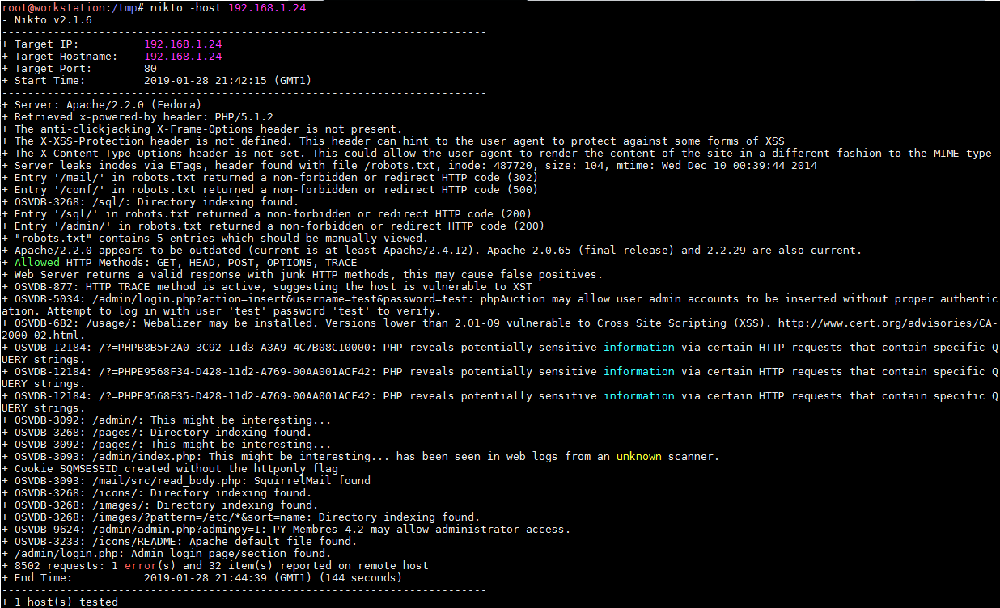

`nikto` __ remonte une nouvelle URL à tester, le répertoire "/pages" que voici :

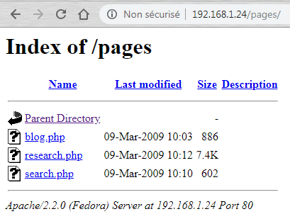

Et voici le résultat de `dirb` __ (la sortie est tronquée, je n'ai mis que ce qui me semblait intéressant) :

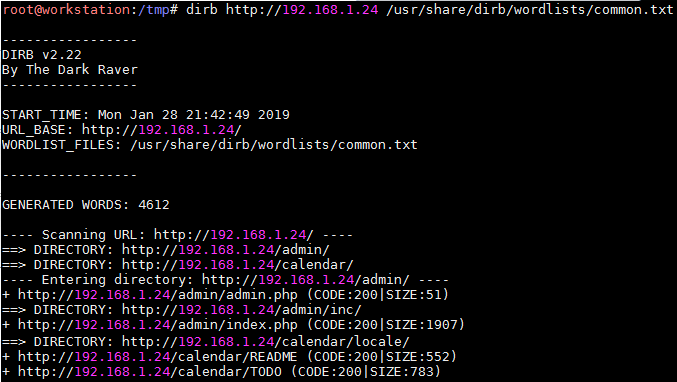

`dirb` indique la présence d'un "/calendar" ainsi qu'un fichier "README". Sa consultation nous permet de connaitre la version du logiciel, soit la version 0.10 :

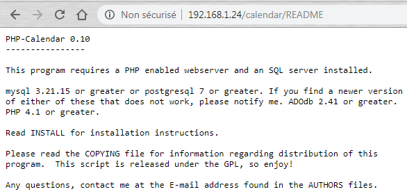

Un `searchsploit`  indique une vulnérabilité de type Arbitrary File inclusion pour la version de php-calendar < 0.10.1 (CVE-2004-1423) :

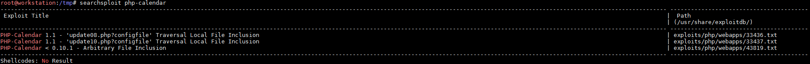

La phase de reconnaissance se termine ici, pas mal de choses à se mettre sous la dent pour la phase d'exploitation.&#x20;

## Exploitation

Je laisse de côté l'énumération côté OpenSSH et SMTP, étant donné qu'on possède déjà le fichier "/etc/passwd". Dans un premier temps j'ai tenté d'exploiter la faille RCE du Sendmail mais sans succès (l'exploit ne semble plus être fonctionnel en l'état).

### Injection SQL

Côté du serveur web on peut exploiter l'injection SQL afin de dumper la base et voir si elle contient des information intéressantes (le mot de passe administrateur n'est plus vraiment un prérequis à cause de l'injection SQL sur la mire d'authentification). Sqlmap est la pour nous aider et l'on tente de récupérer dans un premier temps le nom des bases de données existantes :

* calendar
* ehks
* roundcubemail

On commence par récupérer les noms et mots de passe de la table "phpc\_users" de la base "calendar" :

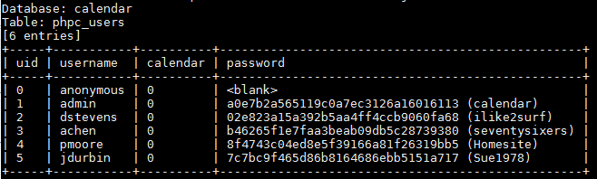

Bon la connexion à tous ces comptes est plus pour le fun qu'autre chose car cela ne change pas grand chose pour la suite des opérations. On continue avec la base qui correspond au webmail. Malheureusement pas de mot de passe présent dans les tables. Il faut savoir que le webmail permet de gérer les mots de passe à partir de différentes sources : LDAP, SQL ou encore dans les fichiers "/etc/passwd" et "/etc/shadow", ce n'est donc pas étonnant que les mots de passe ne se retrouvent pas forcément dans la base. On tente de se connecter avec les mots de passe déjà retrouvé pour le service calendar et cela fonctionne pour "dstevens". En lisant ses mails on tombent sur quelques informations intéressantes :

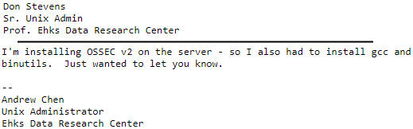

On sait donc qu'il est administrateur de la machine, et, étant donné qu'on possède son mot de passe du webmail et que ce webmail se base sans doute sur les utilisateurs systèmes ... . On sait également que "Andrew Chen" est lui aussi un administrateur du système (et on possède aussi son mot de passe). C'est du joli tout ça ! Si besoin de compiler un certain exploit, le système possède aussi un `gcc`.

On termine avec la base "ehks" :

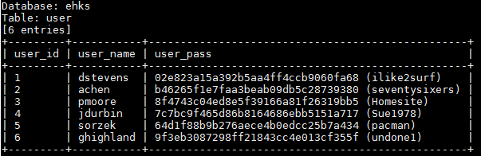

Bravo les admins, utiliser les mêmes mots de passe sur tous les services, quelle bonne idée !

Il est temps d'accéder à la machine en SSH grâce au compte de "dstevens" ou de "achen" :

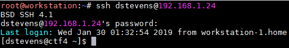

## Élévation de privilèges

L’élévation est ici très facile puisque nous savons que "dstevens" est administrateur du système :

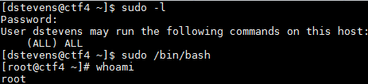

Travail terminé.

## Conclusion

CTF facile puisque à la finale, une seule injection SQL suffit à devenir "root" (plusieurs comptes sont en fait administrateur du système).

Pour ne pas alourdir le writeup je n'ai pas mis les essais que j'ai effectué sur le blog (en se connectant grâce à l'injection SQL ou avec un compte récupéré via l'injection SQL) mais la partie "/admin" ne semble pas apporter quelque chose (à par des XSS).

Je met quand même ci-dessous l'exploitation des deux vulnérabilités CVE-2004-1423 et CVE-2017-7692 (respectivement concernant le php-calendar ainsi que le webmail).

### PHP-Calendar (CVE-2004-1423)

Cette vulnérabilité permet d'exécuter un script distant, dans notre cas un shell php généré par `msfvenom`. Le shell est hébergé sur notre machine d'attaque comme ceci : "/include/html.php"

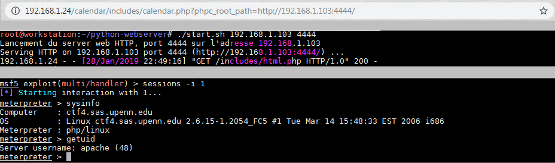

Il ne reste maintenant que l'élévation de privilèges (puisque nous sommes connecté en tant que "apache"). Premièrement un `uname -a` nous donne la version du noyau :

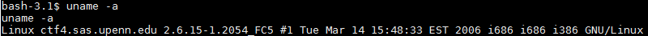

Ce noyau est vulnérable à la CVE-2009-2698, son exploit est ici : [https://www.exploit-db.com/exploits/9542](https://www.exploit-db.com/exploits/9542), et un petit `gcc` plus tard :

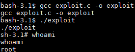

### SquirrelMail (CVE-2017-7692)

Une erreur sur l'exploit ne permet pas la RCE, je n'ai pas cherché plus loin étant donné que j'avais déjà rooté la machine.
