# Metasploitable: 1

## Détails de la machine

**Nom :** Metasploitable: 1\
**Date de sortie :** 19 Mai 2010\
**Lien de téléchargement :** [https://download.vulnhub.com/metasploitable/Metasploitable.zip](https://download.vulnhub.com/metasploitable/Metasploitable.zip)\
**Niveau :** Facile\
**Objectif(s) :** obtenir un accès "root"\
**Description :**`One of the questions that we often hear is "What systems can i use to test against?" Based on this, we thought it would be a good idea throw together an exploitable VM that you can use for testing purposes.`\
****`Metasploitable is an Ubuntu 8.04 server install on a VMWare 6.5 image. A number of vulnerable packages are included, including an install of tomcat 5.5 (with weak credentials), distcc, tikiwiki, twiki, and an older mysql.`\
`You can use most VMware products to run it, and you'll want to make sure it's configured for Host-only networking unless it's in your lab - no need to throw another vulnerable machine on the corporate network. It's configured in non-persistent-disk mode, so you can simply reset it if you accidentally 'rm -rf' it.`\
`Source:` [`http://web.archive.org/web/20100525233058/http://blog.metasploit.com/2010/05/introducing-metasploitable.html`](http://web.archive.org/web/20100525233058/http://blog.metasploit.com/2010/05/introducing-metasploitable.html)

## Reconnaissance

Un `netdiscover` suivi d'un `nmap` afin d'en savoir plus sur notre cible :

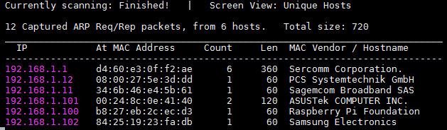

La machine "Metasploit: 1" possède donc l'adresse IP 192.168.1.12. Voici le résultat du `nmap` :

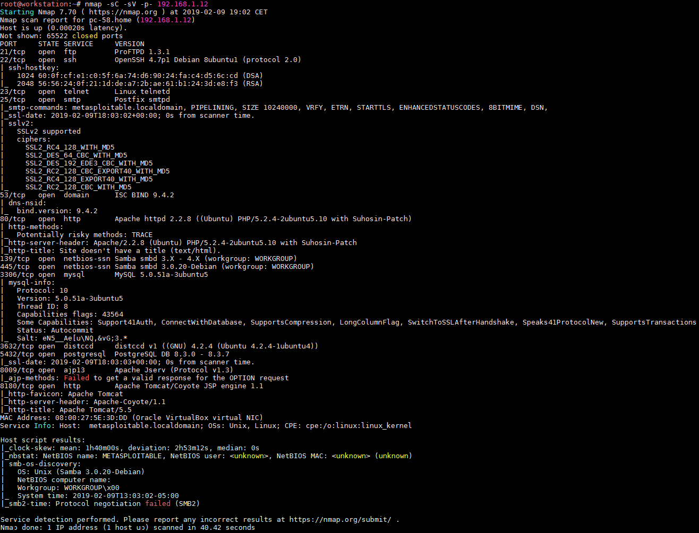

Beaucoup de services disponibles sur cette machine, la reconnaissance va sans doute être un peu plus long que d'habitude :slight\_smile:&#x20;

### Service FTP

La machine dispose d'un service FTP sur le port 21 et `nmap` nous indique qu'il s'agit d'un ProFTPd 1.3.1. Il semble qu'une exécution de code distant soit possible pour les version < 1.3.3g, mais l'exploit nécessite un compte valide (que nous n'avons pas à l'heure actuelle), et surtout aucun exploit semble disponible.

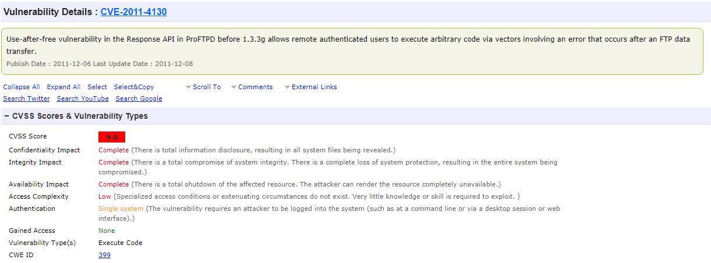

### Service SSH

Le service SSH est un OpenSSH 4.7p1. Il sera possible d'énumérer les utilisateurs du système en fournissant au préalable un dictionnaire de noms d'utilisateur. Je n'ai rien trouvé d'autre de particulier sur cette version.

### Service Telnet

Un service Telnet ouvert, un login/mot de passe est demandé à la connexion :

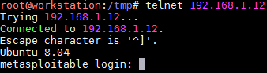

Au passage on note la version du système d'exploitation de la cible : Ubuntu 8.04.

### Service HTTP (port 80)

Ici on commence avec un `nikto` et un `dirb` qu'on laisse tourner pendant notre reconnaissance manuelle. Rien à noter puisqu'une seule page est disponible, celle par défaut du serveur Apache :

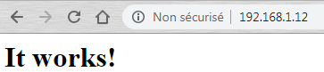

On passe à l'analyse du résultat de `niko` et `dirb` :

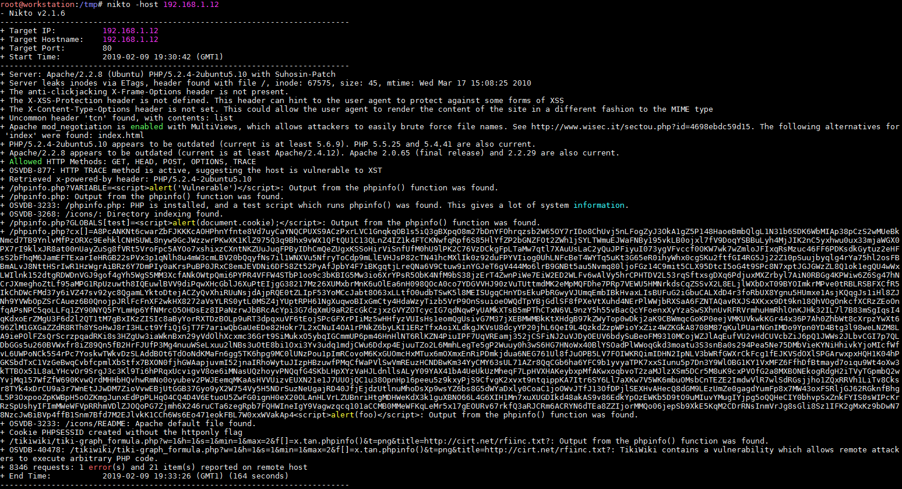

`nikto` nous remonte les version du serveur Apache (soit 2.2.8) et la version de PHP (5.2.4). Il identifie également une page nommée "phpinfo.php" qui exécute la méthode PHP `phpinfo()` :

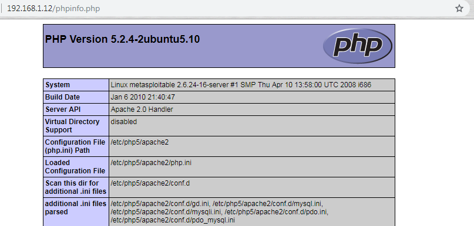

#### Tikiwiki

Une URL "/tikiwiki" est également détectée, il s'agit d'une application web de type CMS et de travail collaboratif :&#x20;

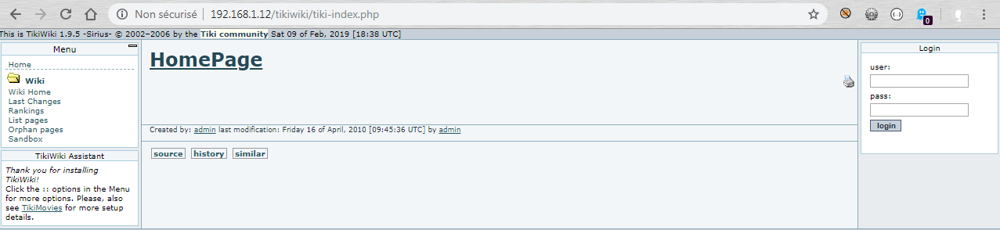

L'outil installé est en version 1.9.5. Cette version semble vulnérable à une fuite d'information avec la CVE-2006-5702 (la CVE-2006-5703 concerne aussi cet outil pour cette version, mais il s'agit d'une vulnérabilité de type XSS) :

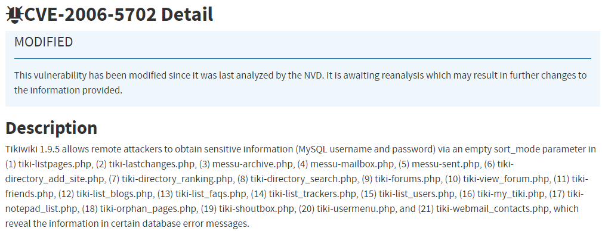

Une petite recherche sur la documentation nous apprend aussi que les credentials par défaut sont admin/admin. En effet, cela fonctionne :

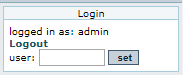

Et pour terminer, la version 1.9.5 de ce logiciel est également vulnérable à une injection de code avec la CVE-2007-5423 que voici :

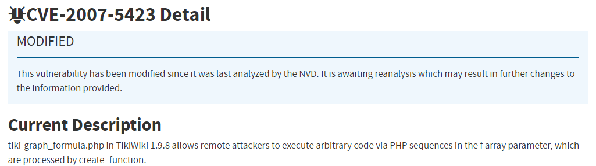

Passons aux résultats de `dirb` :

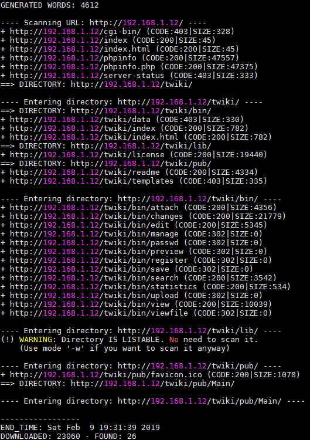

#### Twiki

Une autre URL intéressante apparaît ici, celle d'un wiki d'entreprise. Ce wiki, nommé "Twiki" est disponible à l'URL "/twiki" :

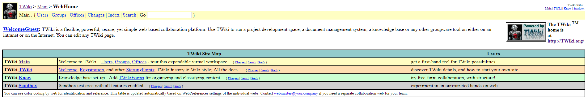

En bas de la page du wiki, nous pouvons voir la version installée :

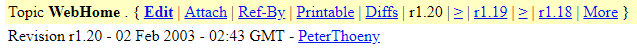

Cette version est vulnérable à exécution de code à distant avec la CVE-2005-2877 :

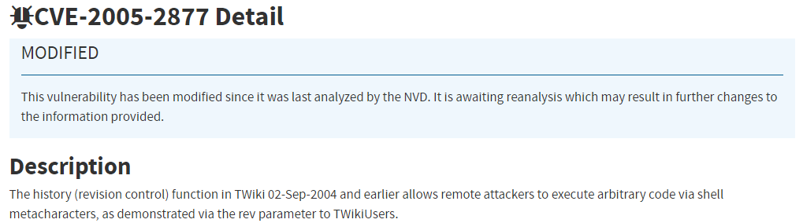

Ou encore à la CVE-2004-1037 :

### Samba

Une authentification anonyme est possible et certains répertoires partagés ne nécessite pas de droits spécifiques :

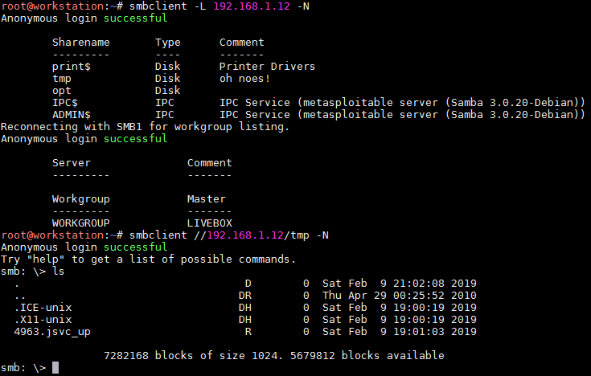

Il est également possible d'énumérer les comptes présents sur la cible :

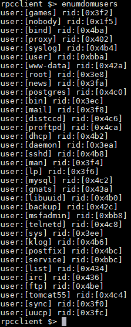

La version 3.0.20 est vulnérable à une exécution de code distant. Cette vulnérabilité est décrite par la CVE-2007-2447 :

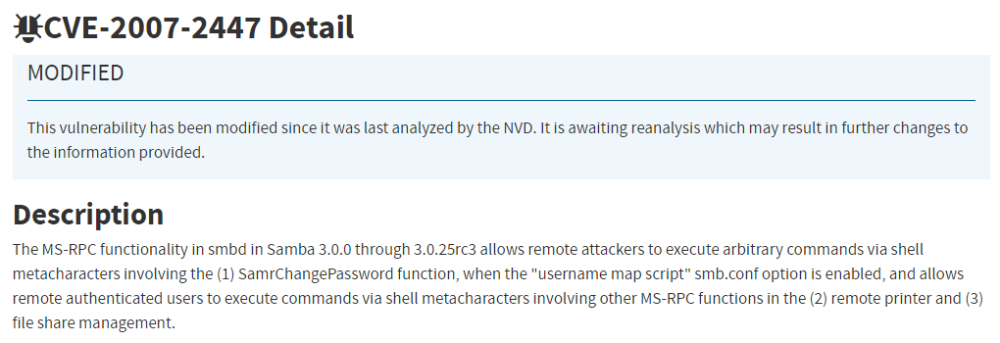

### Compilateur (Distccd)

Il s'agit du serveur du compilateur Distccd en version 4.2.4 qui est vulnérable à une exécution de code distant. Le petit nom de la CVE en question est la CVE-2004-2687 :

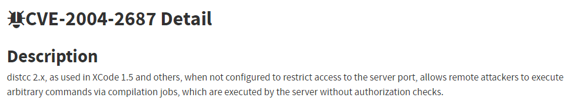

### PostgreSQL

`nmap` indique une version de PostgreSQL comprise entre 8.3.0 et 8.3.7. Metasploit nous permet d'affiner le numéro de version :

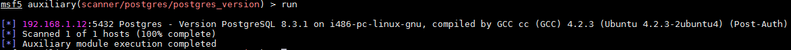

Il s'agit donc de la version 8.3.1. On voit également l'info "Post-Auth" indiquant que Metasploit a réussi à se connecter avec les credentials présents dans les options (cela lui permet d'affiner la détection de version), à savoir postgres/postgres. On peut tenter de s'y connecter afin de confirmer :

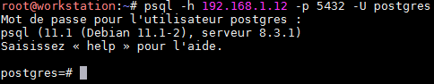

### Serveur HTTP (8180)

Il s'agit ici d'un serveur Apache Tomcat en version 5.5. La page d'accueil est la page par défaut, ce qui peut laisser penser que le serveur est encore en cours de configuration :

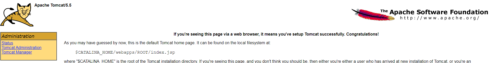

Il faut donc penser ici à tester les credentials par défaut (tomcat/tomcat) :

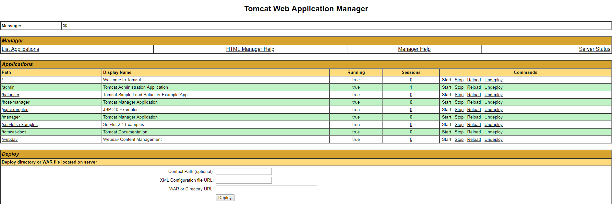

Nous avons accès à l'interface d'administration de Tomcat. Cela peut nous être utile afin d'uploader un .war file malicieux.

## Exploitation

### Tikiwiki (CVE-2006-5702)

Un module Metasploit existe afin d'exploiter la vulnérabilité de Tikiwiki :

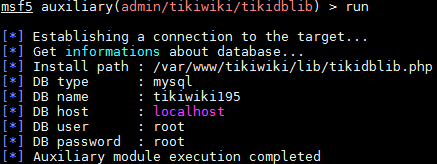

Connaissant les credentials de la base de données `mysql` il est possible maintenant de s'y connecter (port 3306) :

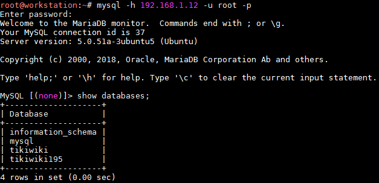

### Tikiwiki (CVE-2007-5423)

Il existe également un module Metasploit pour cette autre vulnérabilité de Tikiwiki :

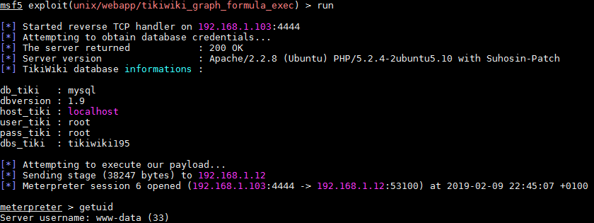

Nous possédons actuellement un compte à privilèges limités.

### Samba (CVE-2007-2447)

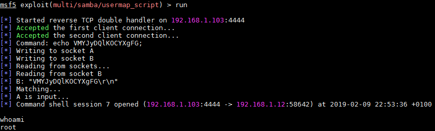

Cette vulnérabilité de Samba est plus intéressante dans le sens ou aucune élévation de privilèges n'est nécessaire : nous sommes déjà "root".

### Distcc (CVE-2004-2687)

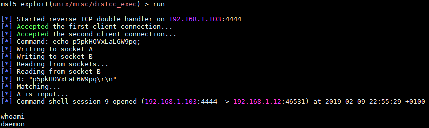

Un compte limité "daemon" pour cette vulnérabilité sur Distcc.

### Autres exploitations

Il y a encore d'autres exploitations à effectuer, que cela soit sur Twiki, PostgreSQL ou encore le serveur Apache Tomcat (chargement d'une application malicieuse, par exemple un reverse shell généré avec `msfvenom`) : tout cela peut se faire avec Metasploit.

## Élévation de privilèges

Dans le cas d'un accès avec un compte limité il nous faut trouver un moyen de devenir calife à la place du calife. Un `uname -a` nous donne :

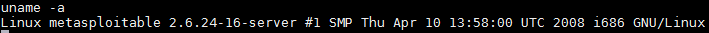

Les versions 2.6 de Linux sont vulnérables à la faille "udev". Nous allons faire le tout grâce à Metasploit en exploitation la CVE-2007-5423 déjà vu pour obtenir notre shell limité :

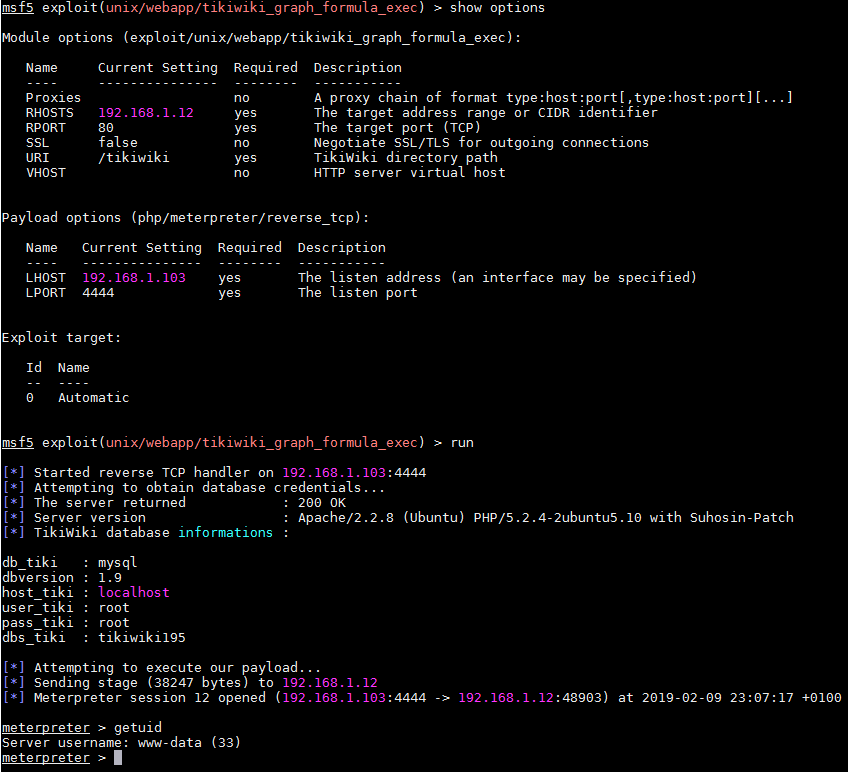

La vulnérabilité de Tikiwiki est exploitée, nous avons un shell limité. Afin d'effectuer l'élévation de privilèges il nous faut connaitre le PID du process "udev" :

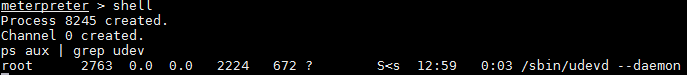

Avec la technique du "ps" il ne faut pas oublier d'ôter "1" au PID affiché pour le processus "udev". On indique à Metasploit d'utiliser l'exploit Udev :

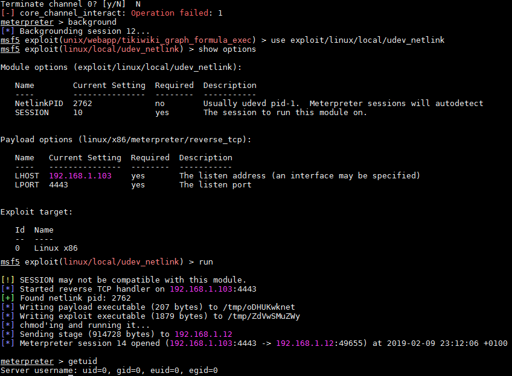

Travail terminé, nous sommes "root".

## Conclusion

La machine en soi n'est pas difficile, mais il y a tellement de services et de vulnérabilités à exploiter que cela en devient long.&#x20;

J'ai identifié d'autres petites choses comme des weak credentials avec l'utilisateur user/user (donc disponible pour du telnet, SSH etc). Une vulnérabilité sur le PostgreSQL qui a les droits en écritures sur le "/tmp" et qui permet de récupérer un shell (module Metasploit disponible). Il doit y avoir encore pas mal de choses encore mais je pense avoir fait un bon petit bout déjà.

J'ai également tenté d'exploiter les vulnérabilités sur le wiki d'entreprise Twiki grâce aux modules de Metasploit mais cela n'a pas fonctionné, je n'ai pas cherché plus loin que ça mais il me semble bien que le wiki soit vulnérable pourtant.
