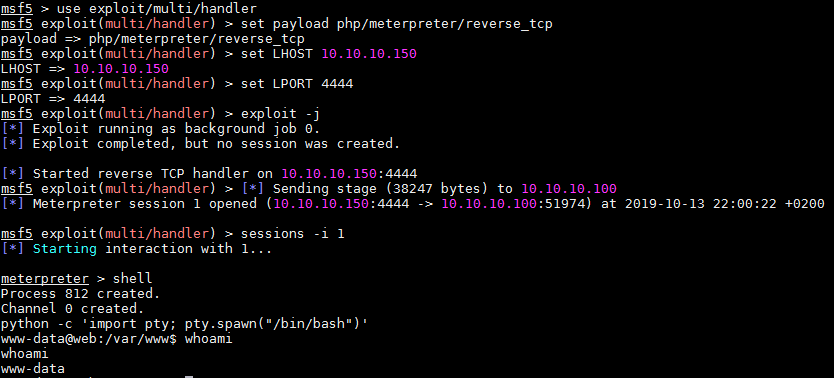
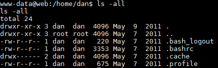

# pWnOS 2.0 \(Pre-Release\)

## Détails de la machine

**Nom :** pWnOS 2.0 \(Pre-Release\)  
**Date de sortie :** 4 Juillet 2011  
**Lien de téléchargement :** [http://pwnos.com/files/pWnOS\_v2.0.7z](http://pwnos.com/files/pWnOS_v2.0.7z)  
**Niveau :** Facile  
**Objectif\(s\) :** obtenir un accès "root"  
**Description :**  
`pWnOS v2.0 is a Virutal Machine Image which hosts a server to pratice penetration testing. It will test your ability to exploit the server and contains multiple entry points to reach the goal (root). It was design to be used with WMWare Workstation 7.0, but can also be used with most other virtual machine software.  
  
Server's Network Settings:  
IP: 10.10.10.100  
Netmask: 255.255.255.0  
Gateway: 10.10.10.15`

## Reconnaissance

L'adresse IP de la machine étant statique pas besoin de scan du réseau :

On commence directement par le scan de services via `nmap` :

Un service SSH \(port 22\) et un service Web \(port 80\). On ne peut pas faire plus simple.

### Service SSH

Quelques vulnérabilités sur la version 5.8p1 d'OpenSSH, mais les CVE ont été découvertes après 2011, leurs exploitations n'est donc pas requises pour compromettre la machine :

### Service Web

Nous sommes donc en face d'un serveur Web Apache 2.2.17 utilisant PHP. Nous commençons par un `dirb` :

Suivi d'un `nikto` :

Ces deux scans nous apprennent la présence d'une page `info.php` qui effectue un appel à la fonction `phpinfo()` :

Cela étant fait, allons faire un tour sur le site proposé. La page d'accueil affiche un message de bienvenue et propose 3 liens \(à droite, dont le lien `Home` qui est la page courante\) :

On peut tenter de s'inscrire via le lien `Register`, cela va peut-être nous permettre de nous authentifier et ainsi avoir accès à d'autres informations :

Après une activation du compte via un lien forgé par l'application :

Nous sommes authentifié, mais aucun lien supplémentaire ne nous est offert :

Aucun lien du site ne l'affiche \(même en étant authentifié\), mais le scan `dirb` remonte également une entrée vers un blog via `/blog` :

Après avoir fait le tour de tout ce qui est proposé, je commence à tester quelques injections. Au bout de quelques minutes : "Bingo !". Le champs `login` de la page principale est vulnérable aux injections SQL :

## Exploitation

On va exploiter l'injection SQL afin de se connecter avec un compte existant et voir ce qu'on peut en tirer :

Nous sommes connectés avec le premier compte que remonte la requête SQL effectuée par l'application :

Un compte admin, pas mal. En fait, l'accès au compte admin ne donne pas d'information supplémentaire.


Je ne l'ai vu seulement après coup mais l'adresse email de l'admin est présente sur la page d'accueil afin de le contacter en cas de questions.


On va donc tenter de récupérer les informations de la base de données en exploitant l'injection. Pour cela direction `sqlmap`. On récupère les mots de passe disponibles :

Le mot de passe est hashé en SHA1 \(40 caractères\), on tente de le cracker :

Etant déjà connecté en tant qu'admin, ce mot de passe ne va pas nous servir directement, mais je tente de l'utiliser admin de me connecter au blog et également en SSH. Pour cela, j'essaie plusieurs login tels que admin, dan, privett, danprivett, dan.privett mais sans succès.

Etant donné que la seule faille à ma disposition est l'injection SQL, je tente d'obtenir un shell par ce biais. Pour ce faire il est possible d'utiliser `sqlmap`. Il faut pour cela que le compte gérant la base de données possède le droit d'écriture sur le système de fichiers.

Dans un premier temps, on génère notre shell avec `msfvenom` :

On upload notre shell sur le serveur web via `sqlmap` :


Le répertoire cible est indiqué dans la page `info` affichant le `phpinfo()`. Dans le cas contraire il faut tenter les valeurs habituelles voir brute forcer le nom du chemin.


On lance un handler en écoute sur le port adéquat, on visite la page contenant le webshell et nous sommes dans la place :

## Élévation de privilèges

On effectue un peu de reconnaissance :

Fichier `/etc/passwd` :

Contenu du seul utilisateur de la machine, dan :

Je vais chercher le mot de passe qu'utilise l'application afin de se connecter à la base de données qui se trouve dans le fichier `/var/www/mysqli_connect.php` :

Malheureusement, le mot de passe "goodday" ne fonctionne pour aucun compte SSH \(dan ou root\). 

Un `cd ..` \(plutôt chanceux sur le coup\) plus tard on retrouve une copie du fichier `mysqli_connect.php`. Sans doute un backup ou une version antérieure/de test :

Ce mot de passe \(indiquant bien qu'il s'agit du mot de passe root\) nous permet de se connecter en root à la machine :

## Conclusion

Aucune grosse difficulté pour cette machine. J'ai apprécié le fait que l'utilisateur de la base de données mysql possède le droit d'écriture en fichier afin d'uploader le webshell via sqlmap.

Concernant l'élévation j'ai eu un coup de chance de voir le fichier à un niveau plus haut. Mais dans le cas contraire une recherche de mots de passe avec les habituels `find` et `grep` auraient fini par faire le travail.

