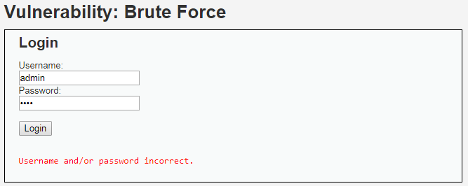
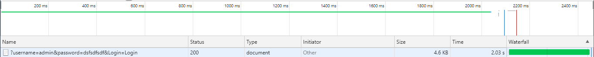
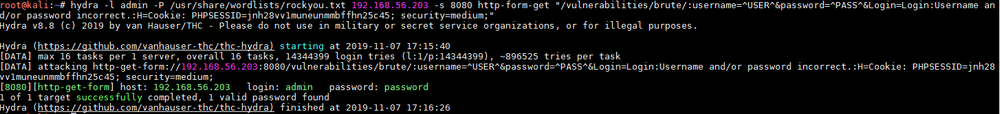

# Niveau "Medium"

La mire d'authentification présentée ne semble pas différente pour ce niveau :

Après quelques essais j'identifie un délai présent pour chaque tentative d’authentification. La console du navigateur me permet de déterminer facilement ce délai, qui est ici de 2 secondes :

Aucune autre mesure de protection ne semble être présente.

L’attaque précédente, effectuée avec `hydra` , fonctionnera toujours mais sera juste un peu plus lente. L’attaque par dictionnaire prendra alors, dans ce cas de figure, un peu moins d'une minute au lieu des quelques secondes du niveau "Low" :

L'attaque est donc certes ralentie mais toujours faisable.
