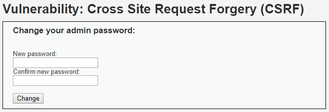
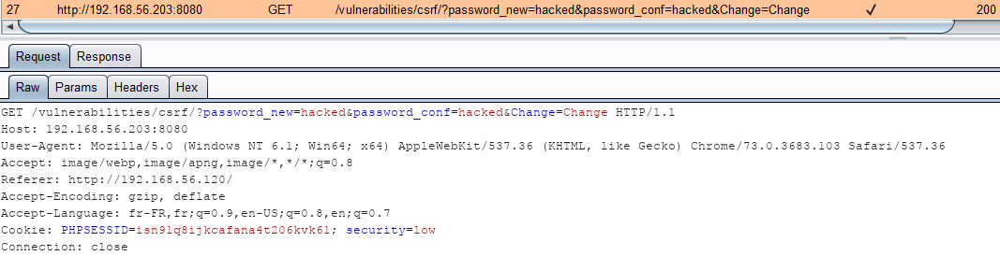
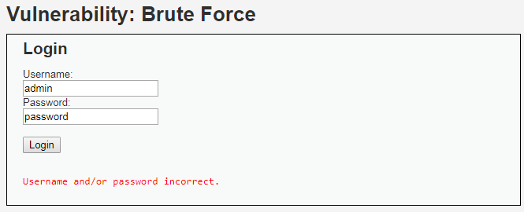

# Niveau "Low"

Le challenge propose un formulaire permettant de renseigner le nouveau mot de passe ainsi que sa confirmation :



Dans un premier temps, j'analyse le fonctionnement de l'application ainsi que les requêtes effectuées lors d'un changement de mot de passe. La mise à jour du mot de passe s'effectue via une requête **`GET`** et aucune protection ne semble présente (pas de jeton anti-CSRF) :


L'exploitation de la vulnérabilité CSRF est donc ici trivial : une simple image pointant vers l'URL d'action est suffisante. Sur un serveur d'attaque, j'héberge la page suivante :

```markup
<html>
  <head>
    <title>Malicious page</title>
  </head>

  <body>
    
  </body>
</html>
```

Il est maintenant nécessaire que la victime (l'administrateur de DVWA) soit authentifiée sur l'application vulnérable puis qu'elle visite la page malicieuse. Lors de cette navigation, son navigateur va tenter de récupérer l'image qui va silencieusement modifier son mot de passe :




L'URL "http://192.168.56.120/" présent dans l'entête `Referer` représente le serveur malicieux



Pour confirmer l'exploitation, l'administrateur tente de se connecter (ou utilise la mire d'authentification du challenge brute force) avec son ancien mot de passe :&#x20;



Mais son nouveau mot de passe est bien celui que j'ai renseigné lors de l'attaque :


