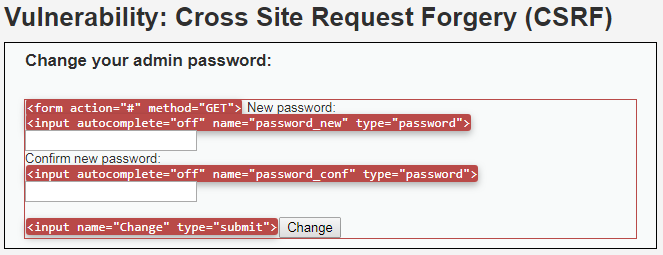
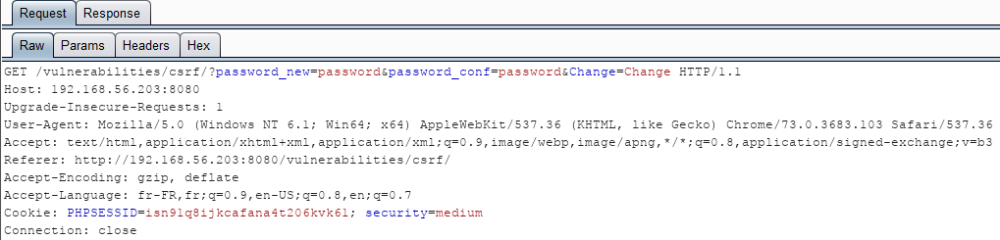
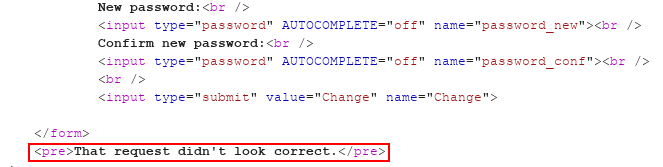
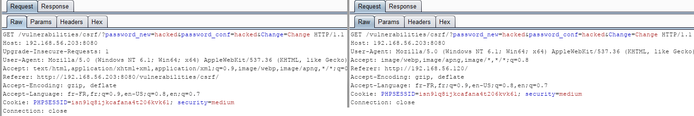
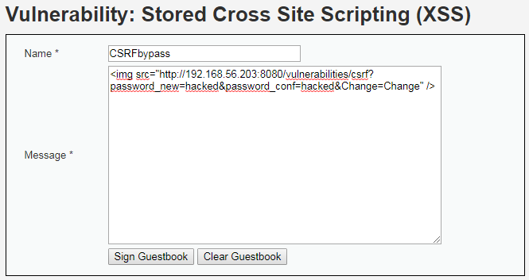
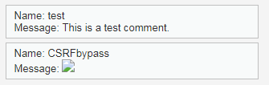
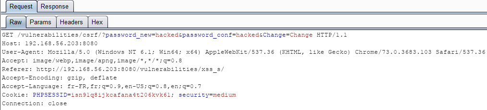
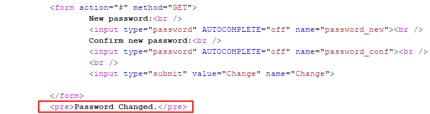

# Niveau "Medium"

A première vue, aucune différence au niveau du formulaire de changement de mot de passe :

Ni au niveau de la requête effectuée lors de la soumission du formulaire :

L'attaque précédente, effectuée pour le niveau "Low", doit donc toujours fonctionner. Mais ce n'est malheureusement pas aussi simple :

J'analyse alors la différence entre la requête légitime et celle générée par ma précédente (tentative d') attaque :

La seule différence réside dans le contenu de l'entête HTTP `Referer`. L'application doit sans doute vérifier que cet entête possède la même valeur que l'hôte d'où elle est hébergée. Une technique permettant de contourner cette protection est d'identifier et exploiter une vulnérabilité XSS sur l'application cible.&#x20;

Cela tombe bien puisque DVWA contient également une telle vulnérabilité (ne pas oublier de contourner la limitation de la longueur du champ, voir le challenge XSS si besoin) :


Il est possible de repasser en niveau "Low" le temps de forger la payload XSS car seule l'exploitation de la faille CSRF a besoin de se faire en niveau "Medium"


Soit lors de la navigation de la victime :

Lors de sa visite de la page du Guestbook contenant l'image malveillante, la requête déclenchée sera effectuée avec un `Referer` valide :

Et son mot de passe sera ainsi changé, contournant ainsi, la protection en place :

