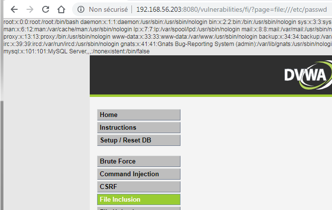

# Niveau "High"

Les réponses du serveur face aux attaques précédentes varient légèrement ici puisque je récupère l'erreur suivante pour chacun de mes essais :

La seule chose facilement réalisable est l'accès à la page cachée :

Il est sans doute possible qu'un filtre vérifie la présence du mot "file" dans le paramètre d'inclusion. L'idée du développeur était sans doute ici de ne pouvoir inclure seulement les fichiers `file*.php` .&#x20;

Je tente un premier contournement mais sans succès :

Après quelques essais, j'identifie qu'il est impératif que la valeur du paramètre commence par la chaîne "file" :

Ou alors, en utilisant le schéma `file://` qui permet d'accéder facilement au système de fichiers local :

&#x20;Je n'ai pas réussi à effectuer une RFI ici, mais cela ne veut pas dire que ce n'est pas possible :upside\_down:&#x20;
