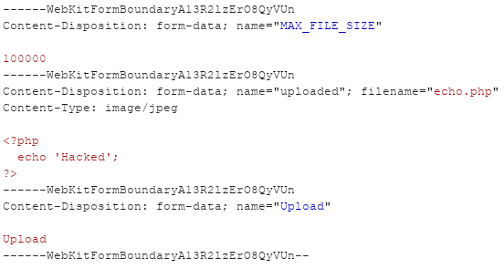
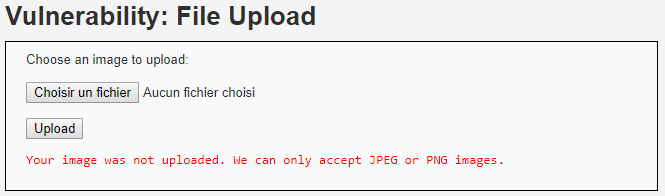
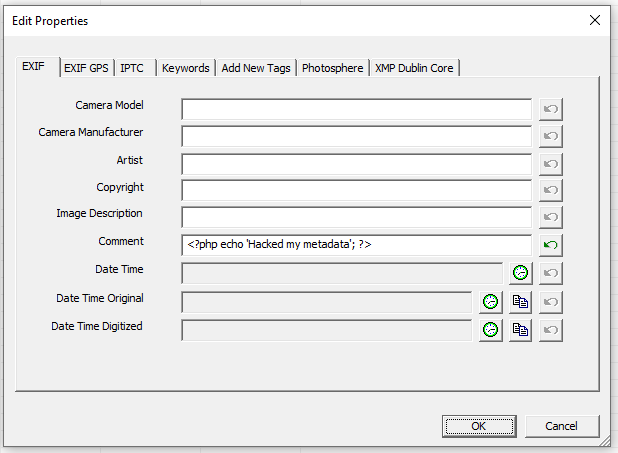
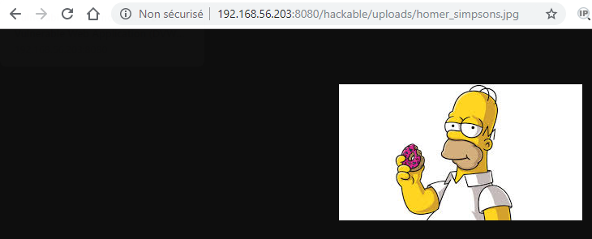

# Niveau "High"

En "High", je constate que la technique utilisée précédemment pour uploader le script PHP ne fonctionne plus et cela même en modifiant le `Content-Type` :

Le serveur renvoi une erreur indiquant un mauvais format d'image :

De plus l'extension est également vérifiée par l'application car il n'est pas possible d'uploader une image valide mais dont l'extension n'est pas une extension de type image.

La solution ici est en fait de passer par les métadonnées de l'image afin d'y injecter la payload PHP. Pour cela j'utilise le logiciel "Exif Pilot", mais n'importe quel logiciel pouvant éditer les métadonnées doit pouvoir faire l'affaire :

Rien ne se passe si je visualise l'image directement :

Par contre, si j'exploite en plus une vulnérabilité de type File Inclusion (disponible sur DVWA et exploitée ici en "Low") :

.png>)

Alors le code PHP est bien exécuté par le serveur.


Cela ne s'arrête pas là mais les possibilités sont vastes : récupération d'un shell plus complet, maintien de l'accès, tentative d'élévation de privilèges, pivotage, ...

