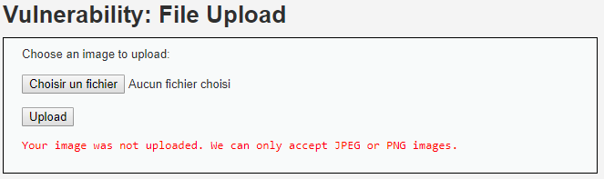
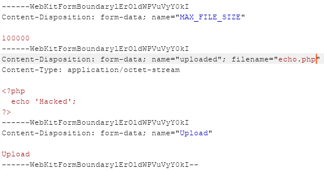
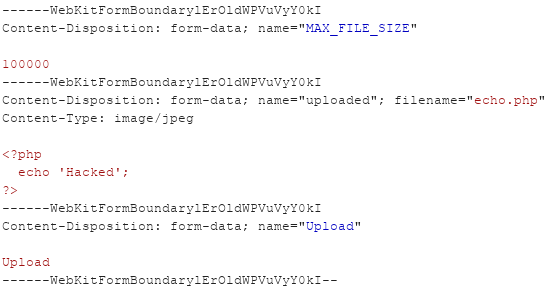
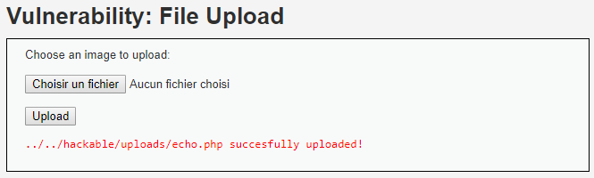
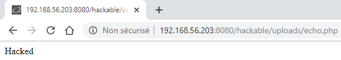

# Niveau "Medium"

Je tente directement d'uploader à nouveau le précédent fichier `.php` :

La nouvelle protection en place m'empêche de réitérer la même attaque. Burp va sans doute m'aider sur ce coup là car je vais tenter de modifier le content-type du fichier `.php` afin de satisfaire au prérequis de l'application.

Voici la requête d'upload de fichiers pour le script PHP :

Je modifie le `Content-Type` afin de lui indiquer qu'il s'agit en fait d'une image :

Cela fonctionne et mon upload de fichier malicieux fonctionne encore :

Il est possible de faire exécuter le code du script de la même façon que pour le niveau "Low" :


Cela ne s'arrête pas là mais les possibilités sont vastes : récupération d'un shell plus complet, maintien de l'accès, tentative d'élévation de privilèges, pivotage, ...

